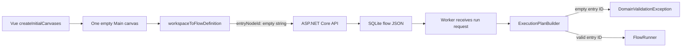

# Design: Blank Project Default

## State and execution boundary

## Module changes

| Module | Responsibility | Change |
| --- | --- | --- |
| `frontend/.../initialCanvases.ts` | New workspace factory | Return only an empty `Main` canvas. |
| `frontend/.../flowDtoMapper.ts` | Editor/API mapping | Continue deriving the entry from the first main node; an empty canvas maps to `""`. |
| `SereinFlow.Domain/FlowDefinition` | Persisted editor model validation | Allow an empty entry ID; validate a non-empty ID references a node. |
| `SereinFlow.Runtime/ExecutionPlanBuilder` | Run admission | Convert an empty entry ID to a structured domain diagnostic and refuse plan creation. |

## Data flow

1. Browser starts with a clean `Main` canvas and no local node catalog.
2. It remains an unsaved draft when no server workspace exists; saving is the explicit project-creation boundary.
3. The API maps and structurally validates the empty definition, then stores it as normal flow JSON.
4. A server-provided node catalog can later add nodes; the first main node becomes the editor's current entry ID.
5. Before execution, the Worker builds a plan. A blank entry becomes `flow.unknown_entry_node`, not a key lookup failure in `FlowRunner`.

## Exception strategy

- Save-time structural errors return the existing validation response through the API.
- An empty draft is not a save-time error.
- Run-time admission throws `DomainValidationException` containing code `flow.unknown_entry_node` and path `entryNodeId`.
- Valid entry IDs retain existing duplicate-node and connection-endpoint validation.
