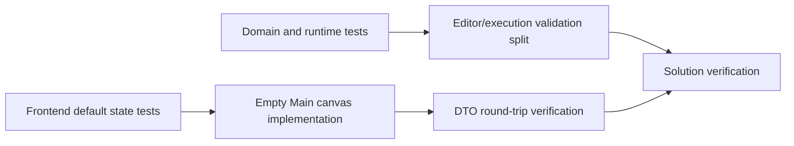

# Tasks: Blank Project Default

| Task | Input contract | Output contract | Constraints | Acceptance | Dependency |
| --- | --- | --- | --- | --- | --- |
| Define default-state tests | Fresh workspace factory | Regression test for one empty main canvas | No browser runner required | Nodes, links, and selections are absent | None |
| Preserve user graph mapping | Explicit user-created graph fixture | DTO mapping test | Must cover data and execution links | Graph survives serialization and restoration | Default-state test |
| Split validation states | Empty `FlowDefinition` | Valid editor draft, invalid execution plan | No fake entry node | Domain accepts draft; runtime returns diagnostic | None |
| Replace fixture factory | Existing preset factory | Literal clean canvas state | Keep i18n canvas key | New startup has one empty main canvas | Default-state test |
| Verify delivery | Source, tests, API | Build/test evidence | Avoid concurrent test output races | Vue and .NET commands pass | All tasks |

