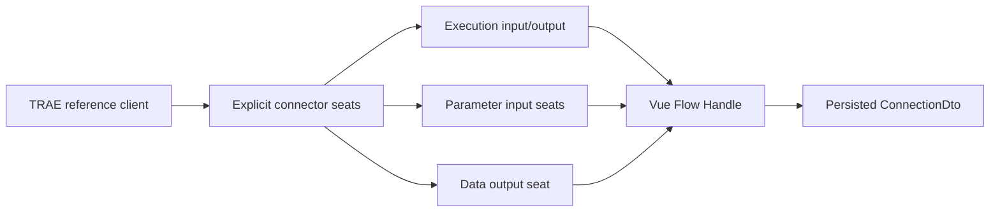
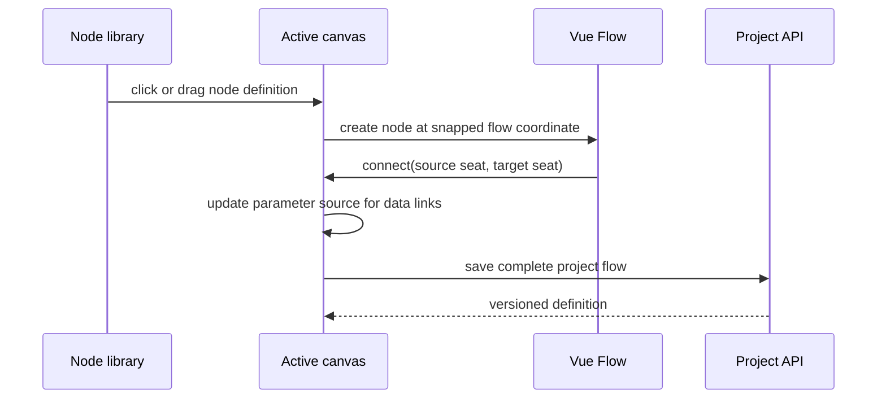

# Design: Canvas Node Seat Refactor

## Reference mapping

The reference client models connectors separately from the node body. The new implementation keeps that principle but uses Vue Flow's managed handles so edge geometry, viewport transforms, selection, and keyboard deletion remain available.

## Seat contract

`src/flow/connectionSeats.ts` is the single source of truth for the seat list and vertical layout:

| Seat | Side | Direction | Semantic | Multiplicity |
| --- | --- | --- | --- | --- |
| `exec-in` | left | target | execution | one |
| `param-{id}` | left | target | data | one |
| `exec-out` | right | source | execution | many |
| `data-out` | right | source | data | many |

The node card renders this model rather than manually positioning individual handles. The seat ID is also the persisted port ID, so visual changes do not rewrite connections.

## User flow

## Project and canvas boundaries

- The project picker owns server project selection and new blank-project drafts.
- The canvas tab row owns lifecycle canvas selection and optional lifecycle canvas creation.
- The node card owns only node presentation and seat rendering; persistence and history remain in `App.vue`/workspace state.

## Visual constraints

- Keep white surfaces, slate text, thin borders, compact typography, blue execution accents, and purple data accents.
- Avoid gradient node cards, emoji connector icons, large onboarding artwork, or a separate visual language for the seat model.
- Use focus-visible outlines and restrained 160–180ms transitions.

