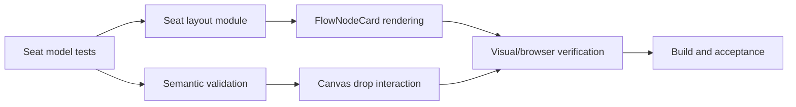

# Tasks: Canvas Node Seat Refactor

| Task | Output | Acceptance |
| --- | --- | --- |
| Extract seat model | `connectionSeats.ts` | Stable IDs and semantic metadata for all seat types |
| Render seat rails | `FlowNodeCard.vue` | Node DOM exposes each seat with accessible label |
| Enforce connection semantics | `resolveConnectionSemantic` integration | Invalid execution/data combinations are rejected |
| Add direct manipulation | Library drag/drop handlers | Drop creates a snapped node at the flow coordinate |
| Add project boundary | Project picker and blank-project action | Existing projects load; new project starts empty |
| Verify | Node tests, type check, build, browser smoke test | No regression in DTO or graph state |

