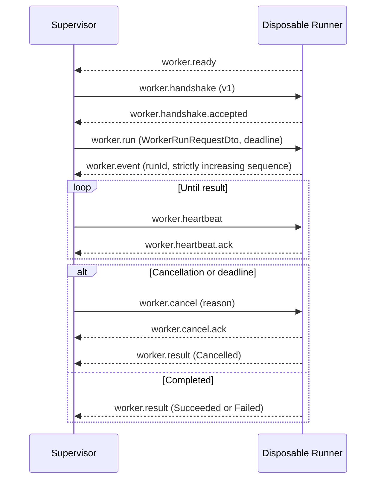

# SereinFlow Worker Protocol v1 (Historical Version)

> This document preserves the historical v1 contract. The current implemented
> and maintained protocol is [Worker Protocol v2](worker-protocol-v2.md); v2
> adds active-run message ingress and registration/receipt messages.

## 1. Boundary

- The API creates `WorkerRunRequestDto` values and consumes
  `WorkerEventEnvelopeDto` / `WorkerRunResultDto`; it does not load Runtime,
  ScriptLang, plugins, or external DLLs.
- The Supervisor validates versions, starts and terminates process trees,
  forwards events, and tracks deadlines/cancellation; it does not load user
  code.
- A new Runner is created for every run. It is the only component allowed to
  load Runtime, ScriptAdapter, SereinScript, and later plugin loaders; it does
  not access SQLite.

## 2. Transport and Limits

Transport consists of one UTF-8 JSON object per line. Multi-line JSON, binary
CLR objects, reflection objects, assembly paths, and unserialized exceptions are
forbidden. The `WorkerMessage` fields are:

| Field | Requirement |
| --- | --- |
| `protocolVersion` | Must be `1` |
| `kind` | See the message types below |
| `requestId` | Non-empty correlation identifier |
| `runId` | Required for run-related messages and must match the current run |
| `sequence` | Optional mirror carried by event messages; the authoritative sequence is in the event DTO |
| `deadline` | `worker.run` uses a UTC deadline |
| `payloadJson` | Embedded versioned DTO JSON |

- A single message is limited to `1,048,576` UTF-8 bytes.
- `payloadJson` is limited to `896,000` characters, leaving room for the
  envelope and UTF-8 encoding.
- The sender writes to standard output serially and waits for I/O completion;
  it does not hold an unbounded event queue, so a slow consumer naturally
  applies backpressure to the Runner.
- Oversized, empty, non-JSON, or version-mismatched messages are rejected
  without downgrade, truncation, or deserialization into CLR objects.

## 3. Session Sequence

`worker.result` is the terminal message from a disposable Runner. The
Supervisor reclaims the Runner process tree after receiving it or after the
grace period expires. Event `sequence` must increase monotonically from 1;
duplicate, regressed, or cross-run events return
`worker.event_sequence_invalid` or `worker.invalid_message`.

## 4. Message Types

| Direction | kind | payload |
| --- | --- | --- |
| Runner -> Supervisor | `worker.ready` | None |
| Supervisor -> Runner | `worker.handshake` | None |
| Runner -> Supervisor | `worker.handshake.accepted` | None |
| Supervisor -> Runner | `worker.run` | `WorkerRunRequestDto` |
| Runner -> Supervisor | `worker.event` | `WorkerEventEnvelopeDto` |
| Supervisor -> Runner | `worker.heartbeat` | None |
| Runner -> Supervisor | `worker.heartbeat.ack` | None |
| Supervisor -> Runner | `worker.cancel` | `WorkerCancelRequestDto` |
| Runner -> Supervisor | `worker.cancel.ack` | None |
| Runner -> Supervisor | `worker.result` | `WorkerRunResultDto` |
| Runner -> Supervisor | `worker.error` | `WorkerErrorDto` |

## 5. Stable Error Codes

| Error code | Meaning |
| --- | --- |
| `worker.protocol_mismatch` | Envelope or result version is unsupported |
| `worker.invalid_message` | Format, kind, run ID, or sequence is invalid |
| `worker.invalid_payload` | Embedded DTO cannot be parsed |
| `worker.message_too_large` / `worker.payload_too_large` | IPC limit exceeded |
| `worker.handshake_failed` | Runner did not start the session according to the protocol |
| `worker.crashed` | Runner closed the protocol stream or exited unexpectedly before ready, handshake, or result |
| `worker.cancelled` | Caller cancelled and the Runner completed cooperatively |
| `worker.timed_out` | Deadline reached; the Supervisor terminates the process tree after the cancellation grace period |
| `worker.event_sequence_invalid` | Event sequence is not strictly increasing |

Protocol diagnostics must not contain API secrets, SQLite paths, complete
script source, process environment, or CLR stack traces.

## 6. Historical Verification Scope

The following records the v1-era verification scope and is not a current
implementation backlog. Verified areas included v1 round trips, version/length
rejection, Action flow execution, ScriptLang cancellation, event sequence,
expired deadlines, and Runner exit classification. The current implemented and
maintained protocol is [Worker Protocol v2](worker-protocol-v2.md); later
protocol behavior and test coverage follow the v2 document and the current test
projects.
