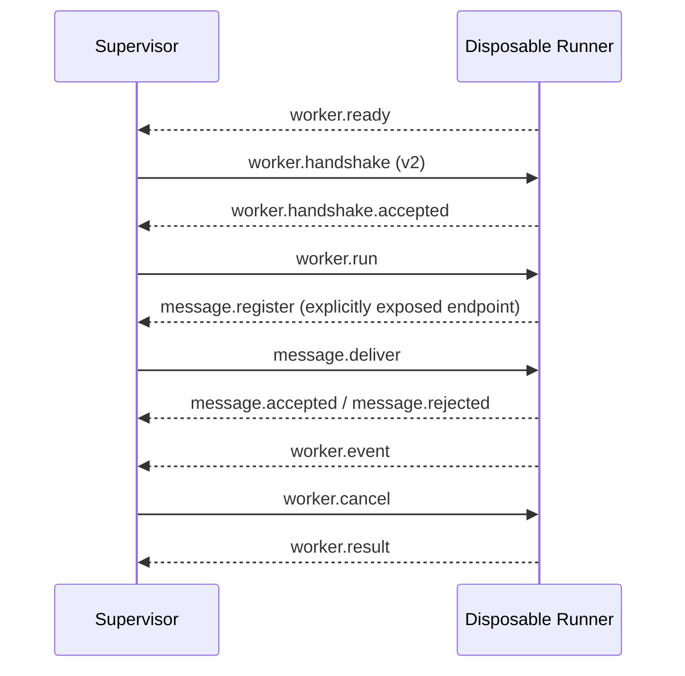

# SereinFlow Worker Protocol v2

> Status: current production protocol, covered by
> `SereinFlow.Worker.IntegrationTests`. The Supervisor and disposable Runner
> use restricted standard-input/standard-output JSON Lines; the transport
> implementation is isolated behind `IWorkerTransport`.

## Boundary and Transport

- The API does not load Runtime, ScriptLang, plugins, or user assemblies.
- The Supervisor starts and terminates process trees, validates versions,
  forwards messages, handles deadlines and cancellation, and manages active-run
  sessions.
- A new Runner is created for every run. It loads Runtime and node libraries
  and creates the run-level message service locally.
- Each transport message is one UTF-8 JSON object; binary CLR objects, assembly
  paths, and unserialized exceptions are forbidden.
- A single message is limited to `1,048,576` UTF-8 bytes and `payloadJson` to
  `896,000` characters.

## Envelope Fields

`WorkerMessage.protocolVersion` must be `2`. `requestId` correlates request and
receipt messages, and `runId` must match the current run. The authoritative
event sequence remains in the event DTO.

## Session Sequence

All control messages continue through the existing single receive loop; the
message service does not start a second `ReceiveAsync` consumer.
`worker.result` is the terminal message from a disposable Runner, and the
message session expires immediately when the run ends.

## Message Types

| Direction | kind | payload |
| --- | --- | --- |
| Runner -> Supervisor | `worker.ready` | None |
| Supervisor -> Runner | `worker.handshake` | None |
| Runner -> Supervisor | `worker.handshake.accepted` | None |
| Supervisor -> Runner | `worker.run` | `WorkerRunRequestDto` |
| Runner -> Supervisor | `worker.event` | `WorkerEventEnvelopeDto` |
| Supervisor -> Runner | `worker.heartbeat` | None |
| Runner -> Supervisor | `worker.heartbeat.ack` | None |
| Supervisor -> Runner | `worker.cancel` | `WorkerCancelRequestDto` |
| Runner -> Supervisor | `worker.cancel.ack` | None |
| Runner -> Supervisor | `worker.result` | `WorkerRunResultDto` |
| Runner -> Supervisor | `worker.error` | `WorkerErrorDto` |
| Runner -> Supervisor | `message.register` | `WorkerMessageEndpointDto` |
| Runner -> Supervisor | `message.unregister` | `WorkerMessageEndpointDto` |
| Supervisor -> Runner | `message.deliver` | `WorkerMessageDeliveryDto` |
| Runner -> Supervisor | `message.accepted` | `WorkerMessageAcceptedDto` |
| Runner -> Supervisor | `message.rejected` | `WorkerMessageRejectedDto` |

Message delivery uses `messageId` for deduplication and `requestId` to correlate
the accepted/rejected receipt for that delivery. External endpoints allow JSON
mode only; `contractId` is a controlled logical contract identifier, not an
assembly or CLR type name.

## Stable Error Codes

In addition to the [v1 error codes](worker-protocol-v1.md), message bridging
uses:

| Error code | Meaning |
| --- | --- |
| `message.protocol_mismatch` / `message.run_mismatch` | Message version or run ownership does not match |
| `message.endpoint_not_ready` | The Worker has not registered the endpoint |
| `message.endpoint_forbidden` | The endpoint has not explicitly allowed external delivery |
| `message.external_json_required` | The external endpoint rejected DirectObject |
| `message.payload_invalid` / `message.payload_too_large` | JSON or payload size is invalid |
| `message.channel_full` | The bounded queue reached its capacity |
| `message.expired` | The message exceeded its TTL |
| `message.delivery_timeout` | The Worker did not acknowledge delivery within the delivery timeout |

The SDK, endpoint declaration, and HTTP API for the message service are
documented in [Worker Message Service](worker-message-service.md).
