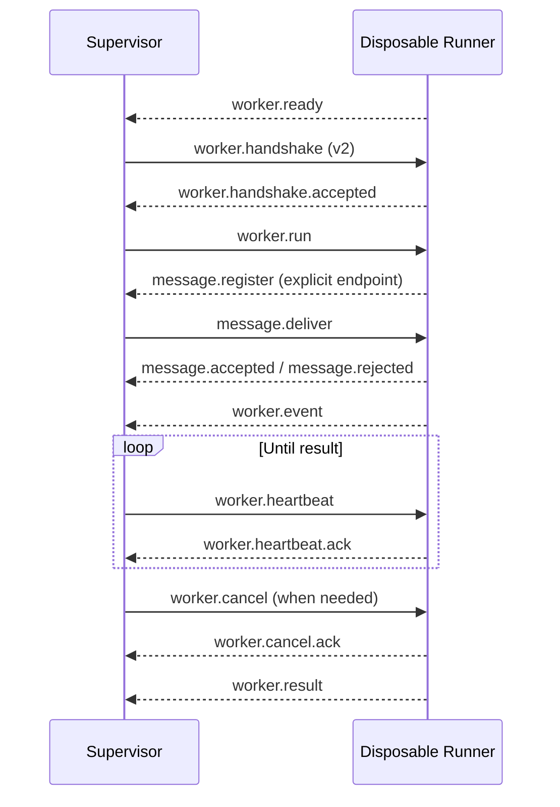

# SereinFlow Worker Protocol

This is the single entry point for the Worker protocol. New readers should read
the current v2 sections first; v1 is kept at the end as historical compatibility
reference rather than as a second current entry point.

## 1. Version status and reading guide

| Version | Status | Use it for | Main capability |
| --- | --- | --- | --- |
| v2 | Current production protocol, covered by `SereinFlow.Worker.IntegrationTests` | All new integrations and Supervisor/Runner communication | Base run protocol plus active-run message ingress, registration, and receipts |
| v1 | Historical | Reviewing old logs or maintaining an old protocol implementation | Base run protocol only; no message bridge |

The current source fixes `WorkerProtocol.Version` at `2`. This is not a
negotiated downgrade protocol: envelopes, embedded DTOs, results, and message
delivery must use the current version. Mixing v1 and v2 or expecting automatic
downgrade produces `worker.protocol_mismatch`.

## 2. Boundaries and responsibilities

- The API creates `WorkerRunRequestDto` values and consumes
  `WorkerEventEnvelopeDto` and `WorkerRunResultDto`; it does not load Runtime,
  ScriptLang, plugins, or user assemblies.
- The Supervisor starts and terminates process trees, validates versions,
  forwards messages, handles deadlines and cancellation, and manages active-run
  sessions; it does not load user code.
- A new Runner is created for every run. It is the only process that loads
  Runtime, node libraries, and the run-level message service; it does not access
  SQLite.
- The Supervisor and disposable Runner communicate over restricted
  standard-input/standard-output JSON Lines, isolated behind `IWorkerTransport`.

## 3. Transport constraints and envelope

Each transport message is one UTF-8 JSON object per line. Multi-line JSON, binary
CLR objects, reflection objects, assembly paths, and unserialized exceptions are
forbidden.

Important `WorkerMessage` fields:

| Field | Requirement |
| --- | --- |
| `protocolVersion` | Must be `2` today; historical v1 envelopes used `1`. |
| `kind` | Message type, such as `worker.run` or `worker.event`. |
| `requestId` | Non-empty request/receipt correlation identifier. |
| `runId` | Required for run-related messages and must match the current run. |
| `sequence` | Optional envelope mirror for events; the event DTO owns the authoritative sequence. |
| `deadline` | `worker.run` uses a UTC deadline. |
| `payloadJson` | Embedded versioned DTO JSON. |

Limits and write behavior:

- one message is limited to `1,048,576` UTF-8 bytes;
- `payloadJson` is limited to `896,000` characters, leaving room for the envelope and encoding;
- the sender writes to standard output serially and waits for I/O completion; it does not hold an unbounded event queue, so a slow consumer naturally applies backpressure;
- empty, non-JSON, oversized, or version-mismatched messages are rejected without truncation or CLR-object downgrade.

## 4. Current v2 session

All control messages continue through the existing single receive loop; the
message service does not start a second `ReceiveAsync` consumer. `worker.result`
is the terminal message from a disposable Runner, and the message session expires
when the run ends. The Supervisor reclaims the Runner process tree after the
terminal message or the cancellation grace period.

Event `sequence` must increase strictly from 1. Duplicate, regressed, or
cross-run events produce `worker.event_sequence_invalid` or
`worker.invalid_message`.

## 5. Message types

The base run messages are the same in v1 and v2:

| Direction | kind | payload |
| --- | --- | --- |
| Runner -> Supervisor | `worker.ready` | None |
| Supervisor -> Runner | `worker.handshake` | None |
| Runner -> Supervisor | `worker.handshake.accepted` | None |
| Supervisor -> Runner | `worker.run` | `WorkerRunRequestDto` |
| Runner -> Supervisor | `worker.event` | `WorkerEventEnvelopeDto` |
| Supervisor -> Runner | `worker.heartbeat` | None |
| Runner -> Supervisor | `worker.heartbeat.ack` | None |
| Supervisor -> Runner | `worker.cancel` | `WorkerCancelRequestDto` |
| Runner -> Supervisor | `worker.cancel.ack` | None |
| Runner -> Supervisor | `worker.result` | `WorkerRunResultDto` |
| Runner -> Supervisor | `worker.error` | `WorkerErrorDto` |

v2 adds the active-run message bridge:

| Direction | kind | payload |
| --- | --- | --- |
| Runner -> Supervisor | `message.register` | `WorkerMessageEndpointDto` |
| Runner -> Supervisor | `message.unregister` | `WorkerMessageEndpointDto` |
| Supervisor -> Runner | `message.deliver` | `WorkerMessageDeliveryDto` |
| Runner -> Supervisor | `message.accepted` | `WorkerMessageAcceptedDto` |
| Runner -> Supervisor | `message.rejected` | `WorkerMessageRejectedDto` |

Message delivery uses `messageId` for deduplication and `requestId` to correlate
accepted/rejected receipts. External endpoints allow JSON mode only;
`contractId` is a controlled logical contract identifier, not an assembly-qualified
or CLR type name. Only a node-library endpoint with `ExternalIngress = true` is
registered with the Supervisor.

The SDK, queue/EventBus semantics, endpoint declaration, and HTTP/MCP API are
documented in [Worker Message Service](worker-message-service.md).

## 6. Stable error codes

Base protocol errors:

| Error code | Meaning |
| --- | --- |
| `worker.protocol_mismatch` | Envelope, embedded DTO, or result version is unsupported |
| `worker.invalid_message` | Format, kind, run ID, or sequence is invalid |
| `worker.invalid_payload` | Embedded DTO cannot be parsed |
| `worker.message_too_large` / `worker.payload_too_large` | IPC message or payload limit exceeded |
| `worker.handshake_failed` | Runner did not start the session according to the protocol |
| `worker.crashed` | Runner closed the protocol stream or exited unexpectedly before ready, handshake, or result |
| `worker.cancelled` | Caller cancelled and the Runner completed cooperatively |
| `worker.timed_out` | Deadline reached; the Supervisor terminates the process tree after the cancellation grace period |
| `worker.event_sequence_invalid` | Event sequence is not strictly increasing |

v2 message-bridge errors:

| Error code | Meaning |
| --- | --- |
| `message.protocol_mismatch` / `message.run_mismatch` | Message version or run ownership does not match |
| `message.endpoint_not_ready` | The Worker has not registered the endpoint |
| `message.endpoint_forbidden` | The endpoint has not explicitly allowed external delivery |
| `message.external_json_required` | The external endpoint rejected `DirectObject` |
| `message.payload_invalid` / `message.payload_too_large` | JSON or payload size is invalid |
| `message.channel_full` | The bounded queue reached its capacity |
| `message.expired` | The message exceeded its TTL |
| `message.delivery_timeout` | The Worker did not acknowledge delivery within the delivery timeout |

Protocol diagnostics must not contain API secrets, SQLite paths, complete script
source, process environment, or CLR stack traces.

## 7. Historical v1 compatibility

The v1 base session matched the base part of v2:
`ready -> handshake -> run -> event/heartbeat -> cancel/result`. The differences
are limited to:

1. the envelope and DTO `protocolVersion` was `1`;
2. v1 had no `message.register`, `message.unregister`, `message.deliver`,
   `message.accepted`, or `message.rejected`;
3. v1 did not support active-run external message delivery and therefore had no
   v2 message-bridge error codes;
4. the v1 document recorded historical verification of v1 round trips,
   version/length rejection, Action flow execution, ScriptLang cancellation,
   event sequencing, expired deadlines, and Runner-exit classification.

The current source maintains and runs v2 only. Use this section and the base
error table when reviewing old v1 logs or maintaining an old external peer. New
integrations should use v2 and must not mix the two versions in one session.

## 8. Tests and related references

- Current protocol and message-delivery integration coverage is under
  `tests/SereinFlow.Worker.IntegrationTests`.
- See [Worker Message Service](worker-message-service.md) for SDK and HTTP/MCP
  message semantics.
- See the [Node Library Development Guide](node-library-development.md) for how
  libraries create message endpoints, Flipflops, and `IFlowContext` usage.
- The old v1/v2 paths remain as compatibility note pages that point to this
  unified document.
