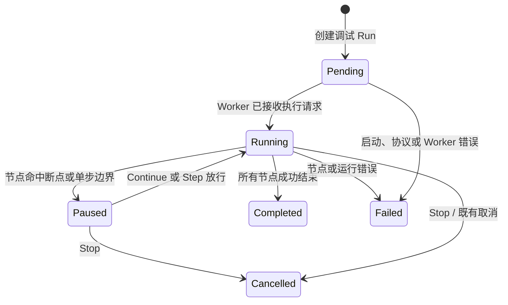

# 流程调试实施计划

**状态：** 已完成

**编制日期：** 2026-08-28

**适用范围：** `SereinFlow.Contracts`、`SereinFlow.Application`、`SereinFlow.Infrastructure`、`SereinFlow.Runtime`、Worker Client/Protocol/Runner/Supervisor、ASP.NET Core API、Vue 编辑器与自动化测试。

**目标：** 在现有隔离运行、运行快照和节点事件基础上，让用户可以在执行前设断点，在节点边界暂停、观察真实输入输出、单步或继续执行、停止运行，并对历史运行进行回放定位。首期只解决“流程为什么这样执行/在哪个节点出错”，不建设版本发布、审批或完整测试管理体系。

实施已于 2026-08-28 完成。本文保留为已交付范围、设计约束与验证记录；未引入流程发布生命周期、失败恢复或指定节点启动。

## 1. 收缩后的范围

### 1.1 本期交付

| 能力 | 首期行为 |
| --- | --- |
| 断点 | 在节点真正调用前暂停；断点按当前流程的节点 ID 保存 |
| 继续 | 从暂停处连续执行，直到下一断点或终态 |
| 单步 | 只放行当前暂停节点一次，在下一个可执行节点前再次暂停 |
| 停止 | 使用既有取消语义终止 Run，并正确回收 Worker 进程与会话资源 |
| 节点观察 | 显示节点状态、解析后的输入、输出、分支、错误、执行序号与 `frameDepth` |
| Flipflop 触发调试 | 全局 Flipflop 继续接收触发；已触发的下游执行按 FIFO 阻塞并逐个进入单步调试 |
| 历史回放 | 使用现有 Run 快照、事件和输出，以只读方式定位运行过程 |
| 调试运行 | 通过现有独立 Worker 执行节点库和脚本，不在 API 进程中直接运行不可信程序集 |

### 1.2 明确不做

- 不新增 `Draft/Review/Published/Archived`、发布审批、发布说明、回滚或环境接口版本绑定。
- 不改变现有流程保存和运行解析规则：调试启动时使用当前已保存的最新流程定义；`FlowDefinitionVersions` 继续只是已有历史快照，不纳入新的版本管理工作流。
- 不建设持久化测试用例、Mock 节点、断言、发布门禁或测试报告体系。
- 不增加重试、退避、失败分支、补偿、检查点恢复或节点失败忽略策略；节点执行失败仍按现有运行模型失败并记录事件。
- 不支持在某段 CLR/DLL/脚本代码执行到一半时挂起，也不保证强制抢占外部代码。暂停只发生在节点调用前的安全边界。
- 不允许暂停后修改流程图、节点参数、运行输入或断点集合后继续同一个 Run；需要修改时结束会话并重新开始。
- 不在 Flipflop 类库方法内部设置断点。监听方法必须持续接收下一次触发；断点只作用于“某次触发已被接收后”的 Flipflop 下游执行边界。
- 不提供“从指定节点开始”。调试始终从普通流程的真实入口或全局 Flipflop 的真实触发开始，绝不绕过上游节点、数据连接、分支或副作用来构造不完整执行。

## 2. 现有代码基础与问题

### 2.1 可直接复用的能力

| 现有实现 | 位置 | 调试中的作用 |
| --- | --- | --- |
| 不可变 Run 定义 | `FlowRunDefinitions`、`FlowRunPersistence` | Run 入队后仍可稳定回放当时的流程定义 |
| Run 事件与输出 | `FlowRunEvents`、`FlowRunOutputs` | 显示节点开始/完成/失败、输入、输出、错误与最终结果 |
| 会话隔离 | `SereinFlow.Runtime/FlowExecutionSession.cs` | 持有 RunId、取消令牌、事件序号、资源租约与 FlowCall frame |
| 节点调度 | `SereinFlow.Runtime/FlowRunner.cs` | 可在所有节点调用前设置统一调试闸门 |
| 全局 Flipflop 触发隔离 | `FlowRunner.RunGlobalFlipflopAsync` 每次触发调用 `session.CreateChild()` | 每个触发已有独立值上下文，避免相邻触发的输入和下游输出相互覆盖 |
| Worker 进程隔离 | `Worker.Client`、`Worker.Supervisor`、`Worker.Runner` | DLL 和脚本继续在独立进程内执行和回收 |
| 实时与历史运行 UI | `RunConsole.vue`、`RunSnapshotViewer.vue`、`useFlowRunner.ts` | 作为调试事件展示和历史回放的基础 |

### 2.2 当前缺口

当前 Worker v1 是“一次 `run` 请求，直到终态才由 `RunAsync` 返回”的单向完成模型。Runner 虽可接收取消命令，但 API/Worker Client/Supervisor 没有长寿命会话句柄，也没有 `continue`、`step` 的控制协议。Runtime 在节点调用前也没有统一可等待的闸门。因此只增加一个前端“断点”按钮不会真正暂停执行。

全局 Flipflop 还有一个独立缺口：当前 `RunGlobalFlipflopAsync` 在一次 `WaitForTriggerAsync` 返回后，直接 `await RunStackAsync` 执行该次触发的下游路径；当该路径单步暂停时，外层 while 无法重新进入下一次 `WaitForTriggerAsync`，后续触发就被监听端阻塞。调试实现必须将“接收触发”和“执行该次触发的下游流程”拆开。

调试实现的核心不是复制一个执行器，而是把以下链路接通：

```text
编辑器断点/输入
  -> Debug Session API
  -> Worker Client 的可控制执行句柄
  -> Worker Supervisor 的 stdin/stdout 读写与进程管理
  -> Worker Runner 的控制消息循环
  -> Runtime 节点边界闸门
  -> 既有 Run 事件、输出快照、SignalR/SSE
  -> 调试面板与历史回放
```

## 3. 调试模型和关键语义

### 3.1 会话状态机



`Paused` 不是线程冻结状态，而是 Runtime 在“即将调用下一个节点”的单个异步等待点。该设计保证运行时不会在持有节点执行器、脚本运行栈或资源锁时被任意挂起。

### 3.2 断点、继续与单步

1. `FlowRunner` 解析节点输入后、实际调用节点执行器前，向调试闸门提交一个边界对象。
2. 边界对象包含 RunId、调试会话 ID、执行实例 ID、节点 ID、节点类型、节点访问序号、解析输入的安全 JSON 和 `frameDepth`。
3. 节点 ID 在会话创建时校验为当前已保存流程定义中的节点；去重、排序后持久化。
4. 命中断点时 Worker 先发送 `debug.pause.hit`，会话进入 `Paused`，节点副作用尚未发生。
5. `continue` 允许当前节点执行，之后只在下一命中断点前暂停。
6. `step` 允许当前节点执行，之后无论下一个节点是否配置断点，都在下一可执行节点调用前暂停；没有下一节点时正常结束。
7. 当前节点完成、失败或被取消后，按既有 Run 事件模型记录。失败不会自动重试、跳过或进入恢复分支。
8. `stop` 触发现有 Run cancellation。若节点已进入第三方 DLL 或脚本，仅在其协作取消点返回；UI 必须显示“正在停止”，而不承诺立即中断。

### 3.3 全局 Flipflop 触发的断点与串行单步

全局 Flipflop 的“等待下一次触发”与“处理某次触发的下游节点”必须是两条不同的工作路径。调试模式采用**会话级单前台触发通道**：同一调试会话内任意时刻只有一个可被 `Continue`/`Step` 控制的活动执行实例；后续已接收的 Flipflop 触发按接收顺序排队。这样用户始终知道当前单步的是哪一次触发，同时监听器不会因当前触发暂停而错过下一次触发。

```text
Flipflop 监听器保持 WaitForTriggerAsync
  -> 收到触发 T1，创建独立 TriggerSession(T1)，将下游工作入队
  -> 立即重新进入 WaitForTriggerAsync
  -> T1 成为队首，在下游首个调试边界暂停/单步
  -> 收到触发 T2，创建独立 TriggerSession(T2)，进入等待队列
  -> T1 的下游路径终态后，T2 自动提升为活动实例
  -> T2 按相同断点规则暂停，继续单步调试
```

具体规则：

1. 全局 Flipflop 的监听调用仍保持每个监听节点只有一个待接收的 `WaitForTriggerAsync`；不为提高吞吐而对同一监听器并行调用该方法，避免破坏现有类库的事件订阅语义。
2. 一次 `WaitForTriggerAsync` 返回表示某次触发已接收。Runtime 立即创建唯一 `TriggerInvocationId`、触发序号和独立 `FlowExecutionSession` 子会话，写入该触发的输入/输出快照，然后把**下游** `RunStackAsync` 工作项提交给调试调度器，而不是在监听循环中 await 它。工作项独占该子会话，在下游终态、入队拒绝或取消的 `finally` 中释放；实现必须移除当前监听循环包住整个处理路径的 `await using`，防止下游尚未完成就释放子会话。
3. 调度器按 session 级 FIFO 管理工作项。队首是 `Active`，其他项为 `Queued`；`Continue`、`Step` 和 `Stop` 都只作用于 `Active` 的 `TriggerInvocationId`。普通入口路径与 FlowCall 继续作为其所属执行实例的一部分，不会抢占活动触发。
4. 调试断点位于全局 Flipflop 节点时，语义是“该次触发已接收，且其下游尚未开始”。系统发布 `debug.trigger.received` 后在此处暂停该触发；不尝试暂停正在执行的类库监听回调内部。
5. 调试断点位于下游 Action/FlowCall 节点时，当前触发到达该节点调用前正常暂停。当前触发经任意 `Continue`/`Step` 序列抵达下游终态后，调度器自动提升下一条已排队触发，使其可以继续命中同一断点。
6. 每次触发的输入、值字典、下游输出和 `frameDepth` 必须只属于其 `TriggerInvocationId`。运行级步骤预算和事件序号仍由父 `FlowExecutionSession` 共享，以保持既有总量限制和全局事件排序。
7. 队列必须有界，例如新增 `MaxQueuedDebugTriggers`（默认值和上限在运行设置中明确）。达到上限时监听器不能被阻塞：记录 `debug.trigger.queue_full` 诊断、发布可见事件并明确拒绝该次**调试下游处理**；不得静默丢失或覆盖已排队触发。此限制只作用于 Debug Run，不改变普通监听 Run。
8. `stop`、Run 超时、Worker 退出或 API 重启时，取消活动实例并清空未开始队列，依次写入 cancelled/failed 诊断并释放每个子会话。不会把 T1 的取消令牌、输出或错误传播为 T2 的数据。

前端在暂停时显示 `Flipflop 节点名 / 触发序号 / TriggerInvocationId 短值 / 等待触发数`，并始终让 `Continue`、`Step` 指向当前活动触发。列表中的排队触发只显示只读元数据和接收顺序，不提供越序选择或并行单步，保证事件次序可解释。

### 3.4 调试 Run 与历史回放

调试也是普通 Run 的一种来源，但不引入流程版本生命周期：

```text
FlowRuns
  Existing fields...
  ExecutionKind           Production | Debug
  DebugSessionId?         Debug Run 才有

FlowRunDefinitions        existing immutable definition snapshot
FlowRunEvents             existing event journal
FlowRunOutputs            existing outputs

FlowDebugSessions
  Id
  RunId                   unique
  ProjectId
  FlowId
  Status                  Pending | Running | Paused | Completed | Cancelled | Failed
  BreakpointsJson
  CurrentNodeId?
  ActiveInvocationId?
  ActiveFlipflopNodeId?
  QueuedTriggerCount
  CreatedAt
  UpdatedAt
```

每次 Flipflop 触发的接收、排队、提升、完成、取消和队列满拒绝都写入既有 `FlowRunEvents`，在 payload 中带 `TriggerInvocationId`、`triggerSequence`、`flipflopNodeId` 和 `queuePosition`。活动队列本身只存在于 Worker 的调试调度器中；服务重启时现有 reconciliation 会将会话结清，事件继续提供只读审计。

`ExecutionKind` 的作用仅是让现有 Run Console 可筛选并标注调试记录；它不是发布状态，也不改变任何现有生产运行的定义解析。历史 Run 始终通过 `FlowRunDefinitions` 回放，不能被重新打开为可继续的调试会话。

## 4. Runtime 与 Worker 设计

### 4.1 Runtime 节点边界闸门

在 `SereinFlow.Runtime.Abstractions` 增加窄接口，并在 `FlowRunner` 的所有节点调用路径之前调用一次：

```csharp
public interface IExecutionGate
{
    ValueTask<ExecutionGateDecision> BeforeNodeAsync(
        NodeExecutionBoundary boundary,
        CancellationToken cancellationToken);
}
```

实现要求：

- 普通 Run 使用 `NoopExecutionGate`，性能和行为与当前运行保持一致。
- Debug Run 使用 `DebugExecutionGate`，由 Worker 控制消息向其授予 continue/step 许可。
- gate 只处理“是否在当前节点调用前等待/放行/取消”，不承担节点执行、Mock、异常转换或流程图修改。全局 Flipflop 的触发接收与 FIFO 交给同一 Debug Session 的 `DebugInvocationScheduler` 协调。
- `NodeExecutionBoundary` 仅使用可安全序列化的数据。不得跨协议传递 CLR `Type`、服务对象、委托、原始异常对象或运行时上下文实例。
- gate 复用 `FlowExecutionSession` 的 RunId、取消令牌、序号、节点访问预算和 frame 隔离；全局触发子会话需附带 `TriggerInvocationId`，但不得重新实现会话并发管理。

节点启动、完成和失败的既有事件字段保持兼容。为调试新增的字段必须可选：`debugSessionId`、`isPausedBeforeStart`、`frameDepth`、`boundarySequence`。现有 SSE/SignalR 消费者不得因字段扩展失败。

### 4.2 Worker Protocol v2

调试需要 Worker 在执行过程中持续接收控制消息，因此协议从当前 v1 升为 v2。部署模型中 API、Supervisor 和 Runner 作为同一版本发布；如果不支持跨版本独立升级，收到不支持协议版本时明确拒绝，而不在单个 Runner 内长期维护 v1/v2 分叉。

建议消息：

```text
run                         启动 normal/debug 执行，含 ProtocolVersion = 2
cancel                      保留已有取消语义
debug.state                 Pending | Running | Paused | Completed | Cancelled | Failed
debug.pause.hit             节点调用前暂停，含节点、序号、输入和 frame depth
debug.continue              RunId + DebugSessionId + CommandSequence
debug.step                  RunId + DebugSessionId + CommandSequence
debug.stop                  RunId + DebugSessionId + CommandSequence
debug.trigger.received      TriggerInvocationId + FlipflopNodeId + triggerSequence
debug.trigger.queued        TriggerInvocationId + queuePosition
debug.trigger.admitted      TriggerInvocationId is now active
debug.trigger.rejected      queue full / cancellation / session termination diagnostic
```

协议约束：

1. 每条调试控制消息必须携带当前 `RunId`、`DebugSessionId` 和严格递增的 `CommandSequence`。
2. 会话不匹配、重复序号、落后序号和不合法状态下的命令只产生协议诊断，绝不能影响其他 Run。
3. Worker stdout 始终只输出完整协议行；普通日志和诊断写 stderr。
4. Supervisor 负责唯一 stdout reader、串行化 stdin 写入、取消和超时后的进程终结及等待回收。
5. Runner 将“控制消息读取”与“流程执行”并发运行。控制循环只向当前活动 `TriggerInvocationId` 的 DebugExecutionGate 投递有效许可；全局 Flipflop 监听器接收触发后立即重新挂起下一次监听，其下游工作交给 FIFO 调度器。
6. Runner 非预期退出、协议反序列化失败、写入失败或控制超时必须结清 Run 与 session 为 `Failed`/`Cancelled`，不能遗留 `Paused` 假状态。

### 4.3 Client/Supervisor 改造

当前 `IWorkerRunClient.RunAsync(...)` 在终态才返回。保留其供普通 Run 使用，并新增明确的调试句柄 API：

```csharp
Task<IWorkerDebugRunHandle> StartDebugAsync(DebugWorkerRunRequest request, ...);

public interface IWorkerDebugRunHandle : IAsyncDisposable
{
    Task ContinueAsync(long commandSequence, CancellationToken cancellationToken = default);
    Task StepAsync(long commandSequence, CancellationToken cancellationToken = default);
    Task StopAsync(long commandSequence, CancellationToken cancellationToken = default);
    Task<WorkerRunResultDto> Completion { get; }
}
```

API 不能直接写 Worker stdin，也不能持有进程对象。`FlowDebugSessionService` 持有受控的会话映射和 handle，按会话状态验证后调用控制方法。服务重启、客户端断线或 handle 完成时都需要移除映射，持久化最终状态。

## 5. API、持久化与应用服务

### 5.1 最小持久化变更

在 `PersistenceRecords.cs`、`FlowRunPersistence.cs` 与 `SqliteMigrator.cs` 中新增 `ExecutionKind`、`DebugSessionId` 和 `FlowDebugSessions`。迁移应是幂等的：

- 已有 FlowRuns 统一回填为 `Production`。
- 不修改 `FlowDefinitions`、`FlowDefinitionVersions`、环境接口或类库绑定逻辑。
- `RunId` 在 `FlowDebugSessions` 中必须唯一；会话记录保存当前活动执行实例/Flipflop 节点和排队数量；`Status + UpdatedAt` 建索引，便于读取活跃会话和清理异常会话。
- API 启动时执行一次遗留会话 reconciliation：进程已不在时，`Pending/Running/Paused` 会话落为 `Failed` 并写入标准诊断，避免刷新页面后永久显示暂停。

### 5.2 应用服务职责

新增 `FlowDebugSessionService`，职责严格限制为：

| 动作 | 服务端职责 |
| --- | --- |
| 创建 | 读取当前已保存定义，验证节点/断点/输入，创建 Debug Run、Run 快照和 Session，启动 Worker |
| 继续/单步 | 校验 Session 状态为 `Paused`、命令序号合法后转发 handle |
| 停止 | 校验活跃状态后触发现有取消链路和 Worker stop |
| 状态同步 | 消费 Worker 的 pause/state/terminal/trigger-queue 事件，更新 session 和既有 Run 事件 |
| 触发调度 | 确保一个 session 只有一个活动执行实例；向 UI 发布当前触发和等待数量，拒绝越序控制 |
| 读取 | 返回 session 详情、当前节点、活动触发、等待数量、事件和输出；客户端刷新后能恢复只读可见状态 |

不要把调试状态塞进 `RunApplicationService` 的所有公共职责。该服务仍负责定义验证、Run 创建、并发策略和普通执行准备；调试服务在它之上协调 gate 与 handle。

### 5.3 API 形状

```text
POST /api/projects/{projectId}/flows/{flowId}/debug-sessions
GET  /api/projects/{projectId}/flows/{flowId}/debug-sessions/{sessionId}
POST /api/projects/{projectId}/flows/{flowId}/debug-sessions/{sessionId}/continue
POST /api/projects/{projectId}/flows/{flowId}/debug-sessions/{sessionId}/step
POST /api/projects/{projectId}/flows/{flowId}/debug-sessions/{sessionId}/stop
GET  /api/projects/{projectId}/flows/{flowId}/debug-sessions/{sessionId}/events
```

创建请求包含：当前流程的期望版本/校验和（仅用于保存冲突检测，不是版本选择）、节点 ID 断点列表、项目输入和可选的调试触发队列上限。服务端重新读取最新已保存定义并验证期望值；若编辑器尚未保存或有人已保存了新版本，返回 `409 Conflict` 并要求用户先刷新/保存后重新创建会话。普通流程从定义入口启动；全局 Flipflop 流程只在真实触发到达后进入下游调试。

控制端点返回更新后的 `FlowDebugSessionDto`；无效状态返回 `409 Conflict`，节点或会话不存在返回 `404`，流程、断点、输入或触发队列配置不满足条件返回含诊断代码的 `422 Unprocessable Entity`。会话控制不通过公共环境接口暴露。

## 6. 编辑器交互设计

### 6.1 用户工作流

```text
保存流程
  -> 在画布节点上切换断点
  -> 点击 Debug
  -> 输入项目参数并启动独立 Worker
  -> 命中断点，画布高亮当前节点
  -> 查看输入/最近输出/分支/错误
  -> Continue 或 Step
  -> Completed / Failed / Cancelled
  -> 在 Run Console 随时只读回放
```

断点属于流程编辑体验，可按 `ProjectId + FlowId + NodeId` 保存为浏览器本地偏好，避免为每次勾选新增服务端业务模型。会话创建时把当前断点快照发送给服务端；运行中修改本地断点不影响已启动会话。删除节点时前端自动清理其本地断点标记。

全局 Flipflop 触发期间，面板在当前调试控制旁显示活动触发标识和等待数。T1 在断点暂停时，T2、T3 仍可以被监听器接收并显示为“已接收，等待当前单步结束”；T1 完整结束后，T2 自动成为活动触发。`Stop` 则取消整个调试会话并清空队列。该列表只用于解释队列，不支持改变顺序、修改已捕获输入或对多个触发同时单步。

### 6.2 前端改动范围

| 位置 | 改动 |
| --- | --- |
| `frontend/sereinflow-web/src/api/flowApi.ts` | Debug DTO、会话 CRUD/控制、结构化错误映射和事件类型 |
| `frontend/sereinflow-web/src/composables/useFlowRunner.ts` | 拆出 debug session 状态机，管理 `Pending/Running/Paused`、事件订阅与控制命令 |
| `frontend/sereinflow-web/src/composables/useProjectSession.ts` | 用当前保存版本/校验和创建会话；遇到 409 保留编辑并提示刷新/保存 |
| `frontend/sereinflow-web/src/App.vue` | 将画布断点、会话状态与运行面板组合，不改变当前工作区结构 |
| `frontend/sereinflow-web/src/components/workspace/CommandBar.vue` | 将当前 Run 入口明确为 `Debug`；运行中显示 Stop，暂停时显示 Continue/Step 工具按钮 |
| `frontend/sereinflow-web/src/components/runs/RunConsole.vue` | 显示调试来源、状态、当前节点、输入/输出/错误、Flipflop 当前触发与等待队列事件 |
| `frontend/sereinflow-web/src/components/runs/RunSnapshotViewer.vue` | 保持只读回放，并区分历史调试 Run 与普通 Run |
| `frontend/sereinflow-web/src/i18n.ts` | 中英文调试状态、动作、Flipflop 触发与队列上限文案 |

可按已有组件风格新增 `FlowDebugPanel.vue`。面板是编辑器的紧凑工具表面，不创建独立落地页；按钮用 Lucide 图标并提供 tooltip，文字大小遵循最近的前端可读性调整。

### 6.3 UI 状态约束

| 会话状态 | 可见动作 | 画布行为 |
| --- | --- | --- |
| 无会话 | Debug | 可编辑、可设置断点 |
| Pending/Running | Stop | 保留视图，禁止启动第二个同流程调试会话；全局 Flipflop 已接收触发显示 FIFO 等待数；不锁死一般编辑但提示本次调试使用已保存快照 |
| Paused | Continue、Step、Stop | 高亮当前节点；显示当前 `TriggerInvocationId` 与等待数；不允许改当前会话的断点/输入后继续 |
| Completed/Failed/Cancelled | 新 Debug、查看回放 | 只读历史事件；恢复正常编辑 |

首期每个流程在同一项目内只允许一个活跃调试会话，且每个会话只允许一个前台执行实例，避免同一 editor 的节点高亮、控制命令和输入展示相互覆盖。普通生产 Run 的现有并发策略保持不变。

## 7. 分阶段实施

**实施结果：** Phase 1 至 Phase 5 均已完成。Runtime、Worker v2、持久化会话、编辑器调试工具和 Flipflop 有界 FIFO 已交付；自动化验证覆盖 .NET Runtime/Worker/Domain/Infrastructure/Application/Architecture 与前端单元测试、生产构建。内置浏览器对本机回环地址进行了客户端拦截，因此未能生成运行时截图；本地开发服务、构建与测试均已正常完成。

### Phase 1：Runtime 节点边界与基础契约

**目标：** 在不改变普通运行结果的条件下，给 Runtime 安全的可等待节点前边界。

1. 新增 `IExecutionGate`、边界 DTO、无操作 Gate 和调试 Gate。
2. 在 `FlowRunner` 所有可执行节点路径接入统一 gate，保留既有事件顺序。
3. 增加 `ExecutionKind`、`FlowDebugSessionStatus`、Worker v2 消息 DTO 的 Contracts。
4. 为 Noop Gate 和 Debug Gate 增加 Runtime 单测，覆盖取消、step 许可、`frameDepth` 和 `TriggerInvocationId`。

验收：普通 `RunAsync` 的既有测试全部通过；调试 Gate 可在节点副作用前等待，不泄漏运行时对象。

建议提交：`feat: add runtime node-boundary debug gate`

### Phase 2：Worker Protocol v2 与受控句柄

**目标：** 让独立 Worker 在运行中可靠接收 continue、step、stop。

1. 更新 `WorkerMessages.cs`，定义 v2 握手、状态、暂停和控制消息。
2. 修改 Runner 并行读取控制流与执行任务，控制消息只作用于当前 Run/session。
3. 在 Client/Supervisor 增加 `IWorkerDebugRunHandle`，实现 stdin 串行化、stdout 单消费者和 Completion。
4. 将 `RunGlobalFlipflopAsync` 拆为“持续接收触发”和“独立子会话下游调度”：接收后立即重挂监听，下游通过会话级有界 FIFO 串行进入断点/单步。
5. 完成取消、超时、协议错误和进程退出路径的资源回收。

验收：断点命中后 Worker 未执行该节点；单步只执行一个节点；T1 暂停时 T2 仍被接收并进入等待队列，T1 到达终态后 T2 按 FIFO 被调试；无效序号/会话不会影响任何执行；Runner 退出不留下活跃 handle。

建议提交：`feat: support interactive worker debug control`

### Phase 3：调试会话持久化与 API

**目标：** 让调试不依赖浏览器内存，可在刷新后查看状态和历史事件。

1. 新增 `FlowDebugSessions`、Run 执行类型字段、SQLite 幂等迁移和启动 reconciliation。
2. 实现调试会话仓储和 `FlowDebugSessionService`。
3. 创建/读取/continue/step/stop/events API，接入现有 Run 事件推送。
4. 以当前已保存定义的版本/校验和作为启动冲突检查；不新增或更改流程发布规则。

验收：服务重启能将悬挂会话可靠结清；刷新页面后可读取暂停/终态会话与完整事件；所有端点有明确 404/409/422 诊断。

建议提交：`feat: add persisted debug sessions API`

### Phase 4：编辑器调试面板与回放

**目标：** 提供完整而不臃肿的可视调试操作。

1. 在节点上实现本地断点开关和删除节点后的断点清理。
2. 实现 Debug、Continue、Step、Stop 操作与禁用/loading/error 状态。
3. 在画布高亮暂停节点，在 Run Console 显示解析输入、输出、分支、错误、序号、`frameDepth`、当前 Flipflop 触发和等待队列。
4. 扩展 Snapshot Viewer，以只读方式回放调试 Run；不允许“继续历史运行”。
5. 实现移动/窄屏布局，避免控制按钮、长错误消息和 JSON 值发生重叠。

验收：用户可以不离开当前工作区完成普通节点或 Flipflop 触发链路的断点、单步、失败定位和历史回放；未保存冲突给出清晰诊断。

建议提交：`feat: add flow editor debugging controls`

### Phase 5：Flipflop 触发与可靠性收口

**目标：** 验证真实触发下的 FIFO 调试语义，并把可观察性和 CI 补齐。

1. 压测真实 Flipflop 触发下的有界 FIFO：持续接收、独立子会话、队首提升、队列满拒绝和完整资源释放。
2. 验证 FlowCall、动态分支和多个全局 Flipflop 监听节点并存时，当前前台执行实例、事件顺序和输入隔离仍然正确。
3. 增加结构化日志：session/run ID、节点、控制序号、状态转移、Worker PID、触发序号、队列长度、耗时和清理结果；不要记录完整敏感输入。
4. 增加前端纯状态测试，并在 `.github/workflows/ci.yml` 的构建前执行 `npm test`。
5. 运行全量 .NET/Worker/API/前端验证，检查 Worker 进程不泄漏。

验收：任何调试执行均从真实入口或真实 Flipflop 触发开始；CI 覆盖前端测试；调试会话在异常、取消、协议错误后无悬挂状态或遗留进程。

建议提交：`feat: harden flipflop debug dispatch`

## 8. 测试矩阵

| 层级 | 主要位置 | 关键覆盖 |
| --- | --- | --- |
| Runtime | `tests/SereinFlow.Runtime.Tests/RuntimeSessionTests.cs`、`ExecutionPlanTests.cs` | 节点调用前暂停、Continue、单步许可、取消、frame depth、普通 Gate 无行为变化、Flipflop 触发子会话隔离与 FIFO 调度 |
| Worker integration | `tests/SereinFlow.Worker.IntegrationTests/WorkerProtocolTests.cs`、`WorkerSupervisorTests.cs` | v2 消息顺序、无效控制、stdout 协议纯度、超时、异常退出、Flipflop 触发队列事件和进程回收 |
| Infrastructure | `tests/SereinFlow.Infrastructure.Tests` | DebugSession 持久化、Run 关联、幂等迁移、启动 reconciliation |
| Application/API | `tests/SereinFlow.Application.Tests`、`tests/SereinFlow.Api.IntegrationTests` | 会话状态迁移、输入/断点验证、409/422、授权边界和事件读取 |
| Frontend | `frontend/sereinflow-web/tests/*.test.ts` | 会话状态映射、控制按钮可用性、事件解析、冲突和不支持诊断 |

最小自动化场景：

1. 节点含副作用标志时，命中断点验证该标志在 `debug.pause.hit` 时仍未改变。
2. `step` 后恰执行当前节点一次，并在下一节点前再次进入 `Paused`。
3. `continue` 跳过非断点节点，在后续断点或终态停止。
4. `stop` 在暂停与执行中两种状态都能完成 Run/session 终结；Worker 进程被回收。
5. 错误、进程崩溃、超时、无效控制序号和 API 重启不会留下 `Paused` 假会话。
6. Debug Run 的事件和输出可以在浏览器刷新后回放；普通 Run 行为与展示没有回归。
7. 调试创建 DTO、会话记录和 API 路由均不存在起始节点字段或入口；所有执行都从真实入口或真实 Flipflop 触发开始，不存在跳过上游的执行路径。
8. T1 在全局 Flipflop 下游断点暂停时，T2 和 T3 仍被监听器接收、拥有独立输入快照并按 FIFO 排队；T1 到达终态后 T2 才成为活动实例，T3 不能抢占。`Stop` 必须取消 T1、清空 T2/T3 并释放全部子会话。
9. 触发队列达到上限时记录可回放的拒绝诊断；不阻塞监听循环、不覆盖既有排队实例，也不改变普通监听 Run。

已执行的验证命令：

```powershell
dotnet restore SereinFlow.sln
dotnet build SereinFlow.sln --no-restore
dotnet test SereinFlow.sln --no-build

Set-Location frontend/sereinflow-web
npm ci
npm test
npm run build
```

## 9. 完成定义

本计划完成时，以下条件必须同时满足：

1. 用户能在当前编辑器中为已保存流程设断点并启动独立 Worker 调试。
2. 暂停发生在节点调用前，Continue、Step、Stop 的行为可由自动化测试证明。
3. 调试面板和历史回放能显示节点、输入、输出、分支、错误、执行顺序和子流程层级。
4. 调试控制不会影响其他 Run；无效协议消息、异常退出、取消和服务重启均能结清会话和 Worker 资源。
5. 全局 Flipflop 在当前触发暂停时继续接收后续触发；每次触发保持输入/输出隔离、按 FIFO 逐个完成单步调试，且队列溢出可见、可审计。
6. 所有调试执行都从真实入口或真实 Flipflop 触发开始，系统不提供可绕过上游流程完整性的指定节点启动能力。
7. 流程保存、历史快照、生产运行、环境接口和失败处理保持当前业务规则，没有被本期调试功能改造成版本发布或失败恢复系统。
8. .NET 测试、Worker/API 集成测试、前端 `npm test` 与 `npm run build` 均进入 CI 并通过。
