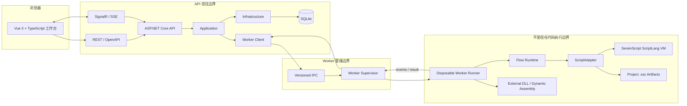
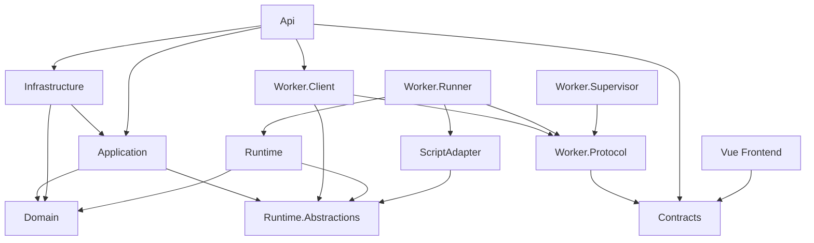
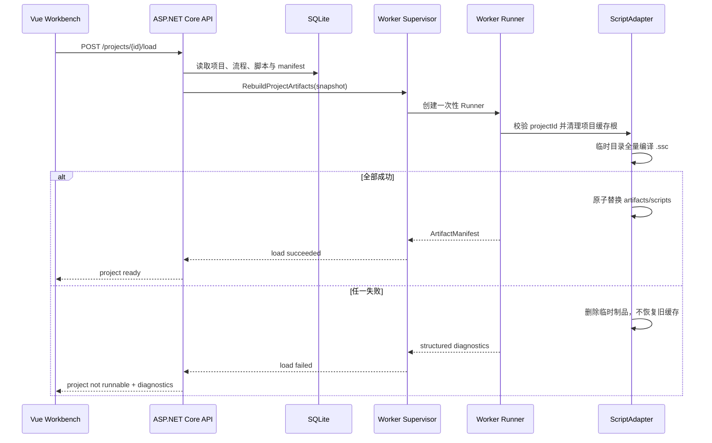
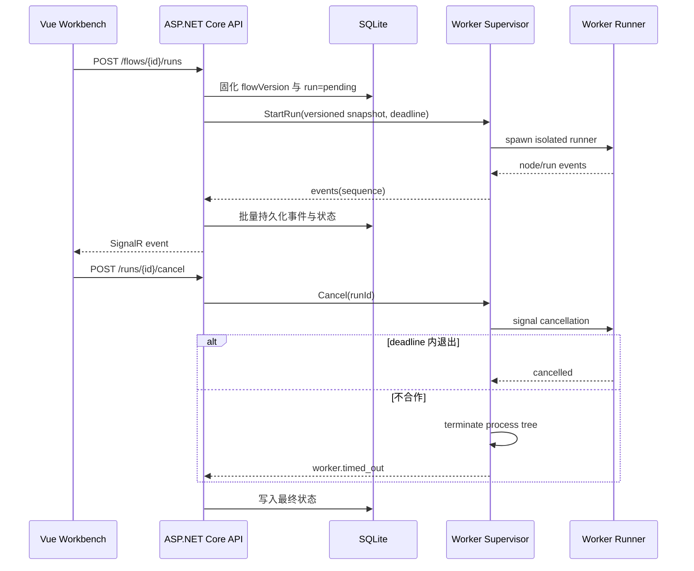

# SereinFlow 重构架构设计

> 状态：设计已按确认决策收敛，已获批准并作为 Automate 实施约束。
>
> 固定基线：`.NET 10 + Vue 3 + ASP.NET Core + SignalR/SSE + SQLite/SqlSugar + Linux Worker`。

目标工程根目录：`D:\Project\dotnet\SereinFlow`。以下 `src/`、`frontend/`、`tests/` 和 `deploy/` 均相对于该目录。

## 1. 目标架构



API 负责可信数据与协议编排，不执行流程节点。Supervisor 负责协议握手、Runner 生命周期、资源限制、心跳和崩溃恢复，也不加载用户代码。Runner 是唯一可以加载 Runtime 实现、ScriptLang、外部 DLL、动态程序集和 CLR 类型的进程。

### 1.1 依赖规则



约束：

- Domain 与传输 Contracts 相互独立，由 Application/API 映射。
- Application 只依赖执行端口，不引用 Runtime 实现。
- API 不引用 Runtime、ScriptAdapter、ScriptLang、插件加载器或外部 DLL。
- Supervisor 不引用 Runtime、ScriptAdapter 或 ScriptLang。
- Runner 不引用 Infrastructure，不访问 SQLite。
- ScriptAdapter 是唯一允许直接引用 ScriptLang 的 SereinFlow 项目。
- 前端只使用 OpenAPI 生成的 TypeScript DTO 和事件合同。

## 2. 模块设计

### 2.1 Domain

核心实体和值对象：

- `Project`：项目 ID、名称、当前版本和状态。
- `FlowDefinition`：schema 版本、流程版本、画布、节点、连线、入口和 checksum。
- `CanvasDefinition`：画布类型、生命周期和触发器。
- `NodeDefinition`：节点 ID、节点类型、位置、端口、参数和节点数据。
- `ConnectionDefinition`：执行/数据连线、端点、优先级和分支语义。
- `ScriptNodeDefinition`：新 SereinScript 源码、输入/输出合同、语言版本和 source hash。
- `PluginManifest`：程序集、版本、SHA-256、目标 RID/API 版本和节点目录。
- `FlowRun`：运行 ID、流程版本、状态、时间戳、取消原因和错误摘要。

领域规则覆盖：ID 唯一、端点存在、端口兼容、参数完整、版本并发、生命周期合法、运行状态转换和最终状态不可逆。Domain 不包含旧文件格式、UI 类型、反射类型或数据库特性。

### 2.2 Contracts

REST DTO：

```text
ProjectDto
FlowDefinitionDto
CanvasDto
NodeDto
ConnectionDto
NodeParameterDto
ScriptNodeDataDto
PluginManifestDto
FlowValidationResultDto
FlowRunDto
FlowRunEventDto
ProblemDetailsDto
```

主要 API：

| 方法 | 路径 | 用途 |
| --- | --- | --- |
| `GET` | `/api/v1/projects` | 项目列表 |
| `POST` | `/api/v1/projects` | 创建新项目 |
| `GET` | `/api/v1/projects/{projectId}` | 项目详情 |
| `GET` | `/api/v1/projects/{projectId}/flows` | 流程目录 |
| `POST` | `/api/v1/projects/{projectId}/flows` | 创建流程 |
| `GET` | `/api/v1/flows/{flowId}` | 获取流程定义 |
| `PUT` | `/api/v1/flows/{flowId}` | 以 expectedVersion 保存 |
| `POST` | `/api/v1/flows/{flowId}/validate` | 校验图和脚本 |
| `POST` | `/api/v1/flows/{flowId}/runs` | 创建运行 |
| `GET` | `/api/v1/runs/{runId}` | 查询运行状态 |
| `POST` | `/api/v1/runs/{runId}/cancel` | 幂等取消 |
| `GET` | `/api/v1/runs/{runId}/events` | 按 sequence 查询事件 |
| `GET` | `/api/v1/runs/{runId}/events/stream` | SSE 降级流 |
| `GET` | `/api/v1/libraries` | 插件与节点目录 |
| `POST` | `/api/v1/projects/{projectId}/load` | 加载项目并重建脚本制品 |

所有写请求使用 `expectedVersion` 或 ETag。版本冲突返回 `409`，不做静默覆盖。第一期无登录和授权中间件，也不创建用户、角色、审计或 API Key 合同。

事件信封：

```json
{
  "runId": "run-uuid",
  "sequence": 42,
  "timestamp": "2026-08-22T08:00:00Z",
  "type": "node.completed",
  "nodeId": "node-uuid",
  "payload": {
    "durationMs": 12.4,
    "outcome": "succeeded"
  }
}
```

### 2.3 Application

用例服务：

- `ProjectService`：创建、列表、加载和版本状态。
- `FlowDefinitionService`：创建、读取、保存和版本冲突处理。
- `FlowValidationService`：领域、插件、脚本诊断汇总。
- `ProjectArtifactService`：触发 Worker 清理和重建 `.ssc`。
- `RunFlowService`：创建、查询、取消运行并协调 Worker。
- `LibraryCatalogService`：插件 manifest 与节点方法目录。
- `RunEventIngestor`：持久化 Worker 事件并发布实时通知。

Application 不保存运行中的 CLR 对象，也不直接创建 ScriptEngine 或 AssemblyLoadContext。

### 2.4 Infrastructure

SqlSugar Repository 映射以下 SQLite 表：

| 表 | 关键字段 | 说明 |
| --- | --- | --- |
| `Projects` | `Id, Name, Version, CreatedAt, UpdatedAt` | 项目元数据 |
| `FlowDefinitions` | `Id, ProjectId, Version, DefinitionJson, Checksum` | 当前定义 |
| `FlowDefinitionVersions` | `FlowId, Version, DefinitionJson, Checksum` | 不可变版本 |
| `PluginManifests` | `Id, ProjectId, Version, Hash, ManifestJson` | 插件目录 |
| `FlowRuns` | `Id, FlowId, FlowVersion, Status, StartedAt, EndedAt` | 运行摘要 |
| `FlowRunEvents` | `RunId, Sequence, Type, NodeId, PayloadJson, Timestamp` | 有序事件 |
| `SchemaMigrations` | `Version, AppliedAt, Checksum` | 数据库迁移 |

SQLite 启用 WAL、foreign keys、`busy_timeout` 和短事务。写入采用有界重试，事件批量提交但必须保持单个 run 的 sequence 顺序。生产启动只执行显式、幂等的向前迁移；不允许删除重建数据库。备份和恢复使用 SQLite 一致性快照并纳入发布测试。

### 2.5 Runtime

Runtime 是对旧执行语义的重写，不包装旧 `FlowControl` 的共享 IOC、对象池、CTS 和全局清理：

```text
FlowGraphValidator       图、端口和参数校验
ExecutionPlanBuilder     定义快照编译为不可变执行计划
FlowExecutionSession     单次运行状态、token、context、sequence 和资源
NodeExecutorRegistry     Action/FlowCall/Flipflop/GlobalData/Script 调度
LifecycleRunner          Init/Loading/Exit 顺序与失败策略
RunEventPublisher        节点状态、日志、诊断和指标
ResourceLeaseRegistry    插件、上下文和临时制品的幂等释放
```

每次运行拥有独立 `CancellationTokenSource`、上下文、事件序列和释放注册表。取消是幂等命令；协作取消超过 deadline 后，由 Supervisor 终止整个 Runner 进程树。

### 2.6 ScriptLang 与 ScriptAdapter

ScriptLang 接入前置改造：

| 当前缺陷 | 目标 | 验收 |
| --- | --- | --- |
| `ScriptTask.Cancel()` 的 token 未进入 VM | 显式 `RunAsync(CancellationToken)` 并贯穿指令、循环、函数、import 和异步模块 | 无限循环、timer、import 可取消 |
| Scope 名称和值未真正绑定 | 编译前登记参数 schema，执行时绑定独立值 | 不同会话参数不串值；缺失/未知参数有诊断 |
| `GlobalSlotRegistry` 是静态共享状态 | 符号表归属 Engine/编译上下文，值归属 ExecutionContext | 并发与 `ClearCache()` 压测通过 |
| CLR 调用按同名方法模糊选择 | 按类型、参数和返回合同做确定性解析 | 重载、Nullable、enum、Guid、集合和异步返回通过 |

适配接口：

```csharp
public interface IScriptNodeExecutor
{
    ValueTask<ScriptCompileResult> CompileAsync(
        ScriptSource source,
        ScriptContract contract,
        CancellationToken cancellationToken);

    ValueTask<ScriptExecutionResult> ExecuteAsync(
        CompiledScript script,
        IReadOnlyDictionary<string, object?> arguments,
        ScriptExecutionContext context,
        CancellationToken cancellationToken);
}
```

ScriptAdapter 职责：

1. 按显式输入/输出合同编译新 SereinScript 源码。
2. 在每次执行中隔离 Engine/ExecutionContext 和参数值。
3. 转换 JSON/CLR 值并限制 IPC 的深度、大小和消息长度。
4. 将 lexer/parser/compiler/VM/CLR 异常转换为结构化诊断。
5. 管理 `.ssc` 编译制品，不把缓存当作源码或数据库事实。
6. 为完整脚本、条件、取值和表达式节点提供统一执行边界。

已确认 file/network/process/timer/动态程序集/CLR 类型在 Runner 内允许使用，因此 ScriptAdapter 不实现“默认全部拒绝”的产品策略。边界仍必须保证这些能力无法在 API 或 Supervisor 进程中执行，且任何 CLR 对象都不能越过 IPC。

### 2.7 Worker

Worker Protocol 至少包含：

- `protocolVersion`、`requestId`、`projectId`、`runId` 和 deadline。
- 流程定义快照、插件 manifest、脚本源码/合同和执行输入。
- 心跳、取消请求/确认、单调事件 sequence 和最终结果。
- 最大消息、最大输出、压缩和背压规则。
- `worker.unavailable`、`worker.protocol_mismatch`、`worker.crashed`、`worker.timed_out` 等稳定错误。

Supervisor 只负责接收 IPC、校验协议、创建 Runner、转发事件、监测心跳和终止进程树。Runner 每次运行创建，运行结束后销毁；这同时隔离 ScriptLang 静态状态、插件版本冲突和脚本调用 `Environment.Exit` 的影响。

## 3. 核心数据流

### 3.1 项目加载与 .ssc 重建



缓存根必须通过 project ID 映射，不能接受浏览器或流程定义提供的任意绝对路径。此约束保护 Worker 自身的多项目制品边界，不改变脚本运行时允许使用文件能力的产品决策。

### 3.2 流程运行



### 3.3 实时降级

前端优先连接 SignalR WebSocket。协商失败或中间代理阻断 WebSocket 时，客户端转到 SSE；两条通道使用相同事件信封。客户端记录最后确认的 sequence，重连后先查询 `GET /events?afterSequence=n`，再接实时流。重复事件按 `runId + sequence` 去重。

## 4. 异常与恢复

| 层 | 错误码/场景 | 外部表现 | 恢复策略 |
| --- | --- | --- | --- |
| Domain | `flow.validation_failed` | `400` + 节点/字段诊断 | 用户修正，不创建运行 |
| Application | `flow.version_conflict` | `409` + 当前版本 | 客户端刷新并显式合并 |
| SQLite | busy/写失败 | `503` 或事务失败 | 有界重试；回滚；不改变内存版本 |
| ScriptAdapter | `script.compile_failed` | 行列、错误码和脱敏消息 | 项目标记不可运行；不回退旧 `.ssc` |
| ScriptAdapter | `script.runtime_failed` | 节点失败事件 | 按流程错误分支或停止策略 |
| Runtime | cancel/timeout | `cancelled` / `timed_out` | 幂等清理；必要时终止 Runner |
| Worker | protocol mismatch | `worker.protocol_mismatch` | 拒绝运行，要求版本一致 |
| Worker | 崩溃/Exit/失联 | `worker.crashed` | Supervisor 回收进程树；API 保持运行 |
| SignalR/SSE | 断线 | UI 显示重连 | sequence 查询补偿后恢复订阅 |

浏览器响应和生产日志不得包含 API secret、数据库路径、完整脚本源码、脚本常量、未脱敏 CLR 对象或宿主堆栈。诊断使用 correlation ID、run ID、node ID、script hash 和源位置关联。

## 5. 前端设计系统

### 5.1 信息架构

| 路由 | 页面 | 核心能力 |
| --- | --- | --- |
| `/projects` | 项目列表 | 新建、打开、状态和最近更新 |
| `/projects/:projectId/flows/:flowId` | 流程编辑 | 节点库、多画布、检查器、脚本、问题和输出 |
| `/runs` | 运行监控 | 状态过滤、实时事件、运行表和指标 |
| `/runs/:runId` | 运行详情 | 只读执行图、节点时间线、输入输出和异常 |
| `/libraries` | 依赖库 | plugin manifest、节点方法、加载状态和诊断 |

第一屏就是可工作的项目/编辑体验，不建设营销页。编辑器保留成熟的三栏语义：`56px` 顶部命令栏、约 `240px` 左侧节点库、中央画布、`320-360px` 右侧检查器、`32px` 状态栏，以及 `240-360px` 可停靠的问题/输出面板。

### 5.2 Swiss 视觉令牌

| 类别 | 令牌 |
| --- | --- |
| 网格与间距 | 12 列；8px 基准；常用 `4/8/12/16/24/32px` |
| 背景 | `#F8FAFC` 页面，`#FFFFFF` 表面 |
| 文字 | `#020617` 主文字，`#475569` 次文字 |
| 边界 | `#E2E8F0` |
| 交互强调 | 唯一强调色 `#0369A1` |
| 状态 | 成功 `#15803D`、警告 `#B45309`、失败 `#B91C1C` |
| 字体 | Inter；中文 Noto Sans SC/Microsoft YaHei；代码 Fira Code |
| 字阶 | `12/14/16/20/24/28px`，`letter-spacing: 0` |
| 圆角/阴影 | 普通元素 `0-4px`，Dialog <= `8px`；默认无阴影 |
| 动效 | 颜色/边界 `150-250ms`；支持 `prefers-reduced-motion` |

禁止渐变、玻璃拟态、装饰性阴影、发光、bokeh、营销 Hero、多层卡片嵌套和 emoji 图标。工具动作使用 `lucide-vue-next`；熟悉操作优先图标按钮，不熟悉图标提供 Tooltip。

### 5.3 Vue 技术栈

- Vue 3、TypeScript、Vite、Vue Router。
- Pinia Setup Store 管理工作区、编辑器命令和有限实时状态。
- `@tanstack/vue-query` 管理项目、流程、运行和插件等服务端权威数据。
- `@vue-flow/core` 及 background/minimap/controls 负责画布。
- Tailwind CSS + shadcn-vue/Reka UI 实现 Design Token 和可访问控件。
- Monaco Editor + `monaco-languageclient` 连接后端 ScriptLang LSP 网关。
- `@tanstack/vue-table`、`@tanstack/vue-virtual` 和 ECharts/`vue-echarts`。
- Vitest、Vue Test Utils、Testing Library Vue、MSW、Playwright、axe-core。

状态边界：

- `workspaceStore`：当前项目、打开画布、面板尺寸和布局偏好。
- `editorStore`：节点/边工作副本、选择集、当前工具和增量 undo/redo。
- `runtimeStore`：连接状态、运行节点和固定容量事件环形缓冲。
- Vue Query：后端权威项目、流程版本、插件与运行历史。
- Monaco 文档状态：局部组件/composable，不放入整个画布 Store。

大型节点图使用 `shallowRef`/增量补丁，避免深层响应式代理和全图复制。路由页面、Monaco、运行详情和图表延迟加载；watcher、SignalR 和 SSE 订阅在卸载时释放。

### 5.4 交互与验收

- 节点建议固定宽度 `224px`，端口和工具栏尺寸稳定；选中态使用 2px 边界，不缩放或发光。
- 执行、成功、失败、异常和数据连接同时使用线型、端口形状/标签与颜色。
- 支持键盘选择、移动、连线、删除、复制粘贴、撤销重做、保存、运行和缩放。
- 所有输入有可见 label；Dialog 捕获焦点并在关闭后还焦；动态 ARIA 与状态同步。
- 运行日志使用虚拟列表，高频事件以 100-250ms 批次刷新。
- `>=1024px` 支持完整编排；更窄视口将左右面板改为抽屉/标签，支持查看、运行和监控。
- 375/768/1024/1440px 无元素重叠和页面级横向滚动；画布内部允许二维平移。
- WCAG 2.2 AA；正文对比 >= 4.5:1，焦点/非文本边界 >= 3:1，核心页面 axe 无 critical/serious。

性能基线：1000 节点/1500 连线首次可交互 <= 3 秒；平移缩放 p95 >= 50 FPS；100 事件/秒的 UI 呈现 p95 <= 250ms；1 万条事件使用虚拟滚动。

## 6. Linux 隔离与部署

推荐生产拓扑：

```text
reverse proxy / controlled network
  -> sereinflow-api (UID api, SQLite mount, no plugin/script mount)
  -> Unix domain socket with ACL
  -> sereinflow-worker-supervisor (UID supervisor, no SQLite/API secrets)
  -> disposable runner namespace/container (UID runner, project work/artifact mount)
```

Runner 内脚本能力全部开放，因此必须满足：

- Runner 不继承 API 环境变量、数据库文件、部署 secret 或宿主控制 socket。
- API 数据目录只授予 API UID；Worker 路径和 SQLite 路径不重叠。
- Runner 使用独立 mount/PID namespace 或等价容器边界。
- cgroup/systemd/container 限制 CPU、内存、执行时间、进程数、文件数、输出和 IPC 大小。
- Supervisor 可终止整个 Runner 进程树，并限制崩溃重启速率。
- API 与 Supervisor 的 UDS 使用文件 ACL；协议握手校验版本和消息大小。

第一期没有应用内身份体系，所有可访问 API 的客户端都拥有同等操作能力。生产部署必须通过受控网络、反向代理或外围访问控制限制入口，但不在本期增加登录/角色模型。

## 7. 可观测性

结构化字段：`correlationId`、`projectId`、`flowId`、`flowVersion`、`runId`、`nodeId`、`workerId`、`scriptHash`、`sequence`、`durationMs`、`outcome`。

指标：API 请求时延、SQLite busy/写入时延、活动运行、节点耗时分位数、脚本编译耗时、`.ssc` 重建成功率、取消/超时、Runner 崩溃/重启、事件积压和 SignalR/SSE 连接数。这里是运行可观测性，不建设用户审计功能。
