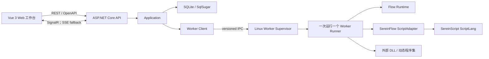
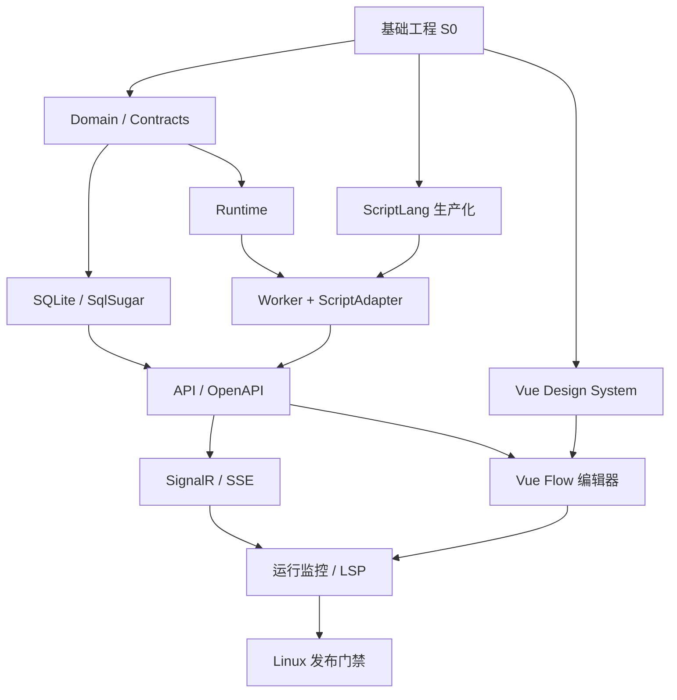

# SereinFlow 重构开发计划

> 状态：Automate 进行中。用户已批准建立新 Git 仓库并开始执行开发计划；旧 SereinFlow 项目保持只读，SereinScript 已完成第一轮生产化并通过内部 NuGet 接入。
>
> 目标目录：`D:\Project\dotnet\SereinFlow`
>
> 旧项目：`D:\Project\C#\DynamicControl\SereinFlow\scr\dotnet`，仅作只读行为参考。

## 1. 已确认基线

| 决策项 | 已确认结论 |
| --- | --- |
| 目标框架 | 后端、Runtime、Worker、测试统一使用 `net10.0` |
| 前端 | Vue 3 + TypeScript + Vite |
| 后端入口 | ASP.NET Core Web API + OpenAPI |
| 实时协议 | SignalR 为主，SSE 为降级通道 |
| 执行边界 | API 不加载脚本、ScriptLang、外部 DLL 或动态程序集；全部在独立 Worker Runner 中执行 |
| 脚本能力 | Worker 内允许 file、network、process、timer、动态程序集和 CLR 类型 |
| 数据 | SQLite + SqlSugar；API 独占数据库访问，Worker 不挂载数据库文件 |
| 部署 | Linux；API、Worker Supervisor、Worker Runner 使用不同进程和受控身份/挂载 |
| 缓存 | `.ssc` 是可丢弃制品；每次项目加载先清理，再由 Worker 全量重建并原子发布 |
| 不兼容项 | 不兼容旧 `.dnf`；不建设 LegacyAdapter，不迁移 Workbench，不保留离线模式 |
| 不保留能力 | 不保留流程图导出 C#，不保留旧 `Serein.Script` 或 NetScript 执行路径 |
| 第一期非目标 | 登录、角色、项目权限、审计、多租户、API Key 管理 |

第一期默认完整编排支持 `>=1024px`；小屏支持项目查看、运行控制和监控。该响应式边界不影响后端合同。

## 2. 目标形态



硬边界：API 工程依赖图不得出现 `ScriptLang`、`Serein.Script`、插件加载器或外部业务 DLL。Supervisor 只管理协议、进程和资源，不执行用户代码；Runner 才加载 Runtime、ScriptAdapter、脚本与插件。

## 3. 工程布局

```text
SereinFlow.sln
Directory.Build.props
Directory.Packages.props
global.json
src/
  SereinFlow.Domain/
  SereinFlow.Contracts/
  SereinFlow.Application/
  SereinFlow.Infrastructure/
  SereinFlow.Runtime.Abstractions/
  SereinFlow.Runtime/
  SereinFlow.ScriptAdapter/
  SereinFlow.Worker.Protocol/
  SereinFlow.Worker.Client/
  SereinFlow.Worker.Supervisor/
  SereinFlow.Worker.Runner/
  SereinFlow.Api/
frontend/
  sereinflow-web/
tests/
  SereinFlow.Domain.Tests/
  SereinFlow.Application.Tests/
  SereinFlow.Infrastructure.Tests/
  SereinFlow.Runtime.Tests/
  SereinFlow.ScriptAdapter.Tests/
  SereinFlow.Worker.IntegrationTests/
  SereinFlow.Api.IntegrationTests/
  SereinFlow.ArchitectureTests/
  SereinFlow.E2E/
deploy/
  containers/
  linux/
docs/
```

`D:\Project\C#\SereinScript\SereinScript` 是 ScriptLang 改造源码。SereinFlow 的可重复构建使用固定提交生成的内部 NuGet 包和锁文件，不在生产工程中保存本机绝对 `ProjectReference`。

## 4. 迭代计划

基准排期按 3 个并行角色估算：后端/Runtime、前端、测试与 Linux 工程共享投入；每个迭代 2 周。总周期约 14-16 周，ScriptLang 生产化是主要浮动项。排期是容量基线，不是发布日期承诺。

| 迭代 | 目标 | 主要交付物 | 退出门禁 |
| --- | --- | --- | --- |
| S0，1 周 | 固定基线与脚手架 | `net10.0` solution、统一包版本、Vue 工程、CI 骨架、架构测试 | 后端/前端空工程在 Linux CI 构建；新构建图不含作废项目和旧脚本 |
| S1，2 周 | Domain、Contracts、SQLite | 新 FlowDefinition、运行合同、SqlSugar Repository、数据库迁移 | Domain 单测通过；SQLite 创建/升级/备份恢复通过；OpenAPI 可生成 TS 类型 |
| S2，2 周 | Runtime 与 ScriptLang 前置改造 | 会话所有权、取消链路、Engine 实例槽位、内部包 | 并发会话不串值；无限循环/timer 可取消；`Serein.ScriptLang 0.1.0-sf.3` 可重复还原 |
| S3，2 周 | Worker 垂直切片 | Worker Protocol、Supervisor、Runner、插件加载、ScriptAdapter、`.ssc` 重建 | 可执行 Action + Script 流程；Runner 退出/崩溃不影响 API；API 进程未加载不受信任程序集 |
| S4，2 周 | API 与实时闭环 | 项目/流程/运行 API、ProblemDetails、SignalR、SSE fallback、事件持久化 | CRUD、校验、运行、取消、查询闭环；WebSocket 被阻断时自动转 SSE；事件可按 sequence 补偿 |
| S5，2 周 | Vue Swiss 编辑器 | 应用壳、项目页、流程画布基础壳、节点库、检查器、undo/redo、保存/校验 | 第一轮已交付应用壳、节点选择/新增、运行切换、输出页签和响应式面板；完整 Vue Flow、持久化和 WCAG 门禁待后续 |
| S6，2 周 | 脚本 UX 与运行监控 | Monaco/LSP、运行控制、节点状态、日志、时间线、ECharts 指标 | 脚本诊断定位准确；运行/停止/重连 E2E 通过；100 事件/秒性能达标 |
| S7，2-3 周 | Linux 加固与发布 | 容器/服务配置、独立 UID/挂载、资源限制、备份恢复、全量测试与发布手册 | API/Worker 隔离验证、崩溃恢复、SQLite 恢复、E2E、安全扫描和发布演练全部通过 |

## 5. 并行工作流



关键路径：ScriptLang 生产化 -> Worker Runner -> API 运行闭环 -> 前端运行 E2E -> Linux 发布。前端 Design Token、应用壳和纯画布交互可以从 S0 后并行；依赖真实 API 的功能必须等 OpenAPI 合同稳定。

## 6. 数据与缓存计划

SQLite 第一期表：

- `Projects`：项目元数据和当前版本。
- `FlowDefinitions`：当前流程定义 JSON、版本和 checksum。
- `FlowDefinitionVersions`：不可变版本快照。
- `PluginManifests`：外部 DLL 元数据、hash 和节点目录。
- `FlowRuns`：运行状态、开始/结束时间和错误摘要。
- `FlowRunEvents`：`runId + sequence` 有序事件，用于查询与实时补偿。

SqlSugar 使用显式迁移版本；生产环境禁止依赖启动时隐式重建数据库。SQLite 启用 WAL、`busy_timeout`、短事务和受控写入重试；备份使用 SQLite 一致性备份机制，并有恢复测试。

`.ssc` 位于 Worker 专属项目制品目录，例如 `worker-data/projects/{projectId}/artifacts/scripts/`。项目加载流程固定为：校验 project ID -> 清理该项目缓存根 -> 在临时目录按源码和依赖全量编译 -> 全部成功后原子替换；任一脚本失败则项目进入“脚本不可运行”状态，禁止回退旧 `.ssc`。缓存身份包含源码/import hash、参数与输出合同、Host API ABI、ScriptLang/编译器/字节码版本、RID 和 CPU 架构。

## 7. 前端实施基线

技术栈：Vue 3、TypeScript、Vite、Vue Router、Pinia、`@tanstack/vue-query`、`@vue-flow/core`、Monaco Editor、`monaco-languageclient`、shadcn-vue/Reka UI、Tailwind CSS、`lucide-vue-next`、`@tanstack/vue-table`、`@tanstack/vue-virtual`、ECharts、Vitest、Vue Test Utils、MSW、Playwright 和 axe-core。

UI/UX PRO MAX 的 Minimalism & Swiss Style 约束：12 列网格、8px 基准间距、浅色中性表面、唯一交互强调色 `#0369A1`、普通圆角 `0-4px`、无渐变/玻璃态/装饰阴影、Lucide 图标、150-250ms 状态过渡、WCAG 2.2 AA。工作台使用 `56px` 命令栏、约 `240px` 左栏、中央画布、`320-360px` 检查器和可停靠输出面板，不改造成卡片式门户。

## 8. 发布门禁

- `dotnet build/test/publish` 在 Linux `net10.0` CI 全部通过，前端 `vue-tsc --noEmit`、lint、unit、build 和 Playwright 全部通过。
- 架构测试证明 API 不引用或加载 ScriptLang、ScriptAdapter、Runtime 实现、插件程序集和外部 DLL。
- file/network/process/timer/动态程序集/CLR 在 Runner 内可用；同样能力不能通过 API 进程路径执行。
- `Environment.Exit`、崩溃、超时、不合作 CLR 调用和子进程不会终止 API；Supervisor 能终止进程树并形成结构化结果。
- 每次项目加载均清理、全量重建 `.ssc`；损坏缓存、编译失败、版本变化和平台变化测试通过。
- SQLite 事务、并发写、迁移、备份和恢复测试通过；Worker 身份无法读取数据库文件和 API 配置。
- SignalR 正常路径、SSE 降级、断线重连和 `sequence` 补偿通过集成测试。
- 1000 节点/1500 连线首次可交互不超过 3 秒；平移缩放 p95 不低于 50 FPS；100 事件/秒呈现 p95 不超过 250ms。
- 375/768/1024/1440px 无元素重叠或页面级横向滚动；核心页面 axe 无 critical/serious 问题。
- solution、发布包和运行依赖中不存在六个作废项目、`Serein.Script`、Workbench、LegacyAdapter 或 C# 导出入口。

## 9. Approve 门禁

本计划已经吸收本轮全部 P0/P1 决策，没有遗留的产品级阻断问题。进入 Automate 前只需要批准本计划；批准后从 S0 开始，严格按 `TASK_sereinflow-refactor.md` 的依赖顺序执行，并在每个迭代更新 `ACCEPTANCE_sereinflow-refactor.md`。
