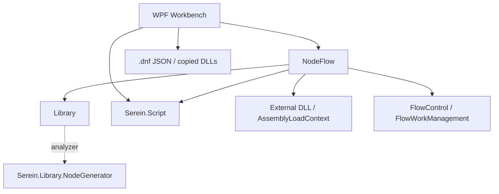
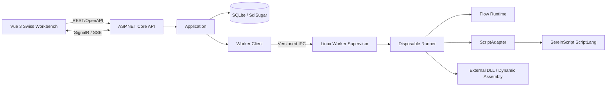

# SereinFlow 重构分析报告

> 报告日期：2026-08-22
>
> 旧项目：`D:\Project\C#\DynamicControl\SereinFlow\scr\dotnet`
>
> 新项目：`D:\Project\dotnet\SereinFlow`
>
> 新脚本引擎：`D:\Project\C#\SereinScript\SereinScript`

## 1. 执行摘要

现有 SereinFlow 是以 `Library + NodeFlow + WPF Workbench` 为核心的桌面单体。它已经具备流程图编辑、外部 DLL 节点、生命周期调度、脚本节点和运行输出，但领域模型、编辑状态、运行状态、文件持久化、插件加载和脚本解释相互穿透。旧 solution 还包含已作废项目和 `Serein.Script`，不适合作为新平台直接升级。

本次重构采用绿地新架构，不迁移旧 solution：

- 新后端、Runtime 和 Worker 统一 `net10.0`。
- Vue 3 + TypeScript 工作台通过 REST/OpenAPI 和 SignalR/SSE 使用后端。
- SQLite + SqlSugar 保存新项目、流程版本、插件 manifest、运行和事件。
- API 不加载 Runtime 实现、ScriptLang、外部 DLL 或动态程序集。
- Linux Worker Supervisor 创建一次性 Runner；Runner 执行 Runtime、脚本和插件。
- Worker 内允许 file/network/process/timer/动态程序集/CLR 能力；安全依赖进程身份、命名空间、挂载、secret 隔离和资源限制。
- 不兼容旧 `.dnf`，不保留 Workbench、离线模式、旧脚本、NetScript 或流程图 C# 导出。
- `.ssc` 是可丢弃制品，每次项目加载清理并全量重建。

最关键的前置工作不是替换项目引用，而是先修复 ScriptLang 的取消、参数绑定、全局槽位和 CLR 重载问题。否则流程停止不真实、参数无法可靠注入，并发会话还会串值。

## 2. 分析范围与方法

本报告检查了：

- solution、`*.csproj`、项目引用和作废项目残留。
- Library 的领域接口、流程数据、IOC、上下文和 NodeGenerator 使用。
- NodeFlow 的流程编辑、Runtime、节点生命周期、对象池、插件与脚本路径。
- Workbench 的信息架构、保存路径、脚本编辑和运行控制。
- SereinScript/ScriptLang 的 Engine、Scope、Compiler、VM、ImportResolver、系统模块、CLR 互操作和 LSP。
- 现有测试与构建基线。
- UI/UX PRO MAX 对 Minimalism & Swiss Style、Vue 栈、无障碍和性能的建议。

本轮没有修改旧生产代码，也没有开始新架构实现。

## 3. 现有架构



### 3.1 模块职责与问题

| 模块 | 当前职责 | 主要问题 | 新架构去向 |
| --- | --- | --- | --- |
| Library | 接口、流程数据、上下文、IOC、工具 | Domain、Runtime、编辑和序列化混合；仍依赖 NodeGenerator | Domain、Contracts、Runtime.Abstractions |
| NodeFlow | 节点、画布操作、流程调度、DLL、脚本、C# 生成 | 超大职责；共享状态；直接依赖旧脚本 | Application、Runtime、ScriptAdapter、Worker |
| Workbench | WPF UI、项目文件、运行控制、日志、脚本编辑 | UI 与引擎/文件强耦合 | 仅提取信息架构语义，产品由 Vue 重写 |
| FlowStartTool | 本地装配和启动 | 与单机 Runtime 绑定 | Worker Supervisor/Runner |
| Serein.Script | 旧解释器、类型推导、C# 转换 | 停止维护且与新语言不兼容 | 删除生产路径 |
| 作废项目 | 生成器、旧协议、Avalonia、协同 | 仍出现在 solution 或引用中 | 新构建图必须为零 |

作废项目为：

`Serein.Library.NodeGenerator`、`Serein.Proto.HttpApi`、`Serein.Proto.Modbus`、`Serein.Proto.WebSocket`、`Serein.Workbench.Avalonia`、`Serein.CollaborationSync`。

### 3.2 构建依赖问题

- `Library/Serein.Library.csproj` 仍引用 NodeGenerator Analyzer。
- `NodeFlow/Serein.NodeFlow.csproj` 仍引用 NodeGenerator、`Serein.Script` 和 Library。
- `Workbench/Serein.Workbench.csproj` 仍引用旧脚本。
- NodeGenerator 虽然作废，但它生成的 partial 属性和通知仍被生产代码消费。实施时必须先盘点生成输出、建立属性/通知等价测试并显式替代，不能直接删 Analyzer。
- Workbench 临时 csproj、生成文件和发布脚本也可能携带旧 DLL 名称，需纳入“项目引用 + 源码 + 发布目录 + 进程加载”四层扫描。

## 4. 运行时分析

`NodeFlow\Env\FlowControl.cs` 和 `NodeFlow\Tool\FlowWorkManagement.cs` 同时处理：

- IOC 和节点类型注册。
- 项目/程序集加载。
- Init、Loading、Exit 生命周期。
- 普通流程、FlowCall、Flipflop 和 GlobalData。
- CancellationTokenSource、上下文池和资源清理。
- 运行事件与异常传播。

这种模型适合桌面进程中的单环境，却不适合 API 服务中的并发会话：

1. 会话所有权不清晰，IOC、对象池、选项和清理可能跨运行共享。
2. `FlowWorkOptions` 只有单个 CTS；部分 Run 路径仍使用内部 CTS 而不是外部 token。
3. 清理包含全局数据、Native DLL 和程序集状态，重复/并发清理难以证明幂等。
4. 节点模型同时承担领域、运行、编辑和持久化职责，无法直接作为 HTTP DTO。

结论：新 Runtime 必须重写 `FlowExecutionSession` 所有权，不能在旧 `FlowControl` 外面包一层 Web API。每次运行必须独占 token、上下文、事件 sequence、插件租约和释放注册表。

## 5. 脚本迁移分析

### 5.1 旧脚本入口

脚本替换范围不只 `SingleScriptNode`：

| 入口 | 旧行为 | 新设计 |
| --- | --- | --- |
| `SingleScriptNode` | 解析/执行脚本、推导返回类型、参与 C# 生成 | 新 `ScriptNodeDefinition` + `IScriptNodeExecutor` |
| `SingleConditionNode` | 旧解释器计算条件 | 新显式布尔输出合同 |
| `SingleExpOpNode` | 旧解释器计算表达式 | 新显式输入/输出合同 |
| `IScriptFlowApi` | 向脚本暴露上下文、参数、全局数据和节点调用 | Runner 内版本化 `FlowHostApi` |
| `SingleNetScriptNode` | 保存旧 C# 脚本和依赖，已 obsolete | 不进入新 schema 或执行计划 |
| `FlowCoreGenerateService` | 收集脚本方法并导出 C# | 整体删除 |

旧语言与新 ScriptLang 不是兼容替换。旧解析器的 `ParserScript(...): Type`、`ConvertCSharpCode()`、静态类型推导和部分语法在新动态 Value/ByteCode/VM 模型中没有等价 API。由于已明确不兼容旧项目，新方案不建设语法转换器，直接以新脚本合同实现节点。

### 5.2 ScriptLang 当前阻断

关键源码：

- `ScriptLang\ScriptEngine.cs`
- `ScriptLang\Runtime\ByteCode\VM.cs`
- `ScriptLang\Runtime\ByteCode\GlobalSlotRegistry.cs`
- `ScriptLang\Runtime\ImportResolver.cs`
- `ScriptLang\System\FileModule.cs`
- `ScriptLang\System\ProcessModule.cs`

| 问题 | 当前事实 | 风险 | 必须完成的改造 |
| --- | --- | --- | --- |
| 取消 | `ScriptTask.Cancel()` 的 CTS 未传入 `RunAsync`/VM | API 显示已停止，脚本继续运行 | token 贯穿 VM、循环、函数、import、异步模块；超时终止 Runner |
| 参数 | 外部 Scope 注册逻辑没有把变量接入 Compiler/VM | 参数不可见或依赖静态全局 | 编译期参数 schema + 执行期独立值绑定 |
| 会话隔离 | `GlobalSlotRegistry` 是进程级无锁静态状态 | 并发串值，`ClearCache()` 破坏其他运行 | Engine/ExecutionContext 实例状态 |
| CLR 绑定 | 同名方法反射与转换覆盖不足 | 重载错误、类型截断、异常不稳定 | 确定性签名解析；decimal/enum/Nullable/Guid/集合/async 测试 |
| 系统能力 | 默认提供文件、网络、进程、timer 等；可删除文件、读环境、启动/退出进程 | 如果进入 API，可读取数据库/secret 或终止服务 | 只在一次性 Runner 提供；API/Supervisor 不引用 |

### 5.3 接入与供应

SereinFlow 不应在生产 csproj 中写入 `D:\Project\C#\SereinScript\SereinScript` 绝对路径。改造完成后，从固定提交生成带版本/提交标识的内部 NuGet 包，由 `Directory.Packages.props` 与 lock file 固定。

源码是唯一事实来源。`.ssc` 制品身份至少包含：

- 源码及传递 import hash。
- 输入/输出合同 hash。
- Host API ABI。
- ScriptLang、Compiler 和 ByteCode 版本。
- Linux RID 与 CPU 架构。

每次项目加载无条件清理当前项目脚本制品，再在临时目录全量编译并原子切换。编译失败不能回退旧缓存。

## 6. 持久化分析与结论

旧项目使用 `.dnf` JSON 和复制到项目目录的 DLL，并存在弱版本字段与多套保存路径。它们不具备稳定迁移基线，但用户已经明确无需兼容，因此不建设读取、迁移、回写或黄金样例任务。

新项目采用 SQLite + SqlSugar：

- `Projects`
- `FlowDefinitions`
- `FlowDefinitionVersions`
- `PluginManifests`
- `FlowRuns`
- `FlowRunEvents`
- `SchemaMigrations`

流程定义可以作为带 schemaVersion/checksum 的 JSON 文档存于版本表，避免第一期过度拆分节点/连线表；需要查询的项目、版本、运行状态和事件保持结构化列与索引。

SQLite 的主要工程风险是单写者与高频事件。处理方式是 WAL、busy timeout、短事务、同一 run 的事件批量写、有限重试和一致性备份/恢复测试。数据库只挂载到 API；Runner 接收版本化运行快照，不直接查询 SQLite。

## 7. 目标架构



目标模块：

| 模块 | 职责 |
| --- | --- |
| Domain | 新流程模型、规则与状态转换 |
| Contracts | REST DTO、错误、事件 |
| Application | 项目、流程、校验、运行、事件摄取用例 |
| Infrastructure | SqlSugar、SQLite、迁移、备份、日志 |
| Runtime.Abstractions | Application 到执行侧的 DTO/端口 |
| Runtime | 执行计划、会话、节点、生命周期 |
| ScriptAdapter | ScriptLang、值转换、诊断、`.ssc` |
| Worker.Protocol/Client | 版本化 IPC |
| Worker.Supervisor | Runner 生命周期、心跳、deadline、资源 |
| Worker.Runner | 唯一不受信任代码执行进程 |
| Api | REST/OpenAPI、SignalR/SSE、健康检查 |
| Vue Web | 编辑、脚本、运行与监控 |

## 8. Worker 隔离设计

用户允许脚本使用全部高权限模块，因此“独立进程”必须落实为真实权限边界：

- API UID 拥有 SQLite 和 API 配置，不拥有脚本/插件执行能力。
- Supervisor UID 只拥有 UDS、Runner 管理和受控工件传递能力。
- Runner 使用独立工作目录、mount/PID namespace 或等价容器，不能看到 SQLite、API secret 或宿主控制 socket。
- cgroup/systemd/container 限制 CPU、内存、执行时间、进程数、文件数、输出与 IPC 消息。
- Supervisor 能终止 Runner 整个进程树；Runner 的 `Environment.Exit`、崩溃和 DLL 依赖冲突不影响 API。
- IPC 提供协议版本、request/run ID、deadline、心跳、取消确认、sequence、背压、最大消息和结构化错误。

Supervisor 自身不加载 Runtime/ScriptLang/插件，否则脚本的 process/CLR 能力仍可破坏管理进程。推荐一次运行一个 Runner；运行结束销毁，减少插件卸载、静态状态和版本冲突问题。

## 9. API 与实时设计

REST 覆盖项目、流程、校验、插件目录、运行、取消、状态和事件查询。所有写请求带 expectedVersion/ETag；冲突返回 `409`。错误统一 ProblemDetails，不向浏览器暴露本地路径、CLR 类型、完整脚本源码或宿主堆栈。

SignalR 是主实时通道，SSE 是明确降级。事件使用 `runId + sequence + timestamp + type + nodeId + payload`。前端保存最后 sequence；重连时先查询缺失事件，再恢复实时订阅，保证至少一次传输下的幂等呈现。

第一期不实现登录、权限、审计、多租户和 API Key。由此带来的结论是：任何可达客户端都拥有同等操作能力，生产入口必须由受控网络或外围反向代理限制。这是部署约束，不在应用内暗自加入身份系统。

## 10. Vue 3 UI/UX 方案

UI/UX PRO MAX 的自动综合推荐偏向暗色监控或营销结构，不符合高频节点编排工作台；领域检索明确匹配 Minimalism & Swiss Style 和 Swiss Modernism 2.0。因此采用浅色、严格网格、单一强调色的操作界面。

技术栈：

- Vue 3 + TypeScript + Vite + Vue Router。
- Pinia Setup Store + `@tanstack/vue-query`。
- `@vue-flow/core`、background、minimap、controls。
- Monaco + `monaco-languageclient`。
- Tailwind + shadcn-vue/Reka UI + `lucide-vue-next`。
- TanStack Vue Table/Virtual、ECharts。
- Vitest、Vue Test Utils、MSW、Playwright、axe-core。

信息架构：

```text
56px 顶部命令栏：项目、保存、校验、运行、停止、连接状态
240px 左栏：流程/画布、节点库、插件库
中央：Vue Flow 多画布、缩放、框选、小地图
320-360px 右栏：节点属性、参数、脚本、诊断
32px 状态栏 + 240-360px 可停靠问题/输出面板
```

Swiss 令牌：

- `#F8FAFC/#FFFFFF` 背景，`#020617` 主文字，`#475569` 次文字。
- 唯一交互强调色 `#0369A1`；状态色 `#15803D/#B45309/#B91C1C`。
- 12 列、8px 基准，普通圆角 0-4px，默认无阴影。
- Inter/Noto Sans SC/Fira Code，固定字阶，`letter-spacing: 0`。
- 150-250ms 颜色/边界过渡；无渐变、玻璃态、发光和卡片嵌套。

完整编排默认支持 `>=1024px`；小屏支持查看、运行和监控。375/768/1024/1440px 不得有页面级横向滚动，画布内部可二维平移。发布以 WCAG 2.2 AA 为门槛。

性能基线：

- 1000 节点/1500 连线首次可交互 <= 3 秒。
- 平移缩放 p95 >= 50 FPS。
- 100 事件/秒呈现 p95 <= 250ms。
- 1 万条日志使用虚拟列表。

## 11. 测试与质量现状

旧项目没有正式自动化测试项目；零测试基线意味着不能依赖旧回归套件保护重写。新项目必须从第一任务起建立：

- Domain/Runtime/ScriptAdapter 单元测试。
- SqlSugar/SQLite、Worker、API 和 SignalR/SSE 集成测试。
- API 依赖边界与进程加载架构测试。
- OpenAPI/Worker Protocol 合同测试。
- Vue 组件、E2E、无障碍、视觉和性能测试。
- Linux build/test/publish、数据库恢复和 Worker 崩溃演练。

旧代码的黄金行为样例只用于 Runtime 节点语义参考，不用于 `.dnf` 或旧脚本兼容。

## 12. 风险排序

| 等级 | 风险 | 处置 |
| --- | --- | --- |
| P0 | ScriptLang 取消、参数和静态槽位缺陷 | T5 前置修复并压力测试 |
| P0 | 全能力脚本突破 API 数据边界 | API/Supervisor/Runner 分离，独立 UID/namespace/mount/secret |
| P0 | API 误加载脚本或 DLL | 架构测试 + 进程程序集清单断言 |
| P1 | Runtime 共享状态被直接迁移 | 重写会话所有权和幂等清理 |
| P1 | NodeGenerator 删除后生成成员缺失 | 输出盘点、显式替代和行为测试 |
| P1 | SQLite 高频事件写入竞争 | WAL、批量、短事务、有界重试、恢复测试 |
| P1 | Worker 协议或进程树无法可靠取消 | 握手、heartbeat、deadline、cancel ack、进程树终止 |
| P1 | `.ssc` 过期或失败回退 | 每次加载重建、原子切换、失败禁用运行 |
| P2 | Vue 大图/实时日志重渲染 | shallow state、增量命令、批量事件、虚拟列表 |
| P2 | 无应用身份导致入口暴露 | 受控网络/反向代理外围限制 |

## 13. 结论

重构应从新 solution 开始，先建立架构边界和测试，再实现 Runtime/ScriptLang/Worker 的执行闭环。第一条纵向切片是：创建新项目 -> SQLite 保存新流程 -> 一次性 Runner 执行 Action + Script 节点 -> API 持久化事件 -> Vue 通过 SignalR/SSE 显示结果。

详细分期见 `DEVELOPMENT_PLAN_sereinflow-refactor.md`，原子任务见 `TASK_sereinflow-refactor.md`。Align、Consensus、Architect 和 Atomize 已完成，用户已批准进入 Automate，T0/T1 工程基线已落地。
