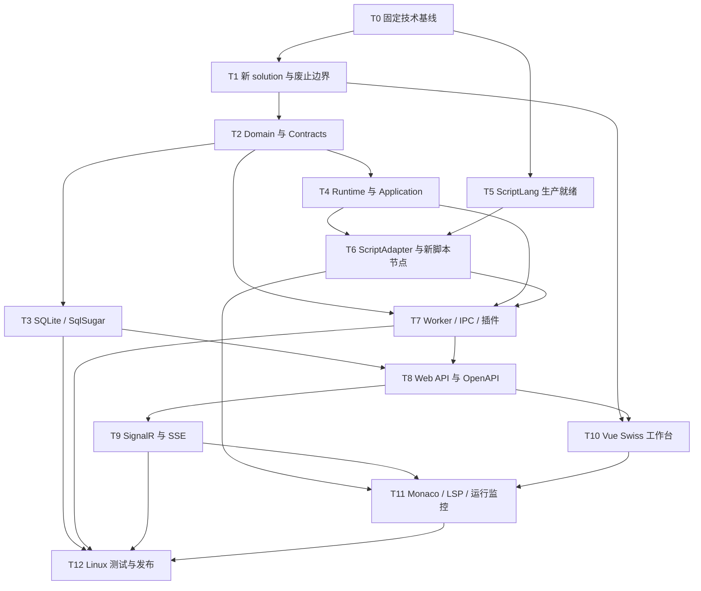

# SereinFlow 重构任务拆分

> 状态：Automate 进行中。P0/P1 架构决策已完成，T0/T1 已开始并完成工程骨架与边界门禁。

实施目录：`D:\Project\dotnet\SereinFlow`。旧源码和旧 Script 项目只作为行为与缺陷证据，不作为新 solution 的编译输入。

## 1. 依赖图

## 2. 原子任务

### T0：固定技术基线（已完成）

- 输入契约：已确认的 `.NET 10`、Linux、Vue 3、SQLite/SqlSugar、Worker 隔离和脚本能力决策；旧项目与 ScriptLang 当前构建基线。
- 输出契约：`global.json`、`Directory.Build.props`、`Directory.Packages.props`、包锁定策略、Linux CI 基础镜像、架构决策记录、可重复构建命令。
- 实现约束：所有新 C# 项目只目标 `net10.0`；不得引用本机绝对路径；ScriptLang 从固定提交生成内部 NuGet 包；不修改或删除旧项目目录。
- 验收标准：Linux CI 可构建最小后端和 ScriptLang 包；Node/Vue 工具链可重现；构建记录能解释 SDK、RID 和依赖版本。
- 依赖：无。

### T1：建立新 solution 与废止边界（已完成第一轮）

- 输入契约：新工程布局、六个作废项目清单、`Serein.Script`、Workbench、NodeGenerator 和 C# 导出路径的引用扫描。
- 输出契约：新 `SereinFlow.sln`、分层项目骨架、测试项目、前端目录、引用边界扫描与迁移映射。
- 实现约束：只迁移新架构需要的行为，不复制旧 solution；先盘点 NodeGenerator 生成的 partial 属性/通知，再用显式领域代码替代；不得建立 LegacyAdapter、WPF 客户端或 C# 代码生成器。
- 验收标准：新 solution/发布图中不存在六个作废项目、`Serein.Script`、Workbench、LegacyAdapter 和 C# 导出入口；API 架构测试禁止引用 ScriptLang/ScriptAdapter/插件程序集；新项目不依赖 NodeGenerator。
- 依赖：T0。

### T2：建立 Domain 与 Contracts（基础模型已完成，OpenAPI 映射待 T8）

- 输入契约：节点、画布、连线、参数、生命周期和运行事件的现有业务语义；新项目仅支持的新 schema。
- 输出契约：`FlowDefinition`、`CanvasDefinition`、`NodeDefinition`、`ConnectionDefinition`、`ScriptNodeDefinition`、`PluginManifest`、`FlowRun`；REST DTO、Worker DTO、错误码和事件信封。
- 实现约束：Domain 与传输 Contracts 相互独立，由 Application/API 映射；Domain 不引用 ASP.NET、SqlSugar、ScriptLang、文件系统或 UI；DTO 不携带 `Type`、`MethodInfo`、委托、CLR 对象或宿主绝对路径。
- 验收标准：节点 ID、端口、连线、参数、版本并发、执行分支和生命周期规则有正常/边界/异常单测；OpenAPI schema 可生成严格 TypeScript 类型；Worker DTO 可序列化且版本化。
- 依赖：T1。

### T3：实现 SQLite 与 SqlSugar 持久化（基础切片已完成，运行数据扩展待 T8）

- 输入契约：Domain 聚合、Application Repository 端口、项目/流程/运行/事件查询需求。
- 输出契约：`Projects`、`FlowDefinitions`、`FlowDefinitionVersions`、`PluginManifests`、`FlowRuns`、`FlowRunEvents` schema；SqlSugar Repository、迁移器、事务与备份恢复工具。
- 实现约束：API 是 SQLite 唯一访问方；Worker 无数据库路径和文件权限；启用 WAL、`busy_timeout`、短事务和有界重试；生产数据库只能通过版本化迁移升级，不使用破坏性自动重建。
- 验收标准：CRUD、乐观并发、事务回滚、并发写、busy、升级、降级阻断、备份和恢复测试通过；进程异常后数据库可重新打开且状态一致。
- 依赖：T2。

### T4：重写 Runtime 会话所有权（会话/执行计划基础切片已完成，生命周期扩展待后续）

- 输入契约：旧 `FlowControl`、`FlowWorkManagement`、上下文、对象池和 Init/Loading/Exit 行为证据；新 Domain。
- 输出契约：`ExecutionPlanBuilder`、`FlowExecutionSession`、`NodeExecutor`、`LifecycleRunner`、`RunEventPublisher`、取消/超时/重试策略和 Runtime 端口。
- 实现约束：不是对旧 FlowControl 的薄包装；每次运行独占 CTS、上下文、事件序列、资源清理表和插件租约；不使用进程级可变运行状态；Application 只依赖 Runtime.Abstractions。
- 验收标准：Action、FlowCall、GlobalData、Flipflop、Init/Loading/Exit、错误分支、取消和资源释放通过单测；并发运行不串上下文；重复取消和重复清理幂等。
- 依赖：T2。

### T5：完成 ScriptLang 生产就绪改造（第一轮已完成）

- 输入契约：`D:\Project\C#\SereinScript\SereinScript` 中的 `ScriptEngine`、`ScriptTask`、`Scope`、Compiler、VM、`GlobalSlotRegistry`、`ImportResolver` 和 CLR 调用实现。
- 输出契约：`RunAsync(CancellationToken)`；Engine-owned 槽位和缓存；VM/循环/import/timer 取消链路；原型重复注册修复；内部 NuGet 包 `Serein.ScriptLang 0.1.0-sf.3`。
- 实现约束：取消贯穿 VM 指令循环、循环回边、函数、import 和异步模块；`ClearCache()` 不能影响其他 Engine/会话；重载不得依赖“第一个同名方法”；file/network/process/timer/动态程序集/CLR 能力保持可用，但只能由 Runner 调用。
- 验收标准：无限循环和 timer 可取消；并发 Engine/会话和清缓存不串值；生产包可被新 solution 从本地内部源重复还原。参数边界已在 T6 ScriptAdapter 第一轮覆盖；CLR 重载/转换矩阵和不合作调用的 Worker 终止留在 T7。
- 依赖：T0。

### T6：实现 ScriptAdapter 与新脚本节点（第一轮已完成）

- 输入契约：T5 稳定 API；新 `ScriptNodeDefinition`、条件节点、取值节点、表达式节点和 Flow Host API 合同。
- 输出契约：`IScriptNodeExecutor`、`ScriptValueConverter`、结构化诊断、编译服务和 `.ssc` 制品管理器；表达式/Host API 留在后续垂直切片。
- 实现约束：只支持新脚本语义，不自动转换旧脚本；源码和显式输入/输出 schema 是事实来源；完整脚本、条件和表达式均在 Worker 边界执行；结果只能通过可序列化 DTO 返回。
- 验收标准：正常、null、数值边界、复杂对象限深/限量、编译错误、运行异常、取消、输入校验和多输出映射均有测试；每次项目加载先清理缓存，再在临时目录全量编译并原子替换；损坏/过期 `.ssc` 不被执行，编译失败不回退旧制品。第一轮已完成 6 项自动化测试。
- 依赖：T4、T5。

### T7：实现 Worker、IPC 与外部插件加载（第一轮 Worker 协议与一次性执行已完成）

- 输入契约：Runtime 端口、ScriptAdapter、PluginManifest、Worker DTO、Linux 部署约束。
- 输出契约：`Worker.Protocol`、`Worker.Client`、Supervisor、一次性 Runner、协议握手、心跳、deadline、取消确认、事件 sequence、背压、工件传输和插件加载器。
- 实现约束：API 只连接 Supervisor；Supervisor 不加载用户代码；Runner 才加载 Runtime、ScriptLang、外部 DLL 和动态程序集。Runner 使用独立低权限身份/命名空间/工作目录，不继承 API 配置或数据库权限；允许脚本在其边界内使用文件、网络、进程和 CLR。
- 验收标准：协议版本不兼容、超大消息、心跳丢失、取消、超时、插件依赖缺失、Runner 崩溃、`Environment.Exit` 和进程树终止均有测试；API 保持可用；Worker 无法读取 SQLite 文件和 API 环境秘密。
- 依赖：T2、T4、T6。

第一轮完成项：`Worker.Protocol` 的 versioned JSONL 信封和大小限制；`Worker.Client` 的 API-side 调用端口；Supervisor 的握手、deadline、取消、事件 sequence、Runner 生命周期和进程树终止；Runner 的 Action/Script 执行、事件/结果序列化。详细合同见 `WORKER_PROTOCOL_V1.md`。插件加载、Linux 强隔离和不合作 CLR 调用测试保留在 T7 后续，不得误标为已完成。

### T8：实现 ASP.NET Core Web API 与 OpenAPI

- 输入契约：Application 用例、Repository、Worker Client、REST Contracts。
- 输出契约：项目/流程/插件目录/校验/运行/取消/查询 API，ProblemDetails、健康检查、OpenAPI 文档、TypeScript 客户端生成流程。
- 实现约束：第一期不实现登录、角色、项目权限、审计、多租户和 API Key；不复用旧自定义 Router；不把本地路径、CLR 类型、堆栈或脚本秘密返回浏览器；API 不引用 Worker Runner 实现。
- 验收标准：创建项目、流程 CRUD、版本冲突、校验、运行、取消、运行查询和插件目录通过集成测试；OpenAPI 生成的 Vue 客户端可类型检查；架构测试确认 API 未加载不受信任程序集。
- 依赖：T3、T7。

### T9：实现 SignalR 与 SSE 降级

- 输入契约：`FlowRunEventDto`、`runId + sequence` 规则、事件存储与前端连接状态模型。
- 输出契约：SignalR Hub、SSE stream、协商/降级逻辑、断线补偿、过滤、背压、结构化运行日志和指标。
- 实现约束：SignalR 为首选；WebSocket 不可用时可降级 SSE；重连从最后 sequence 补偿且不重复改变前端状态；不建设用户审计功能。
- 验收标准：WebSocket、SSE、断线、重连、补偿、取消、Runner 崩溃、100 事件/秒和长日志场景通过测试；事件顺序稳定，客户端可查询最终状态。
- 依赖：T8。

### T10：实现 Vue 3 Minimalism & Swiss 工作台（多画布图编辑器与本地编辑历史切片已完成）

- 输入契约：OpenAPI 客户端、新项目信息架构、UI/UX PRO MAX Swiss 令牌和无障碍标准。
- 输出契约：Vue Router、Pinia、Vue Query、应用壳、项目列表、Vue Flow 多画布、节点库、检查器、参数编辑、命令面板、undo/redo、保存和校验流程。
- 实现约束：Vue 3 Composition API + `<script setup lang="ts">`；使用 `@vue-flow/core`、shadcn-vue/Reka UI、Tailwind 和 `lucide-vue-next`；不存在 React/Zustand/`@xyflow/react`；前端不执行脚本或插件。
- 验收标准：新项目创建、画布切换、节点搜索/创建/移动/连线/删除、属性编辑、撤销重做、保存和校验有 Playwright 流程；`vue-tsc`、lint、单测和构建通过；375/768/1024/1440 无页面级横向滚动或重叠；WCAG 2.2 AA 和 axe 门禁通过。
- 依赖：T1、T8。

> 状态补充：本地工作副本已完成 Vue Flow 多画布、节点添加/拖拽/选择/删除、执行边和参数数据边、参数来源检查器、`zh-CN`/`en-US` 切换、生命周期画布增删、50 步撤销/重做、快捷键和版本化 localStorage 保存恢复。REST 保存、校验、Router/Pinia/Vue Query、复制粘贴/对齐、正式 E2E/axe 与运行监控仍属本任务未完成范围。

### T11：实现 Monaco/LSP 与运行监控

- 输入契约：ScriptAdapter 诊断、ScriptLang LSP、SignalR/SSE 客户端、运行/事件 API。
- 输出契约：Monaco 脚本编辑器、LSP WebSocket 网关、completion/hover/definition/references/diagnostics、运行控制、只读执行图、事件虚拟列表、时间线和 ECharts 指标。
- 实现约束：LSP 与脚本执行都位于后端/Worker 边界；Pinia 只保存工作区和有限实时状态，服务端数据由 Vue Query 管理；高频事件批量刷新，订阅在组件卸载时释放。
- 验收标准：脚本诊断、运行、停止、Runner 崩溃、SignalR/SSE 切换、事件补偿和运行详情 E2E 通过；1000 节点/1500 连线首次可交互 <= 3 秒，平移缩放 p95 >= 50 FPS；100 事件/秒呈现 p95 <= 250ms；1 万条日志使用虚拟滚动。
- 依赖：T6、T9、T10。

### T12：Linux 质量门禁与发布

- 输入契约：全部模块、测试矩阵、SQLite 备份策略、Worker 隔离模型和部署配置。
- 输出契约：Linux 容器/服务文件、API/Supervisor/Runner 独立身份与挂载配置、CI/CD、单元/集成/契约/E2E/架构测试、发布与回滚手册、更新后的 ACCEPTANCE/FINAL/TODO。
- 实现约束：先测试后实现；密钥只从环境或部署 secret 注入；Worker 不获得 API secret/数据库挂载；资源限制覆盖 CPU、内存、时间、进程树、文件数、输出和 IPC 大小；不恢复任何非目标兼容路径。
- 验收标准：Linux build/test/publish、SQLite 迁移/备份/恢复、API/Worker 隔离、Worker 崩溃恢复、`.ssc` 重建、SignalR/SSE、Vue E2E、无障碍、性能和依赖扫描全部通过；发布包不存在作废项目、旧脚本、Workbench、LegacyAdapter 或 C# 导出器。
- 依赖：T3、T7、T9、T11。

## 3. Definition of Done

每个任务只有同时满足以下条件才可完成：

1. 输入/输出合同已版本化，依赖任务已通过。
2. 正常、边界和异常测试先于或随实现提交，CI 可重复运行。
3. 代码未穿透已定义的 API/Worker/Domain 边界。
4. OpenAPI、Worker Protocol、数据库迁移或 UI 行为变更已同步文档。
5. `ACCEPTANCE_sereinflow-refactor.md` 记录命令、环境、结果和已知风险。
6. 未完成项写入 `TODO_sereinflow-refactor.md`，不得以注释或隐式假设隐藏。

## 4. 实施顺序

批准后从 T0/T1 开始。T5 可与 T1/T2 并行，但 T5 的取消、参数绑定、槽位实例化和 CLR 绑定全部通过前，T6 不得进入生产接入。第一条纵向切片是：创建新项目 -> 保存一个流程 -> Worker Runner 执行 Action + Script 节点 -> API 持久化运行事件 -> Vue 显示状态。之后再扩展全部节点类型、LSP、监控和 Linux 发布能力。
