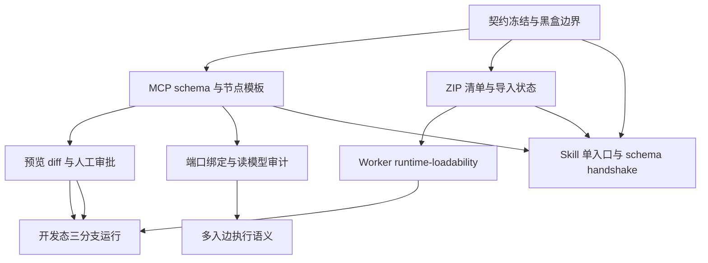

# SereinFlow 任务暴露风险整改优化计划

**编制日期：** 2026-08-30  
**状态：** 待实施  
**关联报告：** [sereinflow-task-exposure-risk-report-2026-08-30.md](sereinflow-task-exposure-risk-report-2026-08-30.md)  
**适用范围：** SereinFlow MCP Server、公开 Contracts、类库 ZIP 打包与导入链路、Worker 运行检查、`sereinflow-ai-toolkit` Skill，以及面向 Codex/OpenCode/Claude Code 等客户端的生产黑盒诊断流程。

## 1. 执行摘要

本计划针对风险报告中的 R-01 至 R-10，目标是让 AI 能够可靠地完成“读取项目 -> 生成变更 -> 预览 -> 人工确认 -> 应用 -> 复读 -> 受限运行验证”，同时保持服务端和生产环境的黑盒边界。

整改顺序固定为：

1. 先冻结 MCP 合同、兼容策略和诊断边界，避免继续扩散协议漂移。
2. 再修复流程补丁 schema、类库节点模板和 ZIP/导入状态模型，保证生成物可重复。
3. 然后提升预览审批可审计性，并提供仅限开发轨道的运行验证。
4. 最后统一端口绑定、项目类库投影、执行收敛语义和 Skill 分发治理。

生产环境的错误处理必须始终以 MCP 返回的错误代码、`diagnosticId`、公开读模型和服务端提供的诊断摘要为依据。客户端不得通过固定路径查找 `D:\Project\dotnet\SereinFlow\SereinFlow.sln`，不得翻阅服务端源码、数据库、Worker 本地目录或其他宿主文件来解释远端错误。用户环境中不存在这些路径属于正常情况，不应被当作故障处理分支。

## 2. 当前基线

下列能力在本计划编制前已经完成，后续阶段应在其上演进，不重复设计同一功能：

| 基线能力 | 当前状态 | 计划处理方式 |
| --- | --- | --- |
| MCP Server 黑盒错误边界 | 已完成 | 保持 `mcp.internal_error`、`mcp.tool_timeout`、`diagnosticId` 和脱敏堆栈策略 |
| 生产客户端禁止查找固定解决方案、源码和服务端本地资源 | 已完成 | 写入 Skill 的硬性规则，并增加回归测试 |
| 公开合同使用 camelCase 字符串枚举，读取兼容旧数值 | 已完成基础能力 | 在流程补丁层补齐规范化、错误代码和 schema 版本治理 |
| 预览后人工 `APPLY`、应用后复读 | 已完成 | 增加审批摘要、分页 diff、候选 checksum 绑定和审计记录 |
| `isPreviewOnly` 等预览安全字段 | 已完成基础能力 | 扩展为完整预览状态与变更摘要模型 |
| `dotnet publish` 输出打包 | 已完成基础能力 | 改为显式枚举 publish 输出的全部文件，并由 manifest 校验 ZIP 精确集合 |
| managed/native 依赖、OpenCV runtime 支持 | 已完成基础能力 | 与导入器 allowlist、runtime-loadability 结果统一 |
| ZIP 路径、重复条目、源码/脚本/EXE 校验 | 已完成基础能力 | 保留安全校验，并逐文件返回可机读判定和原因 |
| Worker 使用 `AssemblyDependencyResolver` | 已完成基础能力 | 增加开发态预热和隔离加载检查 |
| 独立 `SereinFlow.Library` SDK | 已完成 | 以真实 library contract 作为节点模板的唯一来源 |

报告确认的最终开发版本为 `2`，包含 12 个节点和 32 条连接，checksum 为 `37e3e91c189d3fe41df01666dfed0daf93fe9d165723e08a95d634b50ca9d016`。该结果只能作为当前任务的持久化基线，不能替代后续对运行时 DLL 加载和三分支执行的验证。

## 3. 目标与非目标

### 3.1 目标

- MCP 工具的请求、响应和诊断拥有可版本化、可生成、可测试的 JSON Schema。
- 流程补丁同时兼容旧数值输入和新字符串输入，并在服务端内部统一为一种规范模型。
- AI 可以从真实 library contract 生成完整节点，不再手工猜测类名、方法名、端口和参数元数据。
- ZIP 由 publish 输出的显式文件清单生成，清单与 ZIP 条目精确一致，依赖缺失或多余均能定位到具体文件。
- 预览差异能够审阅非敏感拓扑、类库版本、参数类型和连接关系；敏感值只以摘要形式出现。
- 开发轨道可以在明确版本、输入、超时和资源上限下验证 Success、Failure、Error 三个分支。
- 项目主读模型能够审计类库引用和修订，应用后复读能够证明候选变更已经生效。
- Skill 只有一个当前入口，并能在启动时发现自身与 MCP schema 的不兼容。
- 生产诊断始终保持黑盒，不依赖用户本地源码存在与否。

### 3.2 非目标

- 不在 MCP Server 中开放 C# 源码生成、项目创建、MSBuild、`dotnet build` 或任意 shell 执行。
- 不允许预览、导入或诊断隐式发布生产版本。
- 不通过客户端扫描服务端数据库、源码、部署目录或固定开发机路径来补足公开合同。
- 不以“删除文件直到导入通过”的试探方式解决 ZIP 兼容性问题。
- 不在本计划中重构与任务暴露风险无关的流程引擎实现。

## 4. 风险到整改项映射

| 风险 | 整改项 | 优先级 | 主要交付物 | 验收证据 |
| --- | --- | --- | --- | --- |
| R-01 | 补丁枚举规范化和 schema 版本化 | P1 | 规范化器、错误码、JSON Schema、兼容测试 | 字符串/数值输入得到相同规范结果 |
| R-02 | 强类型操作 union 和类库节点模板 | P1 | `sereinflow_create_library_node_template`、模板测试 | 从真实 contract 生成的节点可直接预览 |
| R-03 | 端口 ID 语义统一 | P2 | canonical port ID、迁移器、诊断 | UI/API 使用同一 `toPortId` |
| R-04 | ZIP 文件清单和导入状态模型 | P1 | package manifest、逐文件 verdict、runtime 检查 | publish 输出可重复打包并解释所有文件 |
| R-05 | 可审阅 preview diff | P1 | 字段级脱敏、分页 resource、审批摘要 | 全部拓扑可分页读取且无静默截断 |
| R-06 | 受限开发态运行 | P1 | debug-run Tool、Worker 预热、三分支夹具 | Success/Failure/Error 均有执行证据 |
| R-07 | 脱敏配置摘要 | P2 | `isConfigured`、`valueDigest` 等字段 | 应用后复读可比对配置存在性和摘要 |
| R-08 | 项目类库引用投影 | P2 | `libraryReferences`、引用修订/审计序号 | 附加/解除附加改变项目可审计修订 |
| R-09 | 多入边执行语义 | P2 | input cardinality、join policy、诊断 | 多分支收敛行为有合同和运行测试 |
| R-10 | Skill 单入口和兼容检查 | P2 | 唯一 manifest、schema handshake、缓存治理 | 过期 Skill 可操作地提示升级 |

## 5. 总体依赖关系



不得跳过 P0 直接扩展 Tool；不得把 P5 的开发态运行能力暴露为生产运行入口。每个阶段均须先通过合同测试，再进入集成测试。

## 6. 分阶段实施计划

### Phase 0：契约冻结、基线和兼容策略

**目的：** 先把“什么是合法请求、什么是可解释错误、什么是生产允许行为”固定下来。

**工作项：**

1. 为每个公开 MCP Tool 和 Resource 建立版本化 JSON Schema，记录 `schemaVersion`、字段是否必填、枚举编码、最大页大小和错误代码。
2. 建立 `legacy -> canonical` 规范化层。读取模型、请求模型、存储模型和响应模型不得各自解释枚举和端口 ID。
3. 为 `mcp.flow_patch.*`、`mcp.library_package.*`、`mcp.preview.*`、`mcp.debug_run.*` 建立稳定错误码目录。每个错误包含 `diagnosticId`、安全的 `message`、`fieldPath`、`expected` 和 `remediation`。
4. 将生产黑盒规则写入 MCP Server 合同和 Skill：远端错误只能通过 MCP 返回信息诊断；没有用户明确授权且没有真实本地路径时，不进行源码定位。
5. 记录兼容期限、弃用版本和移除版本。兼容输入可以保留，但新响应和新文档只能生成 canonical 格式。

**交付物：** schema registry、错误码表、兼容矩阵、黑盒诊断规则、现有任务版本 2 的回归 fixture。

**退出条件：** 所有后续阶段都能引用同一 schema 和错误码；对不存在的 `D:\Project\dotnet\SereinFlow\SereinFlow.sln` 不会触发源码扫描路径。

### Phase 1：强类型 MCP schema、枚举规范化和类库节点模板（P1）

#### 1.1 流程补丁规范化

目标 canonical 表示使用小驼峰字符串，例如：

```json
{
  "schemaVersion": "2.0",
  "operations": [
    {
      "op": "addNode",
      "node": {
        "id": "math-sample-gate",
        "type": "action",
        "position": { "x": 120, "y": 80 }
      }
    }
  ]
}
```

实现要求：

- `action`、`flipflop`、`execution`、`previousNode` 等公开枚举值使用 canonical 字符串。
- 兼容期接收旧数值枚举和已发布的旧字符串表示，但进入验证器前必须转换为 canonical enum。
- 数值枚举必须按服务器版本映射，不能依赖客户端的本地零值或枚举顺序猜测。
- 未知枚举、错误大小写和不支持的版本返回稳定错误，并指出字段路径、允许值、当前 schema 版本和迁移建议。
- preview 响应同时返回 `normalizedOperations`，客户端应使用该结果回写或展示，不重新猜测 DTO 字段。

#### 1.2 `operations` discriminated union

`operations` 不再使用 `Array<unknown>`。至少定义以下操作类型，并用 `op` 作为 discriminator：

```text
addNode        -> { op, node }
updateNode     -> { op, nodeId, patch }
removeNode     -> { op, nodeId }
addConnection  -> { op, connection }
removeConnection -> { op, connectionId }
attachLibrary -> { op, libraryId, expectedSha256 }
detachLibrary -> { op, libraryId }
```

每个 union 分支必须拒绝无关字段、缺失字段、重复 ID 和无法解析的引用。schema 中应表达节点类型与节点 payload 的关系，不能只把整个节点再次降级为任意 JSON。

#### 1.3 类库节点模板 Tool

新增 `sereinflow_create_library_node_template`：

```json
{
  "projectId": "project-id",
  "libraryId": "library-id",
  "libraryNodeContractId": "contract-node-id",
  "position": { "x": 320, "y": 180 }
}
```

响应必须包含：

- 完整且已规范化的 Node DTO；
- 输入/输出端口、参数 ID、参数类型、UI 元数据和运行时调用信息；
- library ID、版本、SHA-256 和 contract 修订号；
- `templateSource: "libraryContract"`，用于证明模板来自服务端真实扫描合同；
- 可直接放入 `addNode` 的 payload。

模板只能基于服务端返回的真实 library contract 生成。Agent 不得手工猜测 `className`、`methodName`、CLR 参数名、端口 ID、DLL 版本或运行时字段。若 contract 不完整，Tool 应返回缺失字段诊断，而不是生成半成品节点。

#### 1.4 完成标准

- PascalCase 字符串、camelCase 字符串和旧数值在兼容期产生相同 canonical 结果。
- 新客户端只产生 canonical 字符串，schema 文档与 Tool 元数据一致。
- 从 `SereinFlow.MathLibrary` 的真实 contract 生成节点后，无需手工补字段即可通过 preview。
- 非法 union 分支不进入业务写入层，且错误不会泄露内部异常或文件路径。

### Phase 2：ZIP 显式全量打包、导入判定和运行时可加载性（P1）

#### 2.1 打包原则

最稳妥的打包方式是显式收集并写入选定 publish 输出目录中的全部输出文件，而不是只挑选主 DLL/PDB，也不是依赖模糊通配符在多个目录中搜集文件。

具体规则：

1. 构建完成后确定唯一的 publish 根目录；仅把该目录下的实际输出文件加入候选集合。
2. 递归枚举每个文件，生成相对路径、文件大小、SHA-256、扩展名、文件类型和来源路径。
3. 按 manifest 中的显式条目写入 ZIP；ZIP 不能包含 manifest 之外的文件，也不能遗漏 manifest 中的文件。
4. 包名固定为 `[AssemblyName]-[Version].zip`，包内路径使用 `/`，禁止绝对路径、`..` 路径和重复条目。
5. 输出 ZIP 不得被再次收集进自身；临时目录、源码、项目文件、脚本、测试文件和构建中间目录不得混入 publish 根目录。
6. 对每个被拒绝的文件保留判定记录，不通过“删除文件直到成功”的试探流程规避导入规则。

这意味着“全量”指选定 publish 输出的全部文件；安全规则仍可拒绝不应上传的文件。若 publish 输出包含宿主共享程序集或不应上传的可执行文件，必须由版本化规则明确说明，而不是静默丢弃。

#### 2.2 三种包状态

服务端和 Skill 必须区分：

| 状态 | 含义 | 是否允许下一步 |
| --- | --- | --- |
| `scanSafe` | ZIP 结构、路径、重复项、PE 和安全规则检查通过 | 可进入导入预览 |
| `uploadAccepted` | 服务端允许持久化该包，并确认文件集合符合导入契约 | 可附加到项目或流程 |
| `runtimeLoadable` | 在受限 Worker 预热中能解析依赖并加载目标程序集/入口 | 可进入开发态执行验收 |

`scanSafe` 不得被表述为 `runtimeLoadable`。只完成扫描时，客户端必须明确显示“尚未验证运行时加载”。

#### 2.3 逐文件结果

`sereinflow_preview_library_package` 至少为每个 ZIP 文件返回：

```json
{
  "path": "SereinFlow.MathLibrary.dll",
  "size": 123456,
  "sha256": "...",
  "accepted": true,
  "reasonCode": "library.primary_assembly",
  "requiredBy": ["library-node-contract:quadratic-root"],
  "providedBy": "package",
  "runtimeRole": "primaryAssembly"
}
```

拒绝结果也必须有 `accepted: false`、稳定 `reasonCode` 和修正建议。对 SDK DLL、`.deps.json`、`.runtimeconfig.json`、managed/native 依赖分别说明是宿主提供、允许上传、必须上传还是当前版本禁止上传，解决 Skill 与导入器规则相互矛盾的问题。

#### 2.4 runtime-loadability 检查

新增受限的 Worker 预热/加载检查，检查内容包括：

- 目标程序集能否由 `AssemblyDependencyResolver` 解析；
- managed/native 依赖是否能定位；
- 目标 contract 中声明的类型、方法和参数是否能反射匹配；
- 不执行用户流程副作用，只完成加载和契约验证；
- 返回 `loadable`、`failureCode`、缺失依赖摘要和 `diagnosticId`，不返回本地绝对路径和完整异常堆栈。

运行时检查必须在开发/隔离轨道执行，不能让生产 preview 隐式执行任意用户代码。OpenCV 等 native runtime 依赖要在 Windows 目标架构、RID 和实际 publish 清单下各有测试样例。

#### 2.5 完成标准

- 由 publish 输出生成的 ZIP 与 manifest 文件集合逐项相等。
- 导入预览逐文件解释接受或拒绝原因，服务端不再要求 Agent 反复删包试错。
- `scanSafe`、`uploadAccepted` 和 `runtimeLoadable` 状态可分别读取。
- 缺失依赖、架构不匹配和入口方法不匹配都有稳定诊断代码。

### Phase 3：预览 diff、脱敏摘要和审批可审计性（P1/P2）

#### 3.1 字段级脱敏

脱敏范围下沉到真正敏感的字段：脚本源码、字面量值、密钥、凭据和明确标记的机密参数。以下拓扑元数据默认可见：

- 节点 ID、节点类型、位置和标题；
- 端口 ID、方向、数据类型和连接关系；
- 类库 ID、版本、SHA-256 和 contract ID；
- 参数 ID、参数类型、来源和是否已配置；
- 节点/连接/类库引用的增删改数量。

敏感值使用 `isRedacted`、`valueType`、`valueDigest` 和长度等摘要表示，禁止在非必要场景返回原值。不同字段不能因为同一节点包含敏感值而整体标记隐藏。

#### 3.2 分页和摘要

预览响应应至少包含：

```json
{
  "previewId": "preview-id",
  "schemaVersion": "2.0",
  "candidateChecksum": "...",
  "totalChanges": 44,
  "hasMore": true,
  "nextCursor": "cursor",
  "countsByKind": {
    "nodesAdded": 4,
    "nodesUpdated": 2,
    "connectionsAdded": 10,
    "librariesAttached": 1,
    "sensitiveValues": 6
  },
  "approvalSummary": {
    "entryChanged": true,
    "productionPublishRequired": false,
    "runtimeLoadability": "notChecked"
  }
}
```

分页读取可以通过 `sereinflow_get_flow_patch_preview` 或 `sereinflow://previews/{previewId}/diff` 实现，但必须统一 cursor、page size、过期时间和授权检查。输出达到上限时返回 `hasMore=true`，不得静默截断或只返回不完整 JSON。

#### 3.3 APPLY 绑定

`sereinflow_apply_flow_patch` 必须绑定 `previewId`、`candidateChecksum`、项目修订号和人工确认意图。checksum、预览过期、项目版本变化或敏感摘要变化时必须重新预览，不能复用旧确认。

#### 3.4 完成标准

- 用户能分页审阅全部非敏感节点和连接；
- 能在单个摘要中看到入口、拓扑数量、类库、敏感字段数和 checksum；
- 应用请求不能绕过预览或使用另一个候选版本；
- 预览、确认、应用和复读产生可关联的 `diagnosticId`/审计记录。

### Phase 4：受限开发态运行和三分支验收（P1）

#### 4.1 Tool 边界

新增开发轨道专用的 `sereinflow_start_debug_run`，必要时增加 `sereinflow_check_library_runtime`。请求必须显式包含：

```json
{
  "projectId": "project-id",
  "flowId": "flow-id",
  "developmentVersion": 2,
  "expectedRevision": "revision",
  "input": { "...": "..." },
  "timeoutMs": 30000,
  "maxSteps": 100,
  "maxEvents": 500,
  "libraryLoadCheck": true,
  "track": "development"
}
```

实现要求：

- `developmentVersion`、`expectedRevision`、`timeoutMs`、步数上限、事件上限和输入均为显式字段；
- 默认拒绝 `production` track，不能通过缺省值隐式发布或运行生产版本；
- 运行前检查项目版本、类库引用和 runtime-loadability；
- 运行具有取消、超时、并发和资源配额；
- 返回 `runId`、状态、实际路径、节点输出摘要、错误代码、耗时和库加载状态；敏感输入/输出仍按字段脱敏；
- 生产错误只返回公开诊断，不引导客户端搜索源码或数据库。

#### 4.2 三分支夹具

为示例流程建立可重复的三组输入或测试夹具，分别证明：

| 分支 | 验收内容 |
| --- | --- |
| Success | 正常输入进入 Success，类库方法加载并返回预期类型，后继节点完成 |
| Failure | 业务可预期失败进入 Failure，Failure 路径可观察且不会错误地落入 Error |
| Error | 非法输入或运行时异常进入 Error，诊断安全、流程终止/恢复策略明确 |

每次运行保存最小证据：版本、输入摘要、路径节点 ID、节点状态、输出 digest、运行耗时、library load 状态和 `runId`。不保存机密原文。

#### 4.3 完成标准

- 未发布的开发版本可以独立启动受限运行；
- 三个分支均有自动化测试和 MCP 返回证据；
- DLL 缺失、native 依赖缺失、方法签名不匹配等错误在运行前或首个节点有清晰归因；
- MCP Server 不能借助运行 Tool 执行任意 shell、构建或未授权项目。

### Phase 5：端口绑定、项目类库审计和多入边语义（P2）

#### 5.1 端口 ID 统一

优先方案是统一 `toPortId` 与编辑模型暴露的端口 ID，例如统一使用 `param-<参数ID>`。如果历史数据必须继续使用裸参数 ID，则新增明确字段：

```text
toPortId            -> 图连接上的 canonical 端口 ID
connectionTargetId  -> 兼容层原始 ID（可选）
bindingParameterId  -> 绑定的参数 ID（可选）
```

不得继续让同一个 `toPortId` 在不同上下文中表示两种语义。读取时兼容旧格式并返回迁移警告；写入时只生成 canonical ID。预览应检测 `param-` 与裸 ID 混用，给出具体节点、参数和修正值。

#### 5.2 项目读模型类库引用

项目主读模型增加不可变引用投影：

```json
{
  "libraryReferences": [
    {
      "libraryId": "library-id",
      "version": "1.0.0",
      "sha256": "...",
      "attachedAt": "2026-08-30T00:00:00Z",
      "contractRevision": "contract-revision"
    }
  ],
  "libraryReferenceRevision": 3
}
```

附加和解除附加必须更新项目修订或独立引用审计序号，并明确 `updatedAt` 的语义。流程摘要、项目摘要和编辑模型中的类库集合应能相互核对。

#### 5.3 多入边执行语义

节点或执行端口必须声明 input cardinality 和 join policy。至少明确以下一种或多种策略：

- `firstInput`：任一上游令牌到达即触发，其余令牌按合同处理；
- `everyInput`：每个上游令牌分别触发一次；
- `allInputs`：等待同一执行 token 的全部上游输入后触发一次；
- `keyedJoin`：按显式 key 关联输入，缺失或超时产生诊断。

预览遇到多条执行边汇聚时必须显示实际 policy；没有 policy 的历史节点返回迁移警告。必要时提供显式 Join/Fork 节点或 node-level 配置，避免由引擎默认行为猜测用户意图。并发、去重、取消、超时和异常传播均需要集成测试。

#### 5.4 完成标准

- UI、MCP 和持久化模型只使用一种 canonical 数据端口标识；
- 项目主读模型能够独立列出类库引用和修订；
- 多入边的触发次数、顺序、并发和 join 结果在合同中可读且有运行证据。

### Phase 6：Skill 单入口、缓存和 schema 兼容治理（P2）

#### 6.1 Skill manifest

当前插件只保留一个可发现的 SereinFlow 主入口，manifest 增加或校验以下字段：

```json
{
  "skillId": "sereinflow",
  "semanticVersion": "x.y.z",
  "mcpSchemaVersion": "2.0",
  "status": "current",
  "deprecatedBy": null
}
```

重复缓存副本不能同时被宿主注册为当前入口。发布时检查 manifest、入口路径、Skill 内容和 MCP schema 的唯一性；cachebuster 只用于重新加载，不代替兼容性检查。

#### 6.2 启动 handshake

Skill 初始化或首次调用前读取 MCP Server 的 `serverInfo`/`schemaVersion`，核对 Tool schema digest 和最低支持版本。版本不匹配时返回可操作提示，包括当前版本、所需版本、升级入口和受影响 Tool，不尝试调用旧格式直到失败。

Tool 的 operation 名称和参数 schema 应由服务器元数据生成或自动校验，Skill 文本只描述工作流和安全边界，避免同时维护 `add_node` 与 `addNode` 两份手工名称表。

#### 6.3 Skill 行为规则

- 先读取公开 project/flow/library read model，再生成变更；
- 先 preview，明确展示 `approvalSummary`，等待人工 `APPLY`；
- apply 后重新读取版本、checksum、节点、连接、类库和配置摘要；
- 生产错误仅依据 MCP 返回诊断，不查询固定解决方案、源码、数据库或部署目录；
- 需要运行验证时只调用显式的 development Tool，并提供版本、超时、步数上限和输入；
- ZIP 由 publish 输出显式文件清单构成，先读取逐文件 verdict，再决定是否上传；
- 当 MCP 能力缺失时报告“无法通过当前公开合同验证”，不以猜测或源码搜索替代验证。

#### 6.4 完成标准

- `tools/list` 和 Skill 入口均只有一个当前版本；
- 旧 Skill 能得到明确升级提示，而不是静默使用过期操作名；
- 在没有本地 SereinFlow 源码和 `.sln` 的客户端环境中，常规诊断流程仍能完成或明确报告公开证据不足。

## 7. 公开 API/DTO 草案

以下字段是目标合同草案，最终名称需在 Phase 0 的 schema review 中冻结。新合同使用小驼峰 JSON；服务端内部可以使用现有 .NET 类型，但不得让内部枚举默认序列化行为决定公开协议。

### 7.1 预览请求和响应

```json
{
  "projectId": "project-id",
  "flowId": "flow-id",
  "expectedRevision": "revision",
  "schemaVersion": "2.0",
  "operations": [
    { "op": "addNode", "node": {} },
    { "op": "addConnection", "connection": {} }
  ]
}
```

```json
{
  "previewId": "preview-id",
  "isPreviewOnly": true,
  "validation": { "isValid": true, "diagnostics": [] },
  "normalizedOperations": [],
  "candidateChecksum": "sha256",
  "totalChanges": 0,
  "hasMore": false,
  "nextCursor": null,
  "approvalSummary": {},
  "expiresAt": "2026-08-30T00:30:00Z"
}
```

### 7.2 逐字段配置摘要

```json
{
  "parameterId": "threshold",
  "source": "literal",
  "isConfigured": true,
  "valueType": "number",
  "valueDigest": "sha256:...",
  "isRedacted": true,
  "valueJson": null
}
```

`valueDigest` 必须使用稳定的 canonical value 编码计算，不能受 JSON 属性顺序或 UI 展示格式影响。对于未配置值返回 `isConfigured=false`，不能仅以 `valueJson=null` 表示两种状态。

### 7.3 ZIP 预览结果

```json
{
  "packageName": "SereinFlow.MathLibrary-1.0.0.zip",
  "packageSha256": "...",
  "manifestSha256": "...",
  "packageState": "uploadAccepted",
  "files": [],
  "runtimeLoadability": {
    "state": "notChecked",
    "diagnosticId": null
  }
}
```

### 7.4 开发态运行结果

```json
{
  "runId": "run-id",
  "track": "development",
  "developmentVersion": 2,
  "status": "succeeded",
  "selectedPath": ["math-sample-gate", "quadratic-root"],
  "libraryLoadability": "loadable",
  "nodeResults": [],
  "outputDigests": [],
  "diagnostics": [],
  "startedAt": "2026-08-30T00:00:00Z",
  "completedAt": "2026-08-30T00:00:01Z"
}
```

## 8. 数据迁移与兼容策略

### 8.1 补丁枚举

1. 读取旧数据时识别数值、PascalCase 和旧小驼峰格式，转换为 canonical enum。
2. 预览响应只输出 canonical enum 和 `normalizedOperations`。
3. 应用层按项目版本和 schema 版本记录规范化结果，保证同一候选 checksum 可复现。
4. 兼容期结束前，旧格式只产生弃用警告；结束后使用稳定 `enum_encoding_unsupported` 错误拒绝，并给出迁移 Tool/文档位置。

### 8.2 数据端口

1. 读取历史裸参数 ID 时补充 `bindingParameterId`，同时计算 canonical `connectionTargetId`。
2. 预览阶段将旧连接规范化后再比较 checksum，避免只因表示方式变化产生大量伪差异。
3. 应用新写入只使用 canonical ID；保留原始值仅用于审计和回滚。
4. 迁移结果必须通过旧流程拓扑、节点模板和运行夹具回归测试。

### 8.3 类库引用和包格式

1. 已存在的库记录不可变；新引用通过版本、SHA-256 和 contract revision 定位。
2. 旧项目没有 `libraryReferences` 时读取为空集合并返回 `projectionVersion`，不改变业务语义。
3. ZIP 新 manifest 与旧仅 DLL/PDB 包兼容读取，但新生成包始终采用显式全量清单。
4. 导入器拒绝文件时不得自动从 ZIP 删除并重新上传；客户端必须依据 verdict 修正 publish 配置或选择正确的包 profile。

### 8.4 回滚

所有写入仍遵守“预览 -> 人工 `APPLY` -> 应用 -> 复读”。端口规范化、类库引用和 schema 迁移应可按项目版本回读；若新读模型或 runtime 检查不可用，回滚 Tool/feature flag 只关闭新能力，不删除历史数据。

## 9. 安全与生产黑盒约束

这是本计划的硬性约束：

- MCP Server 的错误响应禁止返回数据库连接字符串、绝对文件路径、程序集加载路径、完整异常堆栈和源代码片段。
- Codex、OpenCode、Claude Code 等客户端在生产连接或远端项目中，不得尝试读取 `D:\Project\dotnet\SereinFlow\SereinFlow.sln` 或任何假定的开发机路径。
- 不存在该解决方案、源码或本地类库目录时，Skill 应继续使用公开 MCP 能力；公开能力不足则报告缺失证据和下一步 Tool，不进行源码定位。
- 只有用户明确要求本地开发诊断、且用户提供的路径真实存在并属于当前开发范围时，才可将本地文件检查作为独立的开发辅助步骤；该步骤不能成为生产故障处理的默认 fallback。
- preview、library import 和 debug-run 的授权、项目范围、超时、并发和输出配额必须在服务端强制执行。
- debug-run 只接受 `development` track 和显式版本；不能通过缺省参数、旧 Tool 名或 Skill 猜测切换到生产轨道。
- ZIP 内文件名、相对路径、压缩大小、解压大小和条目数量均要限制，防止路径穿越和压缩炸弹。
- 脱敏摘要使用稳定 hash，但不能允许通过大量查询反推出机密值；必要时对 digest 查询和 diff 分页限流。

## 10. 测试与验收矩阵

| 类别 | 测试内容 | 通过标准 |
| --- | --- | --- |
| Contract | `tools/list`、Resource schema、必填/未知字段、枚举编码 | schema 与实际序列化、反序列化完全一致 |
| Compatibility | 旧数值、PascalCase、旧小驼峰补丁 | 兼容期规范化为同一 canonical checksum |
| Union | 每个 operation 分支、缺字段、错字段、重复 ID | 非法请求在业务写入前返回稳定诊断 |
| Template | 从真实 library contract 生成 Action/Flipflop/Execution 节点 | 节点可直接 preview，运行时字段完整 |
| Package | publish 目录全量文件、空目录、native 依赖、重复条目、路径穿越 | manifest 与 ZIP 集合精确相等，逐文件有 verdict |
| Import | SDK DLL、deps/runtimeconfig、第三方 managed/native 文件 | 明确 scanSafe/uploadAccepted/runtimeLoadable，不靠删文件试错 |
| Runtime | resolver、架构、缺依赖、签名不匹配、重复加载 | 预热结果可解释且不泄露宿主路径 |
| Preview | 10/100/1000 个变更、敏感脚本、长字符串、分页边界 | 无静默截断，拓扑可见，cursor 稳定 |
| Approval | 过期 preview、checksum 变化、项目 revision 变化 | APPLY 被拒绝并要求重新 preview |
| Read-back | 节点、连接、库引用、版本、updatedAt、配置摘要 | 应用后与 canonical 候选可比较 |
| Debug run | Success、Failure、Error、超时、取消、步数上限 | 三分支路径和资源边界都有证据 |
| Join semantics | 多入边、并发、重复 token、缺失 key、join 超时 | 触发/等待/去重语义与合同一致 |
| Security | 未授权项目、生产 track、超大 ZIP、错误脱敏 | 请求被拒绝且不泄露内部环境信息 |
| Skill | 重复入口、缓存切换、schema mismatch、旧操作名 | 只有一个 current，过期版本给出升级提示 |
| Black-box | 删除/不存在本地 `.sln`、源码和数据库目录后的客户端测试 | 诊断只依赖 MCP 公开证据，不执行本地源码搜索 |
| Regression | 当前版本 2 的 12 节点/32 连接任务 | checksum、拓扑、类库引用和应用流程不回归 |

自动化测试应同时覆盖 stdio 和 Streamable HTTP（若 HTTP 入口已启用），并记录 MCP 请求、响应 schema、诊断代码和脱敏后的摘要。测试日志不得写入用户机密、服务端绝对路径或完整异常。

## 11. 发布、灰度和回滚

### 11.1 发布顺序

1. 发布 schema registry、错误码和规范化器，但先保持旧请求兼容。
2. 发布强类型 operation metadata 和节点模板 Tool，Skill 仅在发现新 schema 后启用。
3. 发布全量 ZIP manifest 和逐文件 verdict；先只读预览，再开启 upload accepted。
4. 发布 preview 分页和审批绑定；观察现有客户端的 cursor、checksum 和脱敏兼容性。
5. 发布 development debug-run 和 runtime-loadability，使用隔离项目灰度，不开放 production track。
6. 发布端口、读模型和 join policy 迁移；按项目版本逐步启用。
7. 发布唯一 Skill 入口、缓存清理和启动 handshake。

### 11.2 灰度指标

- 补丁预览的 enum/schema 拒绝率；
- library package 每文件拒绝原因分布；
- scanSafe 到 runtimeLoadable 的失败率；
- preview 被截断、分页读取失败和 APPLY checksum 冲突次数；
- debug-run 的三分支覆盖率、超时率和 runtime-loadability 失败率；
- Skill schema mismatch、重复注册和旧操作名调用次数。

### 11.3 回滚条件

出现以下情况应关闭对应 feature flag 并保留诊断证据：

- canonical 化导致历史流程 checksum 非预期变化；
- ZIP manifest 与导入服务的 allowlist 不一致；
- preview 分页无法保证完整变更集合或审批绑定失效；
- debug-run 能够触达生产版本或突破资源配额；
- 项目类库引用投影与流程编辑模型不一致。

回滚不得删除已导入的不可变类库、历史预览或审计记录；修复后应通过同一 preview checksum 体系重新验证。

## 12. 依赖、风险与阻塞条件

| 事项 | 依赖/风险 | 处理方式 |
| --- | --- | --- |
| 导入 allowlist | 宿主共享程序集边界尚未在报告中完全固化 | 由服务端发布版本化 profile，并在 Tool 返回 profile ID |
| runtime-loadability | 需要隔离 Worker 和可重复的 native runtime 环境 | 先实现无副作用预热，缺少环境时明确返回 `notChecked` |
| 三分支验收 | 需要可控输入或测试夹具 | 为数学演示流程建立固定开发夹具，不依赖生产数据 |
| 多入边语义 | 现有历史节点可能没有 policy | 读取兼容并给迁移警告，新建节点必须显式声明 |
| Skill 缓存 | 本地缓存路径会随版本变化 | 以 manifest/schema handshake 为准，不硬编码缓存目录 |
| 生产诊断 | 远端可能只返回有限公开信息 | 扩充安全诊断 DTO；仍不足时报告证据缺口，不查源码 |
| 并行客户端 | 旧客户端可能仍发送任意数组 | 兼容期保留读取并记录指标，之后按版本拒绝 |

以下情况才可标记为真正阻塞：服务端没有任何方式提供项目 revision/checksum、无法提供逐文件导入判定、或无法在开发轨道限制运行版本和资源。此时应交付公开能力缺口清单，不通过本地源代码猜测远端行为。

## 13. Definition of Done

整改全部完成必须满足：

- [ ] R-01/R-02：补丁 schema 已版本化，`operations` 是 discriminated union，枚举兼容和错误码测试通过。
- [ ] R-02：`sereinflow_create_library_node_template` 已上线，模板来源可追溯到真实 library contract。
- [ ] R-04：ZIP 明确枚举 publish 输出全部文件，manifest 与 ZIP 精确匹配，逐文件返回 accepted/rejected、reasonCode、requiredBy、providedBy。
- [ ] R-04：导入结果可区分 `scanSafe`、`uploadAccepted`、`runtimeLoadable`，不要求删除文件试错。
- [ ] R-05：preview diff 字段级脱敏、分页、摘要和 APPLY checksum 绑定已通过边界测试。
- [ ] R-06：开发态 debug-run 能在显式版本和资源限制下完成 Success、Failure、Error 三分支验收。
- [ ] R-03/R-08/R-09：端口 ID、项目类库引用、修订信息和多入边 policy 已进入公开读模型并有迁移测试。
- [ ] R-10：插件只暴露一个 current Skill，manifest、MCP schema digest 和升级提示已联调。
- [ ] 生产黑盒测试通过：不存在本地 `.sln`、源码和服务端目录时，客户端不执行源码搜索或固定路径探测。
- [ ] 当前数学演示流程重新执行“preview -> APPLY -> read-back -> development debug-run”，并保存脱敏验收证据。
- [ ] stdio/HTTP 协议测试、导入测试、Worker 集成测试、Skill 合同测试和回归测试全部通过。
- [ ] 发布说明包含兼容期、弃用时间、feature flag、回滚方法和已知不支持项。

## 14. 建议实施顺序

实际开发时按以下顺序拆分任务和提交，避免某个客户端同时面对多个不兼容变化：

1. `contract/schema + black-box policy`：冻结 schema、错误码、生产诊断规则。
2. `patch normalization + operation union + node template`：解决 R-01/R-02。
3. `package manifest + per-file verdict + runtime preflight`：解决 R-04，并落实 publish 输出显式全量打包。
4. `preview pagination + approval binding + redaction digest`：解决 R-05/R-07。
5. `development debug-run + three-branch fixtures`：解决 R-06。
6. `canonical port IDs + project library projection`：解决 R-03/R-08。
7. `join policy + convergence tests`：解决 R-09。
8. `single Skill entry + handshake + cache governance`：解决 R-10。
9. 用当前数学演示任务做完整回归，并仅在证据完整时进入生产发布评审。

本计划只定义整改路径，不授权直接应用流程、发布生产版本或执行用户类库。所有实际写入和运行仍须由对应 MCP Tool 按权限、预览、人工确认和开发轨道约束执行。
