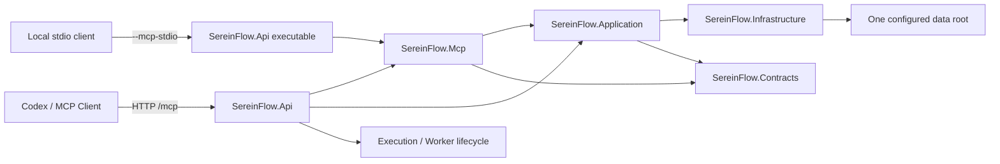

# SereinFlow Web API 与 MCP Server 单宿主整合开发计划

**编制日期：** 2026-08-30  
**状态：** 待实施  
**基线提交：** `47bdb1f`（P1 流程补丁合同与类库节点模板）  
**关联文档：** [sereinflow-task-exposure-remediation-plan-2026-08-30.md](sereinflow-task-exposure-remediation-plan-2026-08-30.md)  
**决策性质：** 直接改造，不保留旧版 MCP 工具包或旧独立 MCP Server 启动入口

## 1. 目的与决策

当前 `SereinFlow.Api` 和 `SereinFlow.McpServer` 是两个独立的 .NET 宿主。两者分别创建配置、数据库、类库目录和 Application 服务，导致 MCP 插件必须在 `.mcp.json` 中显式注入服务器本地路径：

```json
{
  "SereinFlow__DatabasePath": ".../data/sereinflow.db",
  "SereinFlow__LibraryDirectory": ".../data/libraries"
}
```

这不是 MCP 客户端应承担的依赖。它使客户端绑定到开发机目录，并可能让 Web API 与 MCP Server 使用不同的数据根、不同的进程生命周期或不同的服务注册。

本计划确定以下目标架构：

1. `SereinFlow.Api` 成为唯一正式可执行宿主，统一承载 Web API、Worker 生命周期和 MCP。
2. MCP 协议、Backend、HTTP transport 和 MCP 安全组件抽取到新的 `SereinFlow.Mcp` 类库，由 API 直接引用。
3. 同一可执行文件提供两种正式入口：常规 Web API 模式和 `--mcp-stdio` 模式。两种入口复用同一套 Contracts、Application、Infrastructure 和 MCP 代码。
4. MCP Backend 在单进程架构中直接调用 Application 服务，不通过本机 HTTP 回调 Web API，不复制第二套 DTO 或权限边界。
5. 删除旧的 `SereinFlow.McpServer` 项目、旧解决方案引用和旧插件启动命令。不为旧插件入口增加兼容层。
6. `.mcp.json` 不再提供 `SereinFlow__DatabasePath` 或 `SereinFlow__LibraryDirectory`；数据库和 `libraries` 由服务器宿主配置决定。

流程补丁协议的 legacy v1 输入兼容仍然保留。这是已冻结的流程公共合同兼容期，不是旧版 MCP 工具包兼容，不代表保留 `SereinFlow.McpServer` 或旧插件启动方式。

## 2. 请求边界

### 2.1 本次计划包含

- 数据库、类库、脚本产物和 MCP staging 目录的统一配置及解析。
- Application、Infrastructure、执行运行时和 MCP 的可组合 DI 注册。
- `SereinFlow.Mcp` 类库及其协议/Backend/transport 迁移。
- Web API 模式下的 `/mcp` HTTP endpoint。
- API 可执行程序的 `--mcp-stdio` 入口。
- MCP HTTP 与 stdio 的认证、session、限流、超时、请求大小和响应大小边界。
- 旧 `SereinFlow.McpServer` 项目的删除及解决方案清理。
- 插件 manifest、`.mcp.json`、Skill 和打包安装流程的更新。
- 单宿主、两种入口、配置一致性、权限和回归测试。

### 2.2 本次不包含

- ZIP 导入、运行时预热、preview 分页、debug-run、端口 ID 迁移或 Skill 单入口治理。
- `attachLibrary` / `detachLibrary` 并入 flow patch。类库附加继续通过独立的 preview/apply 工具完成。
- 前端节点创建流程重写。节点位置过密的问题由已同步的 Skill 布局约束继续治理，本计划只确保 MCP 模板可被前端和流程合同直接消费。
- 数据库表结构迁移或历史流程拓扑改写。若实现发现必须迁移数据库，必须另立迁移方案并先备份。
- 旧版 `SereinFlow.McpServer`、旧 `.mcp.json` 启动命令或旧 MCP 工具包行为兼容。

### 2.3 附件与用户请求的区分

用户请求是“把 Web API 与 MCP Server 直接改造成同一套代码并封装两套入口，并将开发计划落盘”。附件截图仅作为现有流程节点布局过密的观察证据，不作为宿主整合的额外实现指令；其对应的绘制约束已在两份 `sereinflow` Skill 中补充。本计划不因截图而改写前端节点布局，也不把截图中的具体流程作为迁移 fixture。

## 3. 当前基线与问题证据

### 3.1 宿主分裂

| 位置 | 当前职责 | 问题 |
| --- | --- | --- |
| `src/SereinFlow.Api/Program.cs` | Web API、SignalR、执行队列、Worker client、debug service、类库 reindex | 自己注册基础设施和 Application |
| `src/SereinFlow.McpServer/Program.cs` | MCP stdio、可选 MCP HTTP、MCP Backend 和 MCP 安全 | 再次注册基础设施和部分 Application |
| `src/SereinFlow.Infrastructure/Persistence/SereinFlowInfrastructureRegistration.cs` | 根据 `ContentRootPath` 解析数据库、类库和 staging 路径 | 同一配置在两个宿主中各解析一次 |
| `plugins/sereinflow-ai-toolkit/.mcp.json` | 启动独立 MCP Server | 暴露并硬编码服务器本地路径 |

`SereinFlow.Api` 当前启动 `RunExecutionHostedService`、`FlowDebugSessionService` 和 `LibraryCatalogReindexHostedService`；MCP Server 则使用自己的 `Host.CreateApplicationBuilder`，并拥有单独的 service provider。两边即使指向同一 SQLite 文件，也不是同一个数据库服务实例或同一生命周期。

### 3.2 现有 MCP 代码边界

待抽取的独立 MCP 实现目前位于 `src/SereinFlow.McpServer`：

- `McpContracts.cs`
- `McpHttpSessionRegistry.cs`
- `McpRequestLimiter.cs`
- `SereinFlowMcpBackend.cs`
- `SereinFlowMcpServer.cs`
- `Program.cs` 中的 HTTP transport、stdio transport 和 MCP DI 注册

现有测试位于 `tests/SereinFlow.McpServer.Tests`，覆盖 Backend、HTTP transport 和协议行为。迁移后测试名称和引用应反映新类库，不应继续暗示旧独立宿主是正式入口。

### 3.3 已有安全边界必须保留

- MCP HTTP API key 认证。
- HTTP session 与 `Mcp-Session-Id` 校验。
- 每主体并发限制和每分钟请求限制。
- 请求体大小、响应体大小和工具执行超时。
- `mcp.unauthenticated`、`mcp.session_required`、`mcp.tool_timeout` 等稳定公开诊断。
- 敏感值、脚本、完整异常堆栈和服务器绝对路径的脱敏。
- MCP 访问继续通过 Application 服务和项目权限检查，不允许绕过项目授权。

合并宿主不能因为共享 DI 容器而让 API 的宽松全局 CORS 覆盖 MCP 专用安全策略。

## 4. 目标架构



### 4.1 组件职责

| 组件 | 责任 | 不负责 |
| --- | --- | --- |
| `SereinFlow.Api` | 进程启动、模式选择、Web API 路由、MCP endpoint mapping、正式后台服务 | MCP 业务 DTO 或数据库直接访问 |
| `SereinFlow.Mcp` | MCP JSON-RPC、Tool/Resource 描述、Backend、认证上下文、session、限流、transport helper | 创建第二个数据库、通过 REST 回调 API |
| `SereinFlow.Application` | 项目、流程、预览、类库、权限所需的用例服务 | HTTP/MCP 协议解析 |
| `SereinFlow.Infrastructure` | 数据库、仓储、类库目录、MCP 持久化实现 | 宿主模式判断 |
| `SereinFlow.Contracts` | 公共 DTO、flow patch v2 canonical 合同和 MCP 结果模型 | 宿主本地路径推断 |
| `SereinFlow.Api` 的组合注册 | 按模式启用需要的服务 | 让同一服务注册两次 |

### 4.2 两种入口

#### Web API 正式模式

- 启动 Web API、SignalR、MCP HTTP endpoint 和正式执行/观察后台服务。
- MCP endpoint 固定挂载在 API 进程的 `/mcp` 路径。
- API 与 MCP 使用同一个 `IServiceProvider`、数据库 singleton、类库目录解析结果和 Application 服务。
- MCP endpoint 使用专用认证、session、限流、超时和大小限制中间件/endpoint filter，不继承全局宽松 CORS。

#### `--mcp-stdio` 模式

- 使用同一个 `SereinFlow.Api` 可执行程序启动 MCP stdio transport。
- 不打开 Web API listener、SignalR 或不必要的 API 后台服务。
- 仍使用同一套 MCP/Application/Infrastructure 注册和服务器端数据配置。
- 本地 stdio 身份必须使用显式配置的 MCP API key；开发环境若允许本地管理员身份，必须由明确的 development-only 开关控制，生产环境禁止隐式管理员回退。
- 标准输出只写 MCP JSON-RPC，日志写标准错误；不得把 ASP.NET banner、日志或诊断混入 stdout。

两种模式不是两个业务实现。差异只允许出现在 transport、身份来源和宿主生命周期；Tool 名称、参数、响应、权限判断和持久化语义必须一致。

## 5. 统一配置与数据路径

### 5.1 目标配置

服务器端 `appsettings.json` 的目标形态如下，具体目录名可以按部署环境覆盖，但不再由 MCP 客户端提供：

```json
{
  "SereinFlow": {
    "DataRoot": "data",
    "DatabaseFileName": "sereinflow.db",
    "LibraryDirectoryName": "libraries",
    "ScriptArtifactDirectoryName": "script-artifacts",
    "McpStagingDirectoryName": "mcp-staging",
    "Mcp": {
      "Http": {
        "ListenUrl": "http://127.0.0.1:5180",
        "MaxRequestBytes": 16777216,
        "MaxResponseBytes": 4194304,
        "MaxConcurrentRequests": 16,
        "MaxRequestsPerMinute": 120,
        "MaxToolExecutionSeconds": 60
      }
    }
  }
}
```

### 5.2 路径解析规则

新增 `SereinFlowStorageOptions` 和 `ISereinFlowPathResolver`（命名可按现有代码风格微调）：

1. 绑定 `SereinFlow:DataRoot`，默认相对 API content root 的 `data`。
2. 只在服务器进程内把相对路径解析为绝对路径。
3. 统一生成数据库、libraries、script-artifacts、mcp-staging 四个目录/文件路径。
4. 初始化阶段验证目录可创建、数据库父目录可写；失败返回安全诊断并记录 `diagnosticId`。
5. Application 和 MCP 不再读取 `DatabasePath`、`LibraryDirectory` 并自行拼接路径。
6. 绝对路径仍可作为服务器部署配置使用，但绝不出现在客户端 manifest、公开读模型或错误消息中。

实现期间可以提供一次性的服务器配置迁移读取逻辑，将当前 `SereinFlow:DatabasePath` 和 `SereinFlow:LibraryDirectory` 转换到新配置；这只是服务端部署配置迁移，不是旧 MCP 工具包兼容。迁移完成后删除旧配置读取分支，并在启动诊断中指出仍存在的过时配置。

### 5.3 依赖一致性验收

应用启动后应能通过内部诊断或测试断言以下对象使用相同解析结果：

- `SqliteDatabase` 的数据库路径。
- `ILibraryCatalogService` 的类库目录。
- `McpPackageStagingService` 的 staging 目录。
- `SupervisorWorkerRunClient` 的允许类库和脚本根目录。
- MCP Backend 通过 Application 服务读取到的项目/类库数据。

测试不得依赖机器上的固定 `D:\Project\dotnet\SereinFlow` 路径；使用临时 data root，并在测试结束时释放数据库连接和文件锁。

## 6. 分阶段实施任务

### Phase 0：锁定基线和迁移边界

**目标：** 在代码移动前证明当前行为，防止抽取时混入无关整改。

**任务：**

1. 记录当前 API、MCP stdio 和 MCP HTTP 的启动参数、配置键、Tool 列表、Resource 列表和权限矩阵。
2. 为现有 MCP 测试建立迁移前基线；不终止正在运行的 `SereinFlow.McpServer` 用户进程。
3. 明确本次不修改 flow patch v2/v1 合同，不移动类库 attach/detach 的流程边界。
4. 增加架构测试的失败预期：最终解决方案不得含 `SereinFlow.McpServer` 可执行项目。

**退出条件：** 当前测试基线可复现；迁移清单和删除目标明确；没有把旧插件兼容列入验收条件。

### Phase 1：抽取统一基础设施注册和路径解析

**目标：** 让任何宿主只通过一份组合注册获得同一组数据服务。

**任务：**

1. 在 Infrastructure 或合适的 Composition 层新增 storage options/path resolver。
2. 将 `AddSereinFlowInfrastructure` 改为接收已解析的 storage options 或 resolver，不再在内部重复读取宿主路径字符串。
3. 按现有依赖关系拆分可复用注册：
   - `AddSereinFlowStorage`：数据库、仓储和持久化服务；
   - `AddSereinFlowApplication`：项目、流程、预览、类库和合同服务；
   - `AddSereinFlowExecution`：Worker client、执行队列和 hosted services；
   - `AddSereinFlowMcp`：在新 MCP 类库中注册 MCP 组件。
4. 每个扩展方法保证幂等或明确要求只调用一次，并为重复注册增加架构/DI 测试。
5. 保持 Application 不引用 ASP.NET transport；将宿主专属类型留在 API 或 MCP 类库。

**涉及文件：**

- `src/SereinFlow.Infrastructure/Persistence/SereinFlowInfrastructureRegistration.cs`
- 新增 `src/SereinFlow.Infrastructure/Configuration/SereinFlowStorageOptions.cs`
- 新增 `src/SereinFlow.Infrastructure/Configuration/SereinFlowPathResolver.cs`
- `src/SereinFlow.Api/Program.cs`
- 相关 Application/Infrastructure 项目文件和测试夹具

**退出条件：** API 使用新注册后测试通过；数据库和类库目录可以只由 DataRoot 配置决定；没有 MCP 专属路径环境变量。

### Phase 2：建立 `SereinFlow.Mcp` 类库

**目标：** 将协议实现从可执行宿主中移出，形成可被 API 引用的唯一 MCP 代码包。

**任务：**

1. 新增 `src/SereinFlow.Mcp/SereinFlow.Mcp.csproj`，目标框架和 nullable/implicit usings 设置与现有项目一致。
2. 将以下实现迁移到新类库，调整 namespace 和内部可见性：
   - `McpContracts.cs`；
   - `McpHttpSessionRegistry.cs`；
   - `McpRequestLimiter.cs`；
   - `SereinFlowMcpBackend.cs`；
   - `SereinFlowMcpServer.cs`。
3. 将 MCP DI 注册从 `Program.cs` 移入 `AddSereinFlowMcp`，但保留 transport mapping 所需的配置读取 helper 在 API 宿主或明确的 MCP endpoint mapper 中。
4. 将 MCP HTTP endpoint mapping 封装成 `MapSereinFlowMcp`，由 API 在 Web 模式调用。
5. 把认证主体和请求上下文作为 MCP 类库公开的、最小的抽象；不让 API 的 HTTP endpoint 直接操作 Backend 内部状态。
6. 让 HTTP 与 stdio 共用 `SereinFlowMcpServer.HandleRequestAsync`、错误转换和 Backend。

**退出条件：** 新类库可以独立被测试；API 尚未删除旧项目前即可引用并运行新类库；Tool/Resource 清单和错误结果与基线一致。

### Phase 3：将 MCP HTTP 挂载到 API

**目标：** Web API 与 MCP HTTP 在一个进程内运行，并共用一套服务实例。

**任务：**

1. 在 `SereinFlow.Api/Program.cs` 中使用统一组合注册，不再调用旧的 MCP Server 入口。
2. 在 `app.Build()` 后调用 MCP endpoint mapper，挂载 `/mcp` 的 POST、DELETE 和不支持方法处理。
3. 为 MCP endpoint 保留独立的 API key authentication、session 创建/校验、请求体读取、限流、超时和响应大小检查。
4. 将 API 的全局 CORS 与 MCP CORS 分离；MCP 默认不因 API 的 `AllowAnyOrigin` 获得跨域放行。
5. 确认 HTTP MCP 与 Web API 的异常处理不会泄露路径、栈或请求内容；超时返回稳定的 MCP 诊断。
6. 为 health check 或内部测试增加“API 与 MCP 同进程”的可验证信号，但不要把数据库绝对路径暴露给客户端。

**退出条件：** API 进程同时能响应普通 API 和 `/mcp`；MCP 可以读取 API 同一数据根中的项目和类库；单进程只存在一份 database/application service registration。

### Phase 4：增加 API 的 `--mcp-stdio` 入口

**目标：** 为本地 MCP 客户端提供无需本地数据库路径注入的 stdio 启动方式。

**任务：**

1. 在 API 入口最早阶段识别 `--mcp-stdio`，进入 Generic Host/stdio 分支，不建立 WebApplication listener。
2. 两种模式共享配置加载、storage、Application 和 MCP 注册；stdio 分支只启用 MCP 所需的 hosted service。
3. 明确禁止 stdio 分支启动执行队列、debug session、SignalR 和 API-only hosted service，除非某个 MCP Tool 明确需要且其生命周期已测试。
4. 通过 `SereinFlow:Mcp:Stdio:ApiKey` 认证；无 key 时默认拒绝，development-only 的本地管理员开关必须显式开启并输出安全诊断。
5. stdout 只输出 JSON-RPC；所有启动错误、日志和诊断写 stderr，并给出 `diagnosticId`。
6. 对 `--mcp-stdio` 建立进程级退出码约定：配置/认证初始化失败非零退出，正常 EOF 清理并正常退出。

**退出条件：** 同一个 API executable 可通过 stdio 完成 `initialize`、`tools/list` 和一个只读 Tool；普通 API listener 不被 stdio 模式打开；配置路径和权限行为与 HTTP 一致。

### Phase 5：切换解决方案、删除旧宿主和更新插件

**目标：** 完成不兼容旧版 MCP 工具包的直接切换。

**任务：**

1. 将 `SereinFlow.Mcp` 加入 `SereinFlow.sln`，将 API 项目引用改为新类库。
2. 将测试项目更名/迁移为 `tests/SereinFlow.Mcp.Tests`，更新项目引用、namespace 和测试输出命名。
3. 删除 `src/SereinFlow.McpServer/SereinFlow.McpServer.csproj` 及其旧 `Program.cs`；删除解决方案中的旧项目和配置项。
4. 删除或迁移旧项目剩余 MCP 源文件，确保没有第二份 `SereinFlowMcpBackend`、`SereinFlowMcpServer` 或 transport 实现。
5. 更新 `plugins/sereinflow-ai-toolkit/.mcp.json`：
   - 推荐已运行 Web API 时使用新的 HTTP `/mcp` 地址；
   - 需要自动启动时使用 `SereinFlow.Api` 的 `--mcp-stdio`；
   - 两种配置都不得携带 `SereinFlow__DatabasePath` 或 `SereinFlow__LibraryDirectory`。
6. 同步更新仓库 Skill 和插件打包副本，说明 MCP 由 Web API 承载，类库 attach/detach 仍独立，节点绘制继续遵守防重叠和分支留白约束。
7. 使用 plugin creator 既有的版本缓存/安装流程制作并安装新版 `sereinflow-ai-toolkit`；不保留旧版缓存或旧 manifest 作为运行入口。

**退出条件：** 解决方案只包含 API 作为 MCP 正式可执行宿主；插件配置不含服务器本地数据路径；安装后的 Skill 指向新 Tool/入口。

### Phase 6：验证、发布和运维交接

**目标：** 证明新宿主在 HTTP、stdio、权限、配置和生命周期上可用。

**任务：**

1. 在不终止用户进程的前提下等待旧 MCP Server DLL 锁释放，再执行完整 clean/build/test；若锁仍存在，先完成不需要重建的静态检查并报告阻塞。
2. 运行 Application、MCP、API integration、Architecture 测试项目的正常 build-and-test。
3. 启动新 API Web 模式，验证 `/healthz`、普通 API、`/mcp initialize`、session 后 `tools/list` 和一个只读 Tool。
4. 启动新 API `--mcp-stdio`，验证 stdout 协议纯净、配置/权限正确、EOF 能退出。
5. 使用同一测试 data root 分别通过 HTTP 和 stdio 读取项目、flow、library，比较 canonical JSON 结果。
6. 验证 preview 资源仍能保存和复读 `normalizedOperations`，旧 preview payload 无法使新宿主进入内部异常；这项只验证已有 P1 合同，不扩展其业务范围。
7. 检查进程列表和解决方案输出，确认没有隐式启动第二个 MCP Server。
8. 重新制作和安装插件，检查实际缓存版本、manifest、Skill 内容和 `.mcp.json` 最终入口。

## 7. 文件变更清单

| 类型 | 文件/目录 | 计划动作 |
| --- | --- | --- |
| 新增 | `src/SereinFlow.Mcp/` | MCP 类库、注册扩展和 endpoint mapper |
| 新增 | `src/SereinFlow.Infrastructure/Configuration/` | storage options 和统一路径解析 |
| 修改 | `src/SereinFlow.Api/Program.cs` | 统一注册、HTTP MCP mapping、stdio 模式选择 |
| 修改 | `src/SereinFlow.Infrastructure/Persistence/SereinFlowInfrastructureRegistration.cs` | 使用统一 storage resolver |
| 修改 | `src/SereinFlow.Api/appsettings.json` | DataRoot 和 MCP server-side 配置 |
| 新增/迁移 | `tests/SereinFlow.Mcp.Tests/` | 新类库协议、Backend、HTTP、stdio 测试 |
| 修改 | `tests/SereinFlow.Api.IntegrationTests/` | API 与 MCP 同宿主、配置和生命周期测试 |
| 修改 | `tests/SereinFlow.ArchitectureTests/` | 禁止旧 MCP 可执行宿主和重复注册 |
| 删除 | `src/SereinFlow.McpServer/` | 删除旧独立宿主，不提供兼容入口 |
| 修改 | `SereinFlow.sln` | 加入新类库/测试，移除旧宿主/旧测试项目 |
| 修改 | `plugins/sereinflow-ai-toolkit/.mcp.json` | 改为 API HTTP 或 API stdio，无路径 env |
| 修改 | `skills/sereinflow/SKILL.md` | 新宿主入口、配置边界和布局说明 |
| 修改 | `plugins/sereinflow-ai-toolkit/skills/sereinflow/SKILL.md` | 同步插件打包副本 |
| 生成 | `.codex/plugins` 缓存 | 新版插件安装产物，不纳入源码提交 |

实际迁移时如发现文件已被其他未提交变更触及，先保留其内容并按当前版本合并；不得用旧版本文件覆盖用户已有修改。

## 8. 合同与行为要求

### 8.1 不变的 MCP 行为

- Tool 名称、参数合同、canonical 枚举和 `mcp.*` 稳定错误码保持现有公共合同。
- `sereinflow_preview_flow_patch` 继续只接受规范化后的 flow patch 模型；legacy v1 仅作为输入兼容。
- `sereinflow_create_library_node_template` 仍是只读能力，只能使用已扫描且已附加的真实 Action/Flipflop 合同。
- 类库附加仍由独立 preview/apply 工具完成，不因宿主合并变成 flow patch 操作。
- 所有写入能力继续经过 preview、明确确认、apply、复读和审计边界。

### 8.2 新宿主必须满足的行为

- HTTP 和 stdio 调用同一个 Backend 实现。
- 同一个配置加载结果决定两个入口看到的数据库和类库目录。
- MCP 不直接接受客户端传来的服务器绝对路径作为数据库或类库依赖。
- Web 模式启用 API 运行时；stdio 模式不启动完整 Web/API 生命周期。
- 无效 API key、无效 session、超时、超限和未授权项目均返回稳定安全诊断。
- API 普通请求的 CORS 设置不改变 MCP endpoint 的认证要求。
- 旧 MCP Server 不会因插件缓存、解决方案默认启动项或测试 fixture 被重新引入。

## 9. 测试计划

### 9.1 单元与合同测试

- storage options：相对 DataRoot、绝对 DataRoot、目录缺失、不可写目录和路径穿越输入。
- DI registration：每个核心 service 只有一个有效注册；API 和 stdio 组合分别验证启用/禁用的 hosted service。
- MCP server：同一请求经过 HTTP/stdio transport 后得到相同 JSON-RPC result/error。
- MCP security：API key、session、权限、限流、超时、大小限制和脱敏。
- flow patch：13 类 v2 operation、legacy v1 reader、normalized preview 持久化复读。
- library template：只读、权限和已附加 library 边界不因宿主变化。

### 9.2 集成测试

| 场景 | 断言 |
| --- | --- |
| API Web + `/mcp` | 普通 API 与 MCP 在同进程、同数据根和同 DI graph 下可用 |
| API `--mcp-stdio` | 无 HTTP listener；initialize/tools/list 成功；stdout 无非协议输出 |
| HTTP/stdio 等价性 | 相同主体、项目和只读请求得到相同 canonical 结果 |
| 路径隔离 | 客户端不传路径仍能工作；客户端传入路径不能改变服务端数据根 |
| 权限失败 | 未授权 project/tool 得到稳定 MCP 诊断，不进入 Application 写入层 |
| 生命周期 | Web 模式只启动一套 queue/debug/reindex；stdio 模式不启动 API-only hosted service |
| 旧入口移除 | 解决方案、插件 manifest 和运行产物均没有 `SereinFlow.McpServer` 入口 |
| P1 回归 | flow patch preview、normalizedOperations 和 library template 测试继续通过 |

### 9.3 验证命令

在旧用户进程释放 DLL 锁后，执行与仓库目标框架一致的正常构建和测试，例如：

```powershell
dotnet build SereinFlow.sln
dotnet test tests/SereinFlow.Application.Tests/SereinFlow.Application.Tests.csproj
dotnet test tests/SereinFlow.Mcp.Tests/SereinFlow.Mcp.Tests.csproj
dotnet test tests/SereinFlow.Api.IntegrationTests/SereinFlow.Api.IntegrationTests.csproj
dotnet test tests/SereinFlow.ArchitectureTests/SereinFlow.ArchitectureTests.csproj
```

不使用 `--no-build` 作为本次迁移的唯一证据。若 DLL 锁仍被用户进程持有，不强行结束进程；记录受阻项目、锁定文件和未执行的命令，待进程自然释放后继续。

## 10. 发布与切换顺序

1. 先发布包含新 `SereinFlow.Mcp` 和 API 双模式的构建产物，确认测试 data root 可启动。
2. 停止/替换旧 MCP Server 的启动配置；不让新旧两个进程同时写同一个 SQLite 数据库。
3. 启动 `SereinFlow.Api` Web 模式，验证健康检查、API 和 `/mcp`。
4. 更新客户端到 HTTP `/mcp` 配置；需要本地 stdio 时改用 API executable 的 `--mcp-stdio`。
5. 重新安装新版 `sereinflow-ai-toolkit`，清理旧插件缓存和旧 manifest 的主动引用。
6. 观察启动日志、MCP 初始化、数据库锁、类库目录读取和首个只读请求。
7. 完成回读验证后再把旧项目从构建和部署流水线中移除。

数据库文件和 `libraries` 目录不在本次代码变更中删除或搬迁。若部署需要改变物理目录，使用显式备份、复制校验和切换窗口；不使用删除旧目录的方式验证新路径。

## 11. 风险、取舍与回滚

| 风险 | 处理 |
| --- | --- |
| API 和 MCP 注册重复导致 singleton/scoped 语义异常 | 组合注册扩展 + architecture test + 同进程实例断言 |
| stdio 启动误开 HTTP 或后台执行服务 | 入口分支测试、监听端口检查和 hosted service 列表断言 |
| API 全局 CORS 放宽 MCP | MCP 专用 endpoint policy 和未认证集成测试 |
| 相对路径因 content root 改变而指向错误数据库 | 单一 path resolver、启动摘要和临时 data root 测试 |
| 新旧进程同时写 SQLite | 切换前检查进程，部署文档明确单实例要求 |
| 旧插件仍启动已删除项目 | 先更新 manifest/缓存，再移除解决方案项目并检查残留字符串 |
| 测试/用户进程锁定 DLL | 不终止用户进程，等待自然释放；必要时只做静态检查并延后重建 |
| 迁移误触及 P1 flow patch 或前端节点形状 | 通过非目标清单、合同快照和 P1 回归测试控制范围 |

本次“不兼容旧版 MCP 工具包”意味着代码和启动入口直接切换。出现问题时的回滚单位是整套 API/MCP 发布构建和插件 manifest，而不是重新恢复一个旧的 MCP Server 双宿主长期并行运行。数据目录保持不变，以便在版本回滚时继续读取同一份持久化数据。

## 12. 完成定义

只有以下条件全部满足，才将本计划标记为完成：

- `SereinFlow.Api` 是唯一 MCP 正式可执行宿主。
- `SereinFlow.Mcp` 被 API 引用，HTTP 和 stdio 使用同一个 Backend、协议处理和 Application 服务。
- `.mcp.json` 不含 `SereinFlow__DatabasePath`、`SereinFlow__LibraryDirectory` 或其他服务器本地数据路径依赖。
- Web API 和 stdio 入口使用同一个服务器端 DataRoot，并通过测试证明数据库/类库读取一致。
- HTTP 认证/session/限流/超时/大小限制和 stdio 身份边界全部有自动化覆盖。
- 旧 `SereinFlow.McpServer` 项目、解决方案引用、插件启动参数和测试引用已移除。
- Application、MCP、API integration、Architecture 测试正常 build-and-test 通过。
- 新版 `sereinflow-ai-toolkit` 已制作、安装并通过 `tools/list`/Skill 内容检查。
- P1 flow patch 与 library node template 回归测试通过，且未把 library attach/detach 合并进 flow patch。
- 没有为完成迁移而终止用户进程、删除数据库、删除 libraries 或覆盖用户未提交变更。

## 13. 后续任务登记

本计划完成后，才进入后续任务评估：

- 是否将 API/MCP 的 transport 进一步拆成独立 hosting package。
- 是否为 HTTP MCP 增加反向代理、TLS、生产密钥轮换和部署探针。
- P2 端口 ID、preview 分页、debug-run、runtime preheat 和 Skill 单入口治理。

这些事项不应在本次单宿主迁移中顺带实现，以免改变合同、运行时和前端行为的审查边界。
