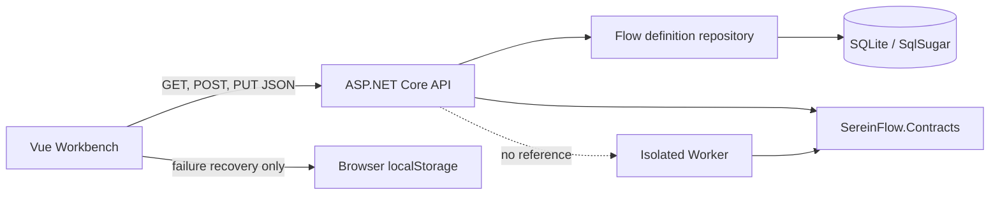
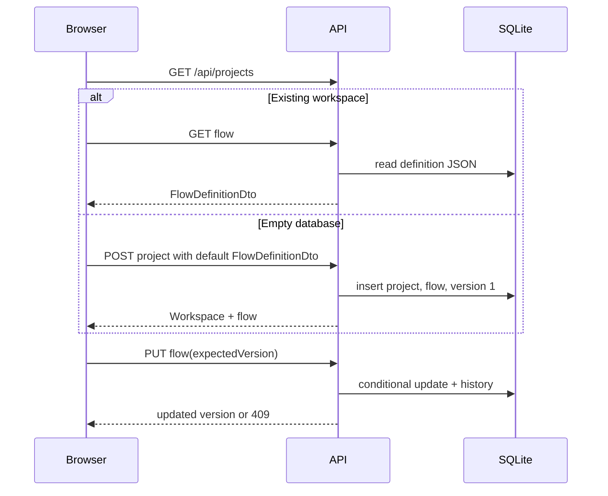

# Design: Workbench API and Graph Fixes

## Architecture

## API contract

| Operation | Route | Success | Failure |
| --- | --- | --- | --- |
| List projects | `GET /api/projects` | `200 ProjectWorkspaceDto[]` | `500 ProblemDetails` |
| Create project | `POST /api/projects` | `201 ProjectWorkspaceDto` | `400 ProblemDetails` |
| Load flow | `GET /api/projects/{projectId}/flows/{flowId}` | `200 FlowDefinitionDto` | `404 ProblemDetails` |
| Save flow | `PUT /api/projects/{projectId}/flows/{flowId}` | `200 FlowDefinitionDto` | `400`, `404`, `409 ProblemDetails` |

`PUT` receives `expectedVersion` and a full definition. The repository updates only when the database version matches, then writes the new JSON into `FlowDefinitionVersions` in the same transaction.

## Frontend state flow

## Canvas edge invariant

Every mutation creates a replacement array for the active `CanvasState`. Edge removal constructs a set of explicit removed IDs and filters only those IDs. Vue Flow is keyed by `activeCanvasId`, so a canvas switch disposes its internal store and initializes it from that canvas's nodes and edges. The application ignores non-removal edge changes because the editor has no business operation for those events.

## Error handling

- API uses `ProblemDetails` with predictable status codes.
- Structural validation returns 400 with diagnostics in `extensions.diagnostics`.
- A stale flow save returns 409 with the current server version in `extensions.currentVersion`.
- Network and server failures preserve the unsaved workspace and write a recovery draft; they never mark the server version as saved.
