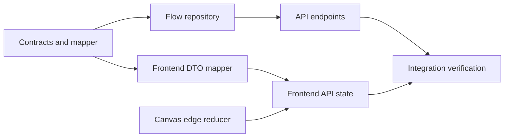

# Tasks: Workbench API and Graph Fixes

| Task | Input | Output | Acceptance |
| --- | --- | --- | --- |
| Contract completion | Current DTOs and workbench state | Trigger/UI metadata + API request/response DTOs | Round trip does not discard editor state |
| Repository | SQLite schema | Versioned flow repository | Reads, inserts, updates, and rejects stale version |
| API | Contracts and repository | Project/flow endpoints | Correct 200/201/404/409 behavior |
| Graph reducer | Edge changes plus current graph | Explicit edge mutation functions | Single deletion leaves unrelated edges |
| UI integration | API DTOs and canvas state | Server bootstrap/save behavior | Saved server workflow reopens correctly |
| Verification | All changes | Tests and build evidence | .NET tests and Vue type/build checks pass |

## Implementation constraints

- Tests precede their related repository/reducer implementation.
- API references only Application, Contracts, and Infrastructure.
- The graph reducer is pure TypeScript, so it can be regression-tested without a browser.
- `localStorage` cannot replace a successful server save.
