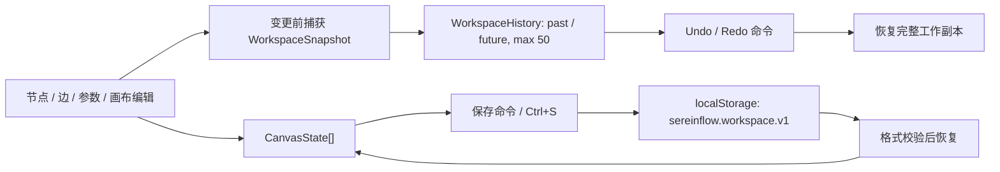

# Web 工作台编辑历史与本地工作副本设计

> 阶段：Architect 完成。

## 架构



## 快照契约

```ts
interface WorkspaceSnapshot {
  canvases: CanvasState[]
  activeCanvasId: string
  nextNodeNumber: number
}
```

选择状态属于 `CanvasState` 的瞬时 UI 状态，会随结构快照一同恢复；但单独的节点/边点击、语言切换、输出面板切换和移动端抽屉状态不写入历史。

`WorkspaceHistory.record(before)` 在流程状态发生变更前调用。`undo(current)` 将当前状态推入 future 并返回最近的 past；`redo(current)` 反向操作。新编辑清空 future，重复快照不入栈。

## 画布契约

| 生命周期 | ID | 可删除 | 创建条件 |
| --- | --- | --- | --- |
| Main | `main` | 否 | 初始必有 |
| Init | `init` | 是 | 尚未存在 |
| Loading | `loading` | 是 | 尚未存在 |
| Exit | `exit` | 是 | 尚未存在 |

新增画布从工具栏的加号菜单选择生命周期。删除当前非主画布时，活动画布切换到 Main，并且当前画布的全部节点、边和选中状态一并移除。

## 持久化和错误处理

`workspaceStorage` 只读写结构化 JSON。读取时检查格式版本、画布数组、节点数组、边数组、活动画布与生命周期值；解析异常、版本不匹配或不完整状态全部回退初始样例，不向用户抛出错误。写入失败时保留内存工作副本，并显示本地保存失败提示。

## 无障碍和响应式

撤销、重做和删除画布按钮绑定 `disabled` 与对应 `aria-label`。画布创建菜单为 `role="menu"`，选项为 `menuitem`。小屏维持横向可滚动标签区域，菜单和工具按钮不撑开页面；键盘快捷键不在输入控件内拦截编辑操作。
