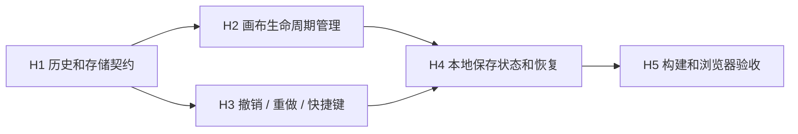

# Web 工作台编辑历史与本地工作副本任务拆分

> 阶段：Atomize 完成。

| 任务 | 输入契约 | 输出契约 | 实现约束 | 验收 |
| --- | --- | --- | --- | --- |
| H1 | `CanvasState` | 无 Vue 依赖的历史/存储模块 | 50 步、深拷贝、损坏快照回退 | 可独立恢复工作副本 |
| H2 | `CanvasLifecycle` | 新增/删除生命周期画布菜单 | Main 不删除、无重复生命周期 | 画布状态隔离 |
| H3 | H1、现有编辑事件 | Undo/redo 和键盘命令 | 不记录纯选择，不劫持文本撤销 | 前后状态正确恢复 |
| H4 | H1-H3 | 保存/未保存状态与刷新恢复 | 仅 localStorage，非服务端保存 | 刷新后状态保留 |
| H5 | H4 | 构建、浏览器交互记录 | 运行时逻辑通过；375px 视觉门禁后续建立 | TypeScript/Vite/模块运行时通过 |

当前状态：H1-H4 已完成；H5 的 TypeScript、Vite、HTTP 和模块运行时部分已完成。正式 Playwright/axe 以及 375px 视觉门禁仍列在 TODO，不作为本轮已完成项。
