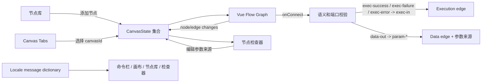
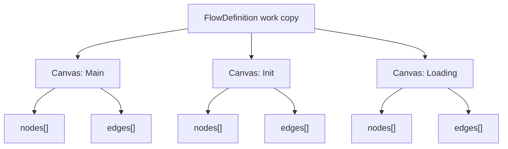

# Web 工作台多画布与国际化设计

> 阶段：Architect 完成。

## 架构

## 画布模型

`CanvasState` 包含 `id`、可本地化的 `nameKey`、`lifecycle`、`nodes` 和 `edges`。变更只能应用于当前画布。节点采用固定约 224px 宽度，位置由 Vue Flow `Node.position` 管理。

## 端口与连接契约

| Handle | 方向 | 连接语义 | 允许对端 | 表现 |
| --- | --- | --- | --- | --- |
| `exec-in` | target | 流程调度入口 | `exec-success`、`exec-failure`、`exec-error` | 流程分支入口 |
| `exec-success` | source | Success 分支 | `exec-in` | 绿色流程连接器 |
| `exec-failure` | source | Failure 分支 | `exec-in` | 琥珀色流程连接器 |
| `exec-error` | source | Error 分支 | `exec-in` | 红色流程连接器 |
| `data-out` | source | 方法返回数据 | `param-*` | 圆形端口、虚线、Value 标签 |
| `param-{parameterId}` | target | 方法参数来源 | `data-out` | 圆形端口、虚线、参数名称 |

`onConnect` 必须：

1. 检查 source/target handle 的前缀与方向。
2. 拒绝自连接、错误组合和重复执行边。
3. 为合法边附加 `semantic` 与 `targetParameterId` 元数据。
4. 对数据边同步将目标参数设为 `previousNode` 并记录源节点/端口。

删除数据边时，若它仍是该参数的来源，则将来源回退至 `literal`。检查器把来源切换为 literal/projectInput/expression 时，删除该参数的已有数据边以保持模型一致。

## 国际化契约

`i18n.ts` 对外提供 `locale`、`setLocale`、`t` 与 `localize`。`setLocale` 更新根 HTML 的 `lang`，并将选择写入 `localStorage`。中文为默认回退语言；未知键返回键名，便于开发期发现遗漏。用户可从带 `Languages` 图标的紧凑语言菜单切换 `ZH` / `EN`。

## 异常与反馈

不合法连接不创建边，而是通过状态栏显示短暂可本地化提示。删除、切换参数来源、节点创建与选中使用非阻塞状态更新。按钮具有可见焦点、title/aria-label 和 150-250ms 色彩/边界过渡；`prefers-reduced-motion` 禁用非必要过渡。
