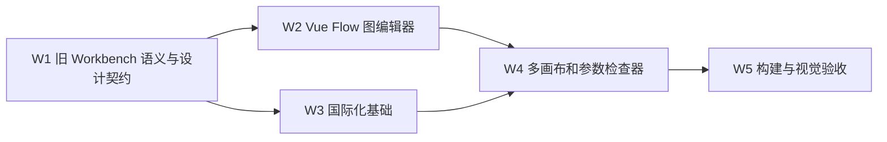

# Web 工作台多画布与国际化任务拆分

> 阶段：Atomize 完成。

| 任务 | 输入契约 | 输出契约 | 约束 | 验收 |
| --- | --- | --- | --- | --- |
| W1 | 旧 `FlowEditView`、`FlowCanvasView`、`INodeJunction` | Align/Consensus/Design 文档 | 旧仓库只读 | 四类连接点和多画布边界有记录 |
| W2 | Vue 3、Vue Flow | 可拖拽节点、连接、删除和选中 | 不手写 SVG 图编辑引擎 | 真实画布操作可用 |
| W3 | 当前门户文案 | `zh-CN`/`en-US` 字典与语言控制 | 所有新 UI 文案经 `t()` | 切换即时更新根 `lang` |
| W4 | W2、W3、CanvasState | 独立画布、双语义边、参数来源检查器 | 数据边与参数来源保持一致 | 画布隔离和端口校验通过 |
| W5 | W4 | 构建结果、验收/最终/TODO 文档 | 使用本地 `vue-tsc` 与 Vite 二进制构建，检查响应式 | 无 TypeScript/Vite 失败 |

当前状态：W1-W5 已完成。本轮交付是 T10 的本地图编辑器第一切片；REST 持久化、撤销重做、完整移动端编排和端到端运行闭环仍按主重构任务后续切片推进。
