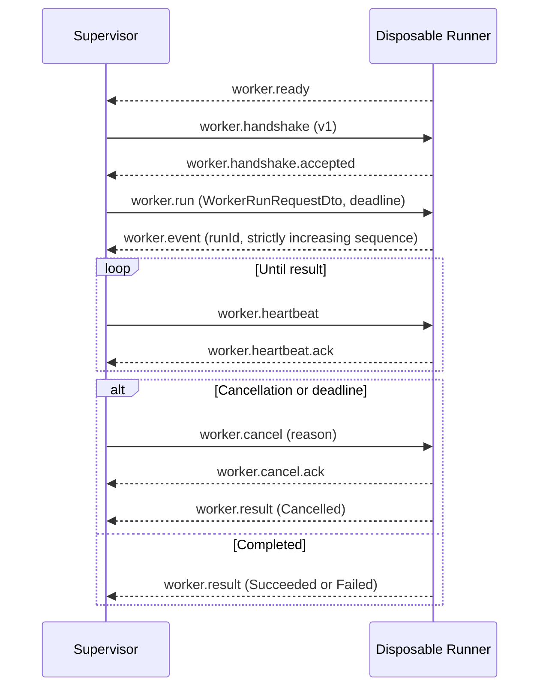

# SereinFlow Worker Protocol v1

> 状态：当前生产协议，由 `SereinFlow.Worker.IntegrationTests` 覆盖。Supervisor 与一次性 Runner 使用受限标准输入/输出 JSON Lines；部署环境可在不改变本信封或 DTO 的前提下，为 API 与 Supervisor 增加 Linux UDS 传输适配。

## 1. 边界

- API 只形成 `WorkerRunRequestDto` 和消费 `WorkerEventEnvelopeDto` / `WorkerRunResultDto`，不会加载 Runtime、ScriptLang、插件或外部 DLL。
- Supervisor 只校验版本、启动/终止进程树、转发事件、追踪 deadline/取消；它不加载用户代码。
- Runner 每次运行新建，唯一允许加载 Runtime、ScriptAdapter、SereinScript 与后续插件加载器；它不访问 SQLite。

## 2. 传输与上限

传输是一行一个 UTF-8 JSON 对象。禁止多行 JSON、二进制 CLR 对象、反射对象、程序集路径和未序列化异常。`WorkerMessage` 字段为：

| 字段 | 要求 |
| --- | --- |
| `protocolVersion` | 必须是 `1` |
| `kind` | 见下方消息类型 |
| `requestId` | 非空关联标识 |
| `runId` | 运行相关消息必须存在，且必须匹配当前运行 |
| `sequence` | 事件消息携带的可选镜像；权威 sequence 在事件 DTO 内 |
| `deadline` | `worker.run` 使用 UTC deadline |
| `payloadJson` | 内嵌版本化 DTO JSON |

- 单条消息最大 `1,048,576` UTF-8 bytes。
- `payloadJson` 最大 `896,000` characters，为信封和 UTF-8 编码留出余量。
- 发送端串行写入标准输出，直接等待 I/O 完成，不持有无界事件队列；慢消费端因此对 Runner 产生自然背压。
- 超限、空消息、非 JSON 或版本不匹配均拒绝，不尝试降级、截断或反序列化为 CLR 对象。

## 3. 会话顺序

`worker.result` 是一次性 Runner 的终结消息；Supervisor 在接收或宽限期超时后回收 Runner 进程树。事件 `sequence` 必须从 1 单调递增；重复、倒退、跨 run ID 事件返回 `worker.event_sequence_invalid` 或 `worker.invalid_message`。

## 4. 消息类型

| 方向 | kind | payload |
| --- | --- | --- |
| Runner -> Supervisor | `worker.ready` | 无 |
| Supervisor -> Runner | `worker.handshake` | 无 |
| Runner -> Supervisor | `worker.handshake.accepted` | 无 |
| Supervisor -> Runner | `worker.run` | `WorkerRunRequestDto` |
| Runner -> Supervisor | `worker.event` | `WorkerEventEnvelopeDto` |
| Supervisor -> Runner | `worker.heartbeat` | 无 |
| Runner -> Supervisor | `worker.heartbeat.ack` | 无 |
| Supervisor -> Runner | `worker.cancel` | `WorkerCancelRequestDto` |
| Runner -> Supervisor | `worker.cancel.ack` | 无 |
| Runner -> Supervisor | `worker.result` | `WorkerRunResultDto` |
| Runner -> Supervisor | `worker.error` | `WorkerErrorDto` |

## 5. 稳定错误码

| 错误码 | 含义 |
| --- | --- |
| `worker.protocol_mismatch` | 信封或结果版本不支持 |
| `worker.invalid_message` | 格式、kind、run ID 或顺序不合法 |
| `worker.invalid_payload` | 内嵌 DTO 不能解析 |
| `worker.message_too_large` / `worker.payload_too_large` | IPC 上限超出 |
| `worker.handshake_failed` | Runner 没有按协议开始会话 |
| `worker.crashed` | Runner 在 ready/handshake/结果之前关闭协议流或异常退出 |
| `worker.cancelled` | 调用方取消并在 Runner 中协作完成 |
| `worker.timed_out` | deadline 到达；超过取消宽限期由 Supervisor 终止进程树 |
| `worker.event_sequence_invalid` | 事件 sequence 非严格递增 |

协议诊断不得包含 API secret、SQLite 路径、完整脚本源码、进程环境或 CLR 堆栈。

## 6. 已验证范围与剩余项

已验证：v1 往返、版本/长度拒绝、Action 流程执行、ScriptLang 取消、事件 sequence、过期 deadline 和 Runner 异常退出分类。待后续 T7/T12 验证：Linux UDS ACL、独立 UID/mount/namespace、cgroup 限制、心跳失联时钟、外部 DLL/`Environment.Exit`/不合作 CLR 调用及进程树的黑盒隔离测试。
