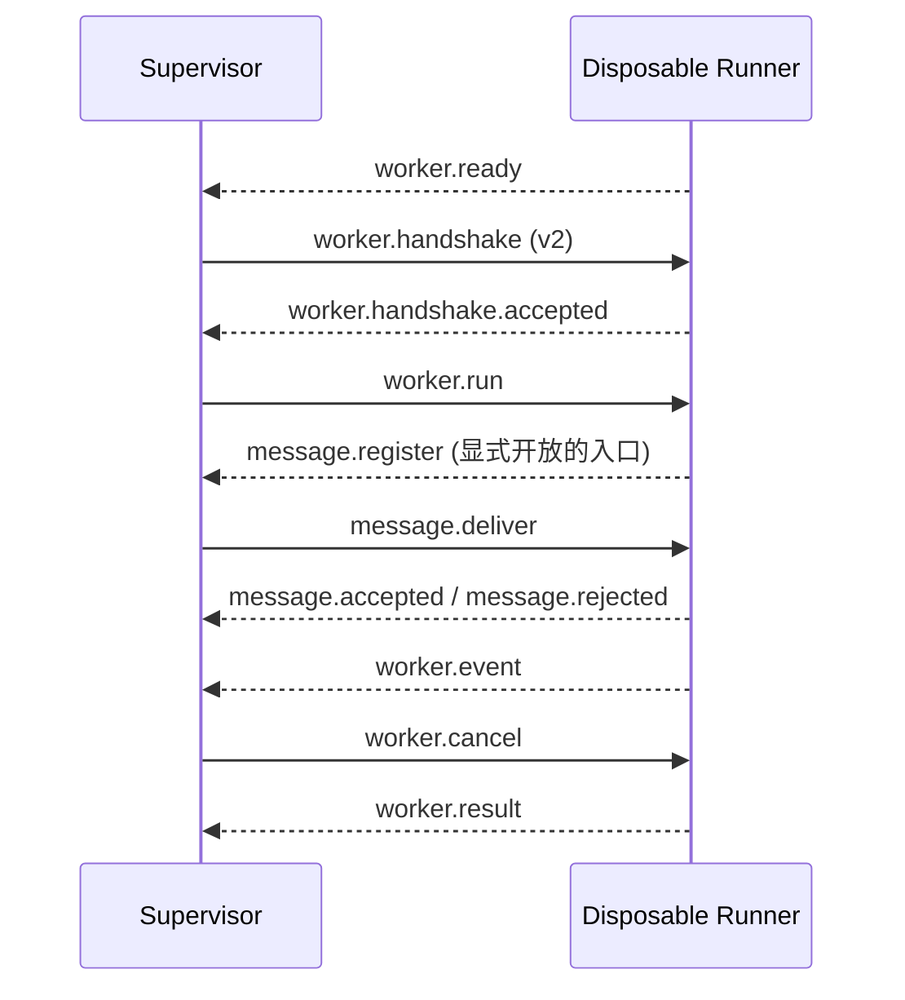

# SereinFlow Worker Protocol v2

> 状态：当前生产协议，由 `SereinFlow.Worker.IntegrationTests` 覆盖。Supervisor 与一次性 Runner 使用受限标准输入/输出 JSON Lines；传输实现通过 `IWorkerTransport` 隔离。

## 边界与传输

- API 不加载 Runtime、ScriptLang、插件或用户程序集。
- Supervisor 负责启动/终止进程树、版本校验、消息转发、deadline、取消和活动运行会话。
- Runner 每次运行新建，负责加载 Runtime 和节点类库，并在本地创建运行级消息服务。
- 每条传输消息是一个 UTF-8 JSON 对象；禁止二进制 CLR 对象、程序集路径和未序列化异常。
- 单条消息最大 `1,048,576` UTF-8 bytes，`payloadJson` 最大 `896,000` characters。

## 信封字段

`WorkerMessage` 的 `protocolVersion` 必须为 `2`。`requestId` 用于请求应答关联，`runId` 必须匹配当前运行；事件的权威顺序号仍在事件 DTO 内。

## 会话顺序

所有控制消息继续由现有的单一接收循环处理；消息服务不会启动第二个 `ReceiveAsync` 消费者。`worker.result` 是一次性 Runner 的终结消息，运行结束后消息会话立即失效。

## 消息类型

| 方向 | kind | payload |
| --- | --- | --- |
| Runner -> Supervisor | `worker.ready` | 无 |
| Supervisor -> Runner | `worker.handshake` | 无 |
| Runner -> Supervisor | `worker.handshake.accepted` | 无 |
| Supervisor -> Runner | `worker.run` | `WorkerRunRequestDto` |
| Runner -> Supervisor | `worker.event` | `WorkerEventEnvelopeDto` |
| Supervisor -> Runner | `worker.heartbeat` | 无 |
| Runner -> Supervisor | `worker.heartbeat.ack` | 无 |
| Supervisor -> Runner | `worker.cancel` | `WorkerCancelRequestDto` |
| Runner -> Supervisor | `worker.cancel.ack` | 无 |
| Runner -> Supervisor | `worker.result` | `WorkerRunResultDto` |
| Runner -> Supervisor | `worker.error` | `WorkerErrorDto` |
| Runner -> Supervisor | `message.register` | `WorkerMessageEndpointDto` |
| Runner -> Supervisor | `message.unregister` | `WorkerMessageEndpointDto` |
| Supervisor -> Runner | `message.deliver` | `WorkerMessageDeliveryDto` |
| Runner -> Supervisor | `message.accepted` | `WorkerMessageAcceptedDto` |
| Runner -> Supervisor | `message.rejected` | `WorkerMessageRejectedDto` |

消息投递使用 `messageId` 去重，使用 `requestId` 关联本次投递的 accepted/rejected 应答。外部入口只允许 JSON 模式；`contractId` 是受控逻辑契约标识，不是程序集或 CLR 类型名。

## 稳定错误码

除 [v1 错误码](worker-protocol-v1.md) 外，消息桥接使用：

| 错误码 | 含义 |
| --- | --- |
| `message.protocol_mismatch` / `message.run_mismatch` | 消息版本或运行归属不匹配 |
| `message.endpoint_not_ready` | Worker 尚未注册该入口 |
| `message.endpoint_forbidden` | 入口未显式开放外部投递 |
| `message.external_json_required` | 外部入口拒绝 DirectObject |
| `message.payload_invalid` / `message.payload_too_large` | JSON 或载荷大小不合法 |
| `message.channel_full` | 有界队列达到容量上限 |
| `message.expired` | 消息已超过 TTL |
| `message.delivery_timeout` | Worker 未在投递超时内应答 |

消息服务的 SDK、入口声明和 HTTP API 见 [Worker 消息服务](worker-message-service.md)。
