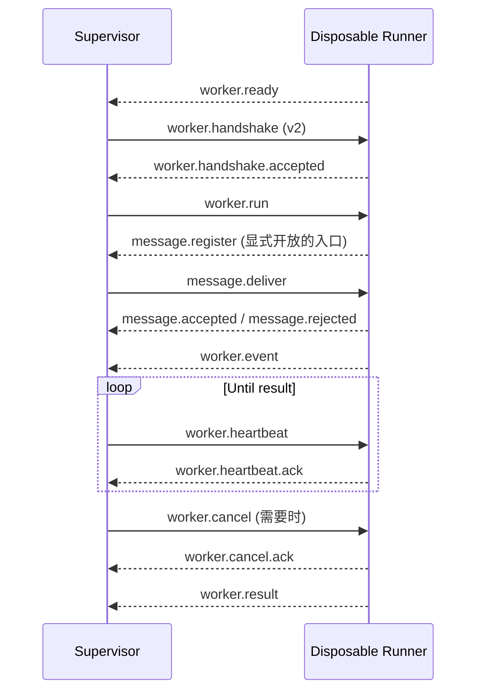

# SereinFlow Worker 协议

本文是 Worker 协议的统一入口。新读者只需要先阅读当前的 v2；v1 放在文末作为历史兼容参考，不再作为当前实现的并列入口。

## 1. 版本状态和阅读方式

| 版本 | 状态 | 适用场景 | 主要能力 |
| --- | --- | --- | --- |
| v2 | 当前生产协议，由 `SereinFlow.Worker.IntegrationTests` 覆盖 | 所有新集成、API Supervisor 与 Runner 通信 | 基础运行协议 + 活动运行消息入口、注册和投递回执 |
| v1 | 历史版本 | 追溯旧日志、维护旧协议实现 | 只有基础运行协议，没有消息桥接 |

当前源码中的 `WorkerProtocol.Version` 固定为 `2`。协议不是协商式降级协议：信封、内嵌 DTO、运行结果和消息投递都必须使用当前版本；混用 v1/v2 或期待自动降级都会得到 `worker.protocol_mismatch`。

## 2. 边界和职责

- API 创建 `WorkerRunRequestDto`，消费 `WorkerEventEnvelopeDto` 和 `WorkerRunResultDto`；API 不加载 Runtime、ScriptLang、插件或用户程序集。
- Supervisor 负责启动/终止进程树、校验版本、转发消息、处理 deadline 和取消，并维护活动运行会话；Supervisor 不加载用户代码。
- Runner 每次运行新建，是唯一负责加载 Runtime、节点类库和运行级消息服务的进程；Runner 不访问 SQLite。
- Supervisor 与一次性 Runner 之间通过 `IWorkerTransport` 隔离的受限标准输入/输出 JSON Lines 通信。

## 3. 传输约束和消息信封

每条传输消息是一行 UTF-8 JSON 对象。禁止多行 JSON、二进制 CLR 对象、反射对象、程序集路径和未序列化异常。

`WorkerMessage` 的关键字段：

| 字段 | 要求 |
| --- | --- |
| `protocolVersion` | 当前必须是 `2`；v1 历史信封使用 `1`。 |
| `kind` | 消息类型，例如 `worker.run`、`worker.event`。 |
| `requestId` | 非空请求/回执关联标识。 |
| `runId` | 运行相关消息必须存在，并匹配当前运行。 |
| `sequence` | 事件消息可携带的信封镜像；事件 DTO 中的 sequence 才是权威顺序号。 |
| `deadline` | `worker.run` 使用 UTC deadline。 |
| `payloadJson` | 内嵌的版本化 DTO JSON。 |

上限和写入行为：

- 单条消息最大 `1,048,576` 个 UTF-8 bytes；
- `payloadJson` 最大 `896,000` 个字符，为信封和编码留出余量；
- 发送端串行写入标准输出并等待 I/O 完成，不持有无界事件队列；慢消费端会对 Runner 形成自然背压；
- 空消息、非 JSON、超限或版本不匹配的消息直接拒绝，不截断、不降级为 CLR 对象。

## 4. 当前 v2 会话流程

所有控制消息继续由单一接收循环处理；消息服务不会启动第二个 `ReceiveAsync` 消费者。`worker.result` 是一次性 Runner 的终结消息，运行结束后消息会话立即失效。Supervisor 在收到终结消息或取消宽限期结束后回收 Runner 进程树。

事件的 `sequence` 必须从 1 开始严格递增；重复、倒退或跨运行的事件会产生 `worker.event_sequence_invalid` 或 `worker.invalid_message`。

## 5. 消息类型

基础运行消息在 v1 和 v2 中相同：

| 方向 | kind | payload |
| --- | --- | --- |
| Runner -> Supervisor | `worker.ready` | 无 |
| Supervisor -> Runner | `worker.handshake` | 无 |
| Runner -> Supervisor | `worker.handshake.accepted` | 无 |
| Supervisor -> Runner | `worker.run` | `WorkerRunRequestDto` |
| Runner -> Supervisor | `worker.event` | `WorkerEventEnvelopeDto` |
| Supervisor -> Runner | `worker.heartbeat` | 无 |
| Runner -> Supervisor | `worker.heartbeat.ack` | 无 |
| Supervisor -> Runner | `worker.cancel` | `WorkerCancelRequestDto` |
| Runner -> Supervisor | `worker.cancel.ack` | 无 |
| Runner -> Supervisor | `worker.result` | `WorkerRunResultDto` |
| Runner -> Supervisor | `worker.error` | `WorkerErrorDto` |

v2 新增活动运行消息桥接：

| 方向 | kind | payload |
| --- | --- | --- |
| Runner -> Supervisor | `message.register` | `WorkerMessageEndpointDto` |
| Runner -> Supervisor | `message.unregister` | `WorkerMessageEndpointDto` |
| Supervisor -> Runner | `message.deliver` | `WorkerMessageDeliveryDto` |
| Runner -> Supervisor | `message.accepted` | `WorkerMessageAcceptedDto` |
| Runner -> Supervisor | `message.rejected` | `WorkerMessageRejectedDto` |

消息投递使用 `messageId` 去重，使用 `requestId` 关联 accepted/rejected 回执。外部入口只允许 JSON 模式；`contractId` 是受控的逻辑契约标识，不是程序集限定名或 CLR 类型名。只有节点类库显式设置 `ExternalIngress = true` 的入口才会注册给 Supervisor。

消息服务的 SDK、队列/EventBus、入口声明和 HTTP/MCP API 见[Worker 消息服务](worker-message-service.md)。

## 6. 稳定错误码

基础协议错误码：

| 错误码 | 含义 |
| --- | --- |
| `worker.protocol_mismatch` | 信封、内嵌 DTO 或结果版本不支持 |
| `worker.invalid_message` | 格式、kind、run ID 或顺序不合法 |
| `worker.invalid_payload` | 内嵌 DTO 无法解析 |
| `worker.message_too_large` / `worker.payload_too_large` | IPC 消息或载荷超限 |
| `worker.handshake_failed` | Runner 没有按协议开始会话 |
| `worker.crashed` | Runner 在 ready、handshake 或 result 前关闭协议流或异常退出 |
| `worker.cancelled` | 调用方取消，Runner 协作完成取消 |
| `worker.timed_out` | deadline 到达，超过取消宽限期后由 Supervisor 终止进程树 |
| `worker.event_sequence_invalid` | 事件 sequence 非严格递增 |

v2 消息桥接错误码：

| 错误码 | 含义 |
| --- | --- |
| `message.protocol_mismatch` / `message.run_mismatch` | 消息版本或运行归属不匹配 |
| `message.endpoint_not_ready` | Worker 尚未注册该入口 |
| `message.endpoint_forbidden` | 入口未显式开放外部投递 |
| `message.external_json_required` | 外部入口拒绝 `DirectObject` |
| `message.payload_invalid` / `message.payload_too_large` | JSON 或载荷大小不合法 |
| `message.channel_full` | 有界队列达到容量上限 |
| `message.expired` | 消息超过 TTL |
| `message.delivery_timeout` | Worker 未在投递超时内应答 |

协议诊断不得包含 API secret、SQLite 路径、完整脚本源码、进程环境或 CLR 堆栈。

## 7. v1 历史兼容说明

v1 的基础会话顺序与当前 v2 的基础部分相同：`ready -> handshake -> run -> event/heartbeat -> cancel/result`。差异只有以下几点：

1. 信封和 DTO 的 `protocolVersion` 是 `1`；
2. v1 没有 `message.register`、`message.unregister`、`message.deliver`、`message.accepted` 和 `message.rejected`；
3. v1 不支持活动运行的外部消息投递，因此也没有 v2 的消息桥接错误码；
4. v1 文档记录的是历史验证范围，包括 v1 往返、版本/长度拒绝、Action 流程执行、ScriptLang 取消、事件 sequence、过期 deadline 和 Runner 异常退出分类。

当前源码只维护并运行 v2。若要排查旧 v1 日志或维护仍使用 v1 的外部实现，可按本节和基础错误码表读取；新集成不应继续选择 v1，也不应在同一会话中混用两个版本。

## 8. 测试和相关文档

- 当前协议和消息投递的集成覆盖位于 `tests/SereinFlow.Worker.IntegrationTests`；
- SDK 消息语义和 HTTP/MCP 投递边界见[Worker 消息服务](worker-message-service.md)；
- 节点类库如何产生消息入口、Flipflop 和 `IFlowContext` 见[节点类库开发指南](node-library-development.md)；
- v1/v2 的旧路径保留为兼容性说明页，正文统一指向本文。
